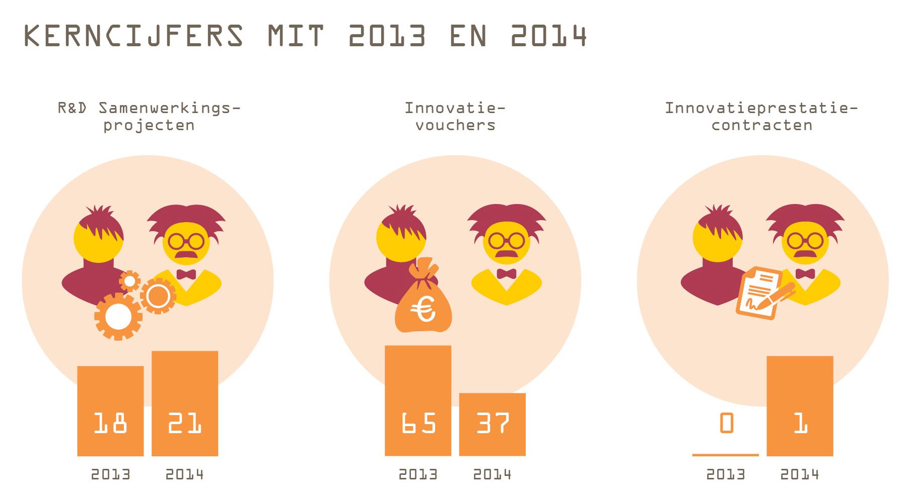

# Pieken en dalen in de Creatieve Industrie

## Publiek-private samenwerking van sleutelgebied tot topsector

### Dr. Frits D.J. Grotenhuis

# Colofon

**Pieken en dalen in de Creatieve Industrie**

Publiek-private samenwerking van sleutelgebied tot topsector

© 2015 F.D.J. Grotenhuis

All rights reserved. No part of this book may be reproduced or
transmitted in any form or by any means, electronical or mechanical,
including photocopying, recording or by any other information storage
and retrieval system, without permission of the publisher:

Alle rechten voorbehouden. Niets uit deze uitgave mag worden
verveelvoudigd, opgeslagen in een geauomatiseerd gegevensbestand of
openbaar worden gemaakt, in enige vorm of op enige wijze, zonder
voorafgaande schriftelijke toestemming van de uitgever:

F.D.J. Grotenhuis

E. [frits@grotenhuisadviseert.nl](mailto:frits@grotenhuisadviseert.nl)

I. [www.grotenhuisadviseert.nl](http://www.grotenhuisadviseert.nl)

Tekst – F.D.J. Grotenhuis

Vormgeving – Ontwerpstudio Op de Millimeter

Eindredactie – Scherpe blik communicatie

Productie – Digigrafi Veenendaal

Mede mogelijk gemaakt door:

  

Eerste druk, augustus 2015

ISBN: 978-90-821753-2-5

  
  
<blockquote>
“Here's to the crazy ones.

The misfits.

The rebels.

The troublemakers.

The round pegs in the square holes.

The ones who see things differently.

They're not fond of rules.

And they have no respect for the status quo.

You can quote them, disagree with them,

glorify or vilify them.

About the only thing you can't do is ignore them.

Because they change things.

They push the human race forward.

While some may see them as the crazy ones,

we see genius.

Because the people who are crazy enough to think

they can change the world, are the ones who do.”
 
(Apple ‘Think Different’ reclamecampagne, 1997)
 
</blockquote>

# Inhoudsopgave

Inhoudsopgave

Samenvatting

Voorwoord

Deel I Nederland als proeftuin

Nederland Kennisland

Het creëren van trends

De rol van de creatieve industrie

Deel II Van zaaien naar oogsten

Wat vooraf ging

2003: Context kenniseconomie

2004: Sleutelgebieden

2005: Ons Creatieve Vermogen

2006: Onderweg naar nieuwe samenwerkingsverbanden

Van fragmentatie naar organisatie

2007: IIP/Create en FES GATE

2008: Het leggen van een nieuwe fundering

2009: De gele kaart, de Federatie en een internationaliseringsprogramma

2010: Waarde van Creatie

2011: FES CRISP en FES COMMIT

Van sleutelgebied tot topsector

2011: Topsector, topteam en Dutch Creative Council

2012: De geboorte van TKI CLICKNL: van muiterij tot een
innovatiecontract

2013: Een grillig jaar en kafkaiaanse situaties

2014: Cross-overs

2015 Stand van zaken en toekomst CLICKNL in het bredere creatieve
landschap

Deel III De overheid als hovenier

Klimaatbeheersing

Topsectoren vergeleken

Tijd voor een nieuw seizoen

Perspectieven op tien jaar creatieve industrie

Perspectieven op het topsectorenbeleid

Dankwoord

Lijst van afkortingen

Referenties

# Samenvatting

In dit boek wordt voor het eerst een integraal overzicht gegeven van de
creatieve industrie in Nederland over de periode 2003-2015. Daarbij
worden feiten en inzichten met de lezer gedeeld die een opmerkelijk
overzicht van pieken en dalen opleveren. Met ups en downs heeft de
creatieve industrie zich van sleutelgebied ontwikkeld tot topsector. Een
innovatieve topsector met circa 130.000 bedrijven van gemiddeld
nauwelijks twee werknemers. De creatieve industrie representeert ruim
10% van alle Nederlandse bedrijven en draagt circa 2% bij aan de
economie. Een sector die meer dan tien jaar geleden begon met een
samenhang van toevalligheden en veel scepsis, is vandaag de dag niet
meer weg te denken uit het Nederlandse innovatielandschap.

In deel I van dit boek worden belangrijke sociaal-maatschappelijke en
technologische trends beschreven die van directe invloed zijn op onze
economie en maatschappij. De creatieve industrie is bij uitstek in staat
deze dynamiek te vertalen in nieuwe concepten, producten en
toepassingen. Nederland wordt mondiaal als proeftuin gezien voor dit
soort nieuwe ontwikkelingen en vervult daarbij een voorbeeldfunctie met
een open innovatiecultuur en adoptieve gebruikers.

Deel II beslaat de kern van dit boek: hier wordt een historisch
overzicht geboden van ruim tien jaar creatieve industrie, rijkelijk
geïllustreerd met diverse bijdragen van direct betrokkenen. Daarbij
wordt gestart bij het bottom-up proces van de sleutelgebieden door het
toenmalige Innovatieplatform in 2003. Vanaf 2007 wordt de
organisatiegraad van de creatieve industrie gestaag opgebouwd met eerste
regio-overstijgende initiatieven. Dit proces wordt versterkt door de
‘gele kaart’ als waarschuwing van de commissie Scheepbouwer die in 2009
de sleutelgebieden evalueerde. In dit boek wordt in het bijzonder
ingegaan op het ontstaan van de topsector Creatieve Industrie in 2011 en
de dynamiek van de publiek-private samenwerking binnen het Topconsortium
voor Kennis en Innovatie, TKI CLICKNL, in de periode 2012-2015. De lezer
wordt meegevoerd langs een grillig proces waar het TKI CLICKNL zich
gestaag een weg weet te banen door het overheidsbeleid voor de
topsectoren: sinds de start daarvan zijn in de periode 2012-2014 in de
creatieve industrie meer dan 150 onderzoeksprojecten gestart, met ruim
200 bedrijven die hierin participeren en die gezamenlijk meer dan 4
miljoen euro investeren.

Deel III gaat in op het overheidsbeleid waarbij wordt teruggeblikt op
decennia innovatiepolitiek, in relatie tot het huidige
topsectorenbeleid. Ook worden de topsectoren vergeleken, waarbij goed
zichtbaar wordt dat de creatieve industrie een bijzondere topsector is
met eigen karakteristieken: een *long tail* van kleine innovatieve
bedrijven en een nog relatief beperkte historie en ervaring met
publiek-private samenwerking in onderzoek. Dit deel sluit af met een
aantal conclusies en aanbevelingen voor toekomstig innovatiebeleid
zoals: continuïteit, het bieden van maatwerk naast generiek beleid en
het beter koppelen van de topsectoren aan de grote maatschappelijke
uitdagingen. Dit impliceert ook dat relaties tussen de topsectoren
gestimuleerd moeten worden. Aan de creatieve industrie zelf de uitdaging
haar waarde te verzilveren; de belofte en groei zitten in de cross-overs
naar andere sectoren. Vraagstukken van morgen vragen om integrale
oplossingen waarbij voor de creatieve industrie bij uitstek een rol is
weggelegd!

Aansluitend wordt aan de hand van interviews met veertien
sleutelpersonen uit de beleidshoek, de wetenschap en het bedrijfsleven
een pallet van perspectieven en inzichten geboden op de dynamiek van de
topsector Creatieve Industrie. Tot slot reflecteren in het laatste deel
drie TKI-directeuren op hun topsector en het topsectorenbeleid.

# Voorwoord

De opkomst van de creatieve industrie leest als een jongensboek. Een
avontuur met een groep vrienden en gelijkgestemden die sloten
oversteken, nieuwe routes door het bos vinden en op de beste momenten
gaan *where no man has gone before*.

Het is ook het verhaal van ontluikend leiderschap, van grote ego's die
zich voor een grotere zaak inzetten en met elkaar armpje drukken. En van
de teamspelers die graag alles samen doen en pas verder willen als de
laatste twijfelaars over de streep getrokken zijn.

Een bonte stoet van ontwerpers, kunstenaars, onderzoekers, ondernemers
en beleidsmakers die met elkaar het visioen van een *creative class*
vertalen naar een nieuwe industriesector die ons sociaal en economisch
welzijn brengt.

Maar, zoals dat gaat met een jeugdige gideonsbende: wel voor het eten
thuis en met gewassen handen aan tafel. Want de grotemensenorde zit nu
eenmaal zo in elkaar. Buitenspelen is goed en geeft mooie verhalen aan
tafel, maar het moet niet te gek worden. Wel met twee woorden spreken en
respect tonen.

Maar het moet juist wel te gek worden. De droom van een industrietak die
waarde creëert gebaseerd op belevingen en op het combineren van nieuwe
disciplines lijkt post te vatten. Het wordt een industrie die de
digitale revolutie omarmt en er betekenis aan geeft. Ook bij de buren in
het buitenland. De bende ruikt succes. Maar daarvoor moeten ze wel een
echte plaats aan tafel krijgen, zelf de etentjes organiseren en de buren
uitnodigen. 

Dat knarst, piept en kraakt met de regels en structuren die er zijn. Het
vraagt moed, veel doorzettingskracht en inventiviteit om de slag te
slaan. De auteur van dit boek, Frits Grotenhuis, is prominent lid van de
gideonsbende en heeft samen met sleutelspelers bij bedrijven en overheid
die slag geslagen. Het piept en knarst ook met andere sectoren die
arrivé zijn. De creatieve gideonsbende vraagt om tijd, om aandacht, om
geld. Want zonder investeringen komt er geen creatieve industrie. Dat
gaat ten koste van tijd, aandacht en geld voor andere sectoren. Dankzij
de visie van leiders in andere sectoren wordt ruimte geboden aan de
creatieve industrie om zich te bewijzen. Dit boek is een minutieuze
verslaglegging van ruim tien jaar bouwen.

Uit een jongensverhaal is een volwassenenboek ontstaan. De creatieve
industrie heeft verantwoordelijkheid genomen en gekregen. De inzet van
creatieve professionals is niet meer weg te denken. Hun kennis, aanpak
en inzichten zijn meer en meer centraal komen te staan in het oplossen
van maatschappelijke vraagstukken, zoals het inrichten van onze zorg,
het realiseren van een circulaire economie en het vergroten van welzijn
in steden. Ook pakken ze vragen op rond gedragsverandering die als ‘cold
cases’ van het oude systeemdenken zijn blijven liggen. De buren
herkennen de Nederlandse creatieve industrie. De rocksterren in
architectuur, mode, muziek en ontwerp doen het goed. Dutch Design is een
trademark geworden en staat voor professionaliteit, eigenzinnigheid en
multidisciplinariteit.

Ook het overdragen van kennis aan een breder publiek en een
nieuwe generatie is van de grond gekomen. Creatief denken en leiderschap
wordt onderwezen in het hoger onderwijs en als een nieuwe vorm van
MBA-educatie. Op basisscholen en voortgezet onderwijs wordt creativiteit
meegegeven aan een nieuwe generatie die later voldoening kan putten uit
persoonlijke groei en een bijdrage aan het Nederlandse sociale en
economische welzijn.

Dat de creatieve industrie salonfähig is geworden is de verdienste van
alle ondernemers, MKB’ers, onderzoekers, beleidsmakers, politici en de
creatieve rocksterren die de bende hebben gevormd. Het laat ook zien hoe
op nationale schaal innovatie kan plaatsvinden: in de woorden van de
innovation guru Prahalad: “Innovation is about amplifying weak signals.”
Dat hebben ze gedaan. Luid en duidelijk.

De uitdaging is nu om structurering door te zetten. Een tikkeltje saai
misschien, want de fantasie en onbekendheid van het begin hebben
plaatsgemaakt voor nieuwe structuren. Voor waardebepaling van creatieve
arbeid, voor een rol van creatieve arbeid bij bestaande industrietakken
en maatschappelijke uitdagingen. Voor een nieuwe onderzoekstak naar
ontwerpdisciplines, user-centered design, naar big data, naar sociale
netwerken.

Structurering is ook niet zonder risico. Het is een bekend gegeven uit
de natuur dat als de entropie of wanorde daalt, de temperatuur daalt. En
zo ver kan dalen dat creativiteit verstilt en de sector alleen nog kan
herkauwen wat eerder bedacht is. Om dat te voorkomen moet
vernieuwingsdrang en ongeleidheid voldoende stand houden. De vrije en
toegepaste kunsten spelen hier een belangrijke rol als broedkamer van
vernieuwing en daarmee laat de creatieve industrie als geen andere
sector zien dat cultuur en economie nauw met elkaar zijn verbonden.

Dat de creatieve industrie leeft blijkt uit de bereidheid van een steeds
grotere groep van individuen en organisaties om het stokje op te pakken
en de schouders eronder te zetten. De getuigenissen en interviews in dit
boek laten dat duidelijk zien. Kritische geluiden, niet allemaal
dezelfde mening, maar allemaal met de blik vooruit.

Ondertussen is de gideonsbende van het eerste uur al weer verder
getrokken. Een nieuw avontuur tegemoet, *to boldly go...*

Geleyn Meijer

Voorzitter CLICKNL

# Deel I Nederland als proeftuin

Dit eerste deel gaat over innovatie wat essentieel is voor onze
kenniseconomie. Innovatie vindt steeds vaker plaats in zogenaamde
proeftuinen die zijn gericht op het testen, valideren en ontwikkelen van
nieuwe producten en diensten. De creatieve industrie speelt een
belangrijke rol bij het signaleren, interpreteren en vertalen van trends
en ontwikkelingen naar nieuwe toepassingen.

### Nederland Kennisland

Nederland is mondiaal gezien (nog steeds) een koploper voor wat betreft
innovatie. Op de Global Innovatie Index 2014 staat Nederland op een
vijfde plaats[^1], waarbij wordt gekeken naar diverse aspecten van
infrastructuur tot de politieke situatie. Ook scoort Nederland met een
achtste plaats hoge ogen in de Global Competitiveness Index 2014-2015.

## Nederland op nummer 8 in de Global Competitiveness Index 2014-2015**

>“As in the last edition, the Netherlands retains its 8th place this
>year and depicts a stable competitiveness profile. Overall, the country
>continues to depict a set of important competitiveness strengths that
>allow its economy to remain highly productive. An excellent education
>and training system (3rd), coupled with a strong adoption of technology
>(9th), including ICTs (8th), and an excellent innovation capacity (8th)
>result in highly sophisticated businesses (5th) that manage to compete
>at the very high end of international value chains. In addition,
>efficient institutions (10th), world-class infrastructure (4th), and
>highly competitive (5th) and open products markets (6th) complete the
>impressive list of the country’s assets. Notwithstanding these
>strengths, the otherwise excellent Dutch performance is somewhat
>hindered by some persistent rigidities in its labor market, especially
>in terms of hiring and firing practices (123rd) and wage determination
>(135th)—these rigidities are regarded as the most problematic factor for
>doing business in the country. Furthermore, the current weaknesses of
>its financial system (80th), which are a consequence of the housing
>bubble, have made access to credit (48th) more difficult.”[^2]

Ter relativering kunnen overigens ook andere cijfers worden aangedragen
op basis waarvan een pleidooi zou kunnen worden gehouden dat de
Nederlandse economie er nog steeds matig voorstaat, ondanks steeds
positievere geluiden anno 2015. Vanuit de bredere Europese context
beschouwd is namelijk het gevaar voor de monetaire unie nog niet
geweken: het blijft een wankel sociaal-economisch evenwicht met de
Zuid-Europese landen[^3]. Ook de BRIC-landen vertonen sinds enkele jaren
een hapering in de economische groei, wat niet bijdraagt aan het
mondiale vertrouwen in de wereldeconomie. Innovatie is het sleutelwoord
om nieuwe groeipaden in te kunnen slaan.

Nederland is in de basis een innovatief en creatief land[^4]. De
uitdaging is de innovatieve kracht en bestaande infrastructuur verder te
versterken en aan te wenden voor de breedte van de economie.
Creativiteit speelt een belangrijke rol bij innovatie. Innovatie
ontstaat veelal op kruispunten, op snijvlakken van disciplines, uit
onverwachte ontmoetingen en combinaties. Dit wordt ook geïllustreerd in
het boek *De toekomst van creativiteit: steden als smeltkroezen van
economie, technologie en cultuur*[^5]. Het organiseren en faciliteren
van deze nieuwe combinaties vindt plaats in zogenaamde proeftuinen of
*Living Labs*.

#### Proeftuinen

Nederland is met haar open cultuur, tolerante houding ten opzichte van
vernieuwing en een sterke kennis- en ICT-infrastructuur een ideale
proeftuin voor het ontwikkelen, testen en valideren van nieuwe producten
en diensten. Nederland fungeert daarbij als een Living Lab, waar diverse
stakeholders in real-life omgevingen gezamenlijk werken aan nieuwe
producten en diensten[^6]. Een belangrijke karakteristiek van een Living
Lab is de ongecontroleerde real-life omgeving versus een gecontroleerde
klassieke laboratoriumomgeving.

Proeftuinen of Living Labs zijn denkbaar op verschillende schaalniveaus.
Zo kan een specifiek Living Lab-project een vliegveld, ziekenhuis of
winkelcentrum als proeftuin gebruiken. Ook steden kunnen als proeftuin
worden beschouwd, zoals het Amsterdam Living Lab[^7]. De metropoolregio
Amsterdam kent als mondiaal internetknooppunt een sterke
ICT-infrastructuur, toonaangevende kennisinstellingen en veel creatieve
bedrijven. Daarbovenop kent Amsterdam een open innovatiecultuur en een
bestuur dat de stad graag profileert als proeftuin van grootstedelijke
vraagstukken[^8].

In het voorjaar van 2015 werd de Knowledge Mile aangekondigd: een
samenwerking van de Hogeschool van Amsterdam, Hogeschool Inholland en de
Amsterdamse Hogeschool voor de Kunsten en het bedrijfsleven met NS, KPN,
Rabobank en Bell Labs. De ambitie is de brede Wibautstraat met zijn
grote flatgebouwen te transformeren van ‘lelijkste straat van Amsterdam’
naar ‘slimste straat van Nederland’, met multifunctionele en duurzame
gebouwen, waar volop innovatie plaatsvindt en veel kennis is
gecentreerd.[^9]

**The Knowledge Mile** Met dank aan Amsterdam Creative Industries Network. 
Foto credits: Mark van der Horst | [*Airpic.nl*](http://airpic.nl/)

Ook een stad als Eindhoven (met de herontwikkeling van de voormalige
Philips fabrieksterreinen, de binnenstad, universiteitscampus en High
Tech Campus) is exemplarisch voor een Living Lab. Onder meer worden in
Eindhoven lichtoplossingen ontwikkeld voor een scala aan
toepassingsgebieden, variërend van straatverlichting tot winkelcentra en
van sport tot de gezondheidszorg. Co-creatie, waarbij gebruikers
centraal staan, is het modewoord voor ontwikkeling van nieuwe
oplossingen: de participatieve samenleving.

Tot slot kan een hele regio of zelfs land als Nederland als proeftuin
worden beschouwd. Naast de metropoolregio Amsterdam en Brainport
Eindhoven kent Nederland meerdere regio’s die als proeftuin fungeren en
diverse Living Lab-projecten faciliteren.

### Het creëren van trends

De afgelopen decennia hebben meerdere trendwatchers generieke trends in
kaart gebracht en op basis daarvan toekomstscenario’s ontwikkeld.
Twintig jaar geleden werden Amerikanen als John Naisbitt of Faith
Popcorn bekend met hun toekomstvisies over hoe de wereld er uit zou gaan
zien[^10]. Deze visies zijn vandaag de dag veelal nog steeds actueel,
denk aan de voorspelde gezondheidshype of nieuwe toepassingen voor video
en film. In Nederland is Adjiedj Bakas in 2005 doorgebroken als
trendwatcher met zijn boek *Megatrends Nederland*[^11] en hij heeft
later nog diverse boeken rond actuele thema’s, zoals *Het Einde van de
Privacy* geschreven. De Stichting Toekomstbeeld der Techniek spreekt
over ‘toekomstverkenningen’ in plaats van ‘voorspellingen’, gegeven de
impact van kleine wijzigingen in scenario’s die over een langere periode
tot een heel andere situatie kunnen leiden. Zo wordt in de Horizonscan
2050 een langetermijnperspectief geboden voor nu nog onopgeloste grote
maatschappelijke vraagstukken[^12].

#### Technologie als driver van innovatie

Naast meer generieke trends kunnen technologische trends worden
onderscheiden, zoals NBIC (Nanotechnologie, Biotechnologie,
Informatietechnologie en Cognitive Science). *Nanotechnologie* gaat over
de mogelijkheden die steeds verdergaande miniaturisatie met zich mee
brengt. *Biotechnologie* gaat over de technologische toepassing van
levende systemen of organismen, denk aan de relatie met voeding of
medicijnen. *Informatietechnologie* betreft het gebruik van computers en
telecommunicatie in relatie tot (big) data. *Cognitive Science* tot slot
gaat in de kern over het gedrag van mensen.

Deze technologische trends raken ook sterk aan het gedachtengoed van
*singularity*, waarbij computerintelligentie, onder invloed van
razendsnelle ontwikkelingen, de intelligentie van de mens op termijn zal
gaan overtreffen. Naast de verdergaande gelijkenis in denk- en
rekenkracht zal ‘emotie’ het onderscheidende element blijven tussen mens
en technologie. Vooralsnog blijkt dit een majeur struikelblok in het
nabootsen van menselijk gedrag.

## Singularity

>“Singularity is defined as the point in time when computer intelligence
>exceeds human intelligence, due to rapid and accelerating developments
>within and between science and technology fields. These exponential
>growing technologies are: Artificial Intelligence, Robotics,
>Nanotechnology, Biotechnology & Bioinformatics (including DNA
>sequencing), Medicine & Health (including Quantified Self),
>Neuroscience, Networks & Computing Systems (including Internet of Things
>& Sensors), Energy & Environmental Systems” [^13]

**Convergentie van mens en technologie**
*Wearables* kennen inmiddels vele toepassingen in relatie tot een
gezonde leefstijl en zijn door het brede publiek geaccepteerd. Dit
vooralsnog in tegenstelling tot *implants*, hoewel hier zeker in het
curatieve domein langzaam aan verandering in komt.

Een andere belangrijke trend is de convergentie van mens en
technologie[^14]. Steeds vaker wordt technologie gebruikt die wordt
gedragen buiten het lichaam, de *wearables*, of langzaamaan ook al vaker
in het lichaam, de zogenaamde *implants*. Voorbeelden van wearables zijn
smartphones, smartwatches (waarmee bijvoorbeeld de hartslag wordt
bijgehouden), of smart textiles. Een voorbeeld van technologie in het
lichaam is een chip in de hersenen waarmee enerzijds curatieve
toepassingen worden gebruikt zoals voor Alzheimerpatiënten. Anderzijds
kan worden gedacht aan preventieve toepassingen zoals het voorspellen
van een epilepsieaanval met behulp van een implantaat waarmee
elektrische activiteit in de hersenen wordt gemeten[^15].

## Hack the Brain

>Bijdrage van Frank Kresin, onderzoeksdirecteur Waag Society, 4 juli 2014

>“Hack the Brain brengt kunstenaars, wetenschappers en hard- en
>softwarehackers in een hackathon bij elkaar om in multidisciplinaire
>teams te experimenteren met geavanceerde brein-computerinterfaces. De
>deelnemers inspireren en helpen elkaar om tot verrassende toepassingen
>te komen, waarbij ze informatie uit het brein halen, nieuwe informatie
>in het brein stoppen of komen tot een collectief ‘superbrein’.

>De kennis over het brein gaat met grote sprongen vooruit.
>Tegelijkertijd komt er goedkope maar krachtige technologie op de markt
>die tot voor kort was voorbehouden aan gespecialiseerde laboratoria. In
>de (nabije) toekomst zullen brein-computerinterfaces ons dagelijks leven
>grootschalig binnendringen. Daarmee ontstaat de behoefte om te
>doorgronden wat dit maatschappelijk, artistiek en commercieel kan
>betekenen. Vernieuwing komt tot stand in onverwachte combinaties en
>daarom sloegen TNO (de Nederlandse organisatie voor
>Toegepast-Natuurwetenschappelijk Onderzoek), het Donders Instituut,
>Total Active Media en Waag Society hiervoor de handen ineen.

>De eerste editie van de hackathon vond plaats in mei 2014 in Amsterdam
>en was met 44 vooraf geselecteerde deelnemers meer dan uitverkocht. Het
>programma besloeg drie intensieve dagen en bestond uit
>inspiratielezingen, onder meer van Peter Werkhoven (TNO), uitleg over de
>apparatuur, hands-on werksessies, pitchpresentaties en een openbare
>jurering. Daarnaast was er een publieksavond waarin over ethische
>aspecten en disruptieve toekomstbeelden werd gediscussieerd.

>Uiteindelijk werden tien zeer uiteenlopende prototypen aan de jury
>gepitcht; van Brain Tinder via Mental Handshakes tot directe
>breinstimulatie om lucide dromen op te wekken (de winnaar). De
>deelnemers waren enthousiast en de organisatoren besloten tot een
>volgende editie in 2015, waarbij de nadruk zal liggen op
>maatschappelijke uitdagingen.” Voor meer informatie:
>[*www.hackthebrain.nl*](http://www.hackthebrain.nl/)

#### Do-it-yourself

De ontwikkelingen in technologieën, miniaturisatie en integratie,
alsmede de toegankelijkheid hiervan, maken dat gebruikers steeds vaker
zelf komen tot maatwerk toepassingen. Het *open access*-principe en de
eenvoud van verspreiding van nieuwe inzichten via social media en het
internet, resulteert in een razendsnelle cumulatie van kennis. Het zelf
experimenteren, prototypen, meten (*quantified self*) en combineren van
data en inzichten is de nieuwe trend waarvan we de consequenties nu nog
niet kunnen overzien.

Hier dragen nieuwe slimme onderzoeksmethoden in sterke mate aan bij.
Denk aan ‘lab-on-a-chip’, een minilaboratorium (chip) ter grootte van
een postzegel, dat als meetinstrument bij bijvoorbeeld bloedonderzoek
wordt gebruikt[^16]. De toepassingsmogelijkheden, zoals in relatie tot
de gezondheidssector, zijn talloos. Een andere ontwikkeling, die van
‘Do-it-yourself biology’ raakt hier sterk aan.

## Do-it-yourself biology (DIY biology)

>“DIY biology is a growing movement in which individuals, communities,
>and small organizations, study biology and life science using the same
>methods as traditional research institutions. DIY biology is primarily
>undertaken by individuals with extensive research training from academia
>or corporations, who then mentor and oversee other DIY biologists with
>no formal training. This may be done as a
>[*hobby*](http://en.wikipedia.org/wiki/Hobby), sometimes called*
>[*biohacking*](http://en.wikipedia.org/wiki/Biohacking), as a
>not-for-profit endeavor for community learning and open-science
>innovation, or for profit, to start a
>[*business*](http://en.wikipedia.org/wiki/Business).”[^17]

#### Van Industrie 4.0 naar Smart Industry

Een andere technologische ontwikkeling is in Duitsland opgepakt als
Industrie 4.0. Deze visie is gebaseerd op de overtuiging dat de
ontwikkeling van nieuwe productietechnologieën en de toenemende rol van
ICT bij het ontwerpen, fabriceren en distribueren een vierde industriële
revolutie met zich mee brengen. Industrie 4.0 maakt onderdeel uit van de
Duitse High Tech Strategie, vergelijkbaar met het Nederlandse
innovatiebeleid. Binnen deze strategie wordt ingezet op vijf
maatschappelijke uitdagingen in tien concrete publiek-private
onderzoeksprojecten, waaronder Industrie 4.0.

In Nederland wordt Industrie 4.0 omarmd als ‘Smart industry – Dutch
industry fit for the future’[^18]. De initiatiefnemers FME, TNO, KvK,
VNO-NCW en het ministerie van Economische Zaken (EZ) hebben een agenda
opgesteld om dit thema als onderdeel van het topsectorenbeleid en de
ICT-agenda cross-sectoraal op te pakken. Ook tijdens de Hannover Messe
begin april 2014 stond het thema Industrie 4.0 centraal en is de agenda
aan minister Kamp van EZ overhandigd. Nog geen half jaar later op 11
november 2014 is een uitgewerkte actieagenda ontwikkeld en aan minister
Kamp aangeboden. Partijen zetten hierbij in op het verzilveren van
bestaande (technologische) kennis, versnellen in Living Labs en het
verder versterken van het fundament (kennis, skills en ICT-
randvoorwaarden) zodat de smart industry ambitie in Nederland ook
duurzaam wordt ontwikkeld[^19].

#### Sociaal-maatschappelijke trends

Naast de meer technologische trends zijn diverse
sociaal-maatschappelijke ontwikkelingen zichtbaar, zoals de invloed van
de economische crisis, globalisering, duurzaamheid en verstedelijking.
De toenemende verstedelijking creëert nieuwe problemen en vraagt om
nieuwe toepassingen en oplossingen. Denk aan efficiënter ruimtegebruik,
veiligheid, gezondheidsvraagstukken, verkeer en stedelijke mobiliteit of
duurzaamheid.

**Frisse lucht en leefbaarheid van steden**
*“How healthy is our environment? What about the air quality and noise
levels around your home and can you measure and improve these?
Increasingly affordable technical tools are available to explore your
surroundings. Waag Society examines the impact and the use of those
tools. As part of the Smart Citizen kit project, the artists of
Cascoland show you during "Fresh air!" on the Nieuwmarkt what Coughing
Shrubs are, how stressed a tree can be, and serve you herby soup.”*
[*www.waag.org/en/event/fresh-air*](http://www.waag.org/en/event/fresh-air)
Met dank aan Waag Society

De verschillende tendensen grijpen in elkaar. Zo versterkt de
economische crisis in combinatie met duurzaamheid de trend
cradle-to-cradle, maar ook is steeds beter zichtbaar hoe er een
kanteling plaatsheeft ‘van bezit naar toegang’. Ruud Koornstra was een
van de pioniers die dit principe benoemde met voorbeelden die passen in
deze trend: het delen van een auto, toegang tot muziek via Spotify, on
demand films of series streamen van het internet via Netflix, een
streamingdienst voor e-boeken[^20], Airbnb waarbij via internet een
kamer of appartement bij particulieren geboekt wordt of couchsurfen, het
delen van het woonverblijf.

De meer technologische trends en sociaal-maatschappelijke ontwikkelingen
hebben directe invloed op elkaar. Zo wordt crowdsourcing, met al haar
mogelijk denkbare toepassingen, ondersteund door big data. Bij varianten
op dit thema zoals *crowd management*, in relatie tot grote groepen
mensen en veiligheid, wordt gebruik gemaakt van ICT-patronen en
herkenning van bijvoorbeeld groepsgedrag. Ook de diverse mogelijkheden
van databeheer in de cloud staan en vallen met ICT. De stichting
Toekomstbeeld Techniek heeft hierover het boek *Samen slimmer: hoe de
Wisdom of the Crowds onze samenleving zal veranderen*[^21] uitgebracht.

#### Exponential organizations en nieuwe businessmodellen

Salim Ismail, Michael Malone en Yuri van Geest werken het fenomeen van
de ‘exponentiële organisatie’ eind 2014 uit in hun boek *Exponential
Organizations: why new organizations are ten times better, faster, and
cheaper than yours (and what to do about it)*[^22]. Daarin staat de
volgende definitie: “An Exponential Organization (ExO) is one whose
impact (or output) is disproportionally large – at least 10x larger –
compared to its peers because of the use of new organizational
techniques that leverage accelerating technologies”.

Deze technologieën, zoals robotica, kunstmatige intelligentie,
neurowetenschappen, bio-informatica, biotechnologie, datawetenschap,
3D-printing en nanotechnologie versterken elkaar evident. Het
exponentiële gehalte werkt meerdere kanten uit waar technologieën steeds
verder samenkomen: zowel aan de kant van de capaciteit die exponentieel
stijgt, de omvang die exponentieel daalt en de kosten die ook
exponentieel dalen over de tijd.

Dit wordt geïllustreerd door drones die in 6 jaar tijd 142 keer
goedkoper zijn geworden, of door 3D-printen wat 400 keer goedkoper is
geworden in 7 jaar tijd. Daarmee worden technologieën en toepassingen
steeds toegankelijker voor een breed publiek. Zo realiseerde Airbnb, de
grote concurrent van het hotelwezen, “90x more listings per employee” in
vergelijking met de traditionele hotelwereld. Het mag duidelijk zijn dat
deze ontwikkeling de bestaande markten in sterke mate op hun kop zet.

In het verlengde hiervan schetsen Diamandis en Kotler in *Abundance*
(2012)[^23] hoe het niveau van welvaart wereldwijd gestaag stijgt,
waarbij exponentiële technologieën een belangrijke rol spelen. Daarnaast
spelen de opkomst van het individu (de DIY-revolutie), toegang tot geld
(onder meer via crowdfunding), alsmede een groeiende groep van miljarden
mensen die toegang hebben en komende jaren nog gaan krijgen tot
internet, een rol bij het stijgen van het welvaartsniveau.

In het boek *Bold* (2015)[^24] bouwen Diamandis en Kotler hierop verder
met best practices van beroemde ondernemers zoals Larry Page, Richard
Branson en Jeff Bezos die gebruik maken van exponentiële technologieën
en daarmee bestaande markten hebben opgeschud.

Deze trends zetten bestaande businessmodellen op hun kop, waarbij het
tijdig inspelen op nieuwe ontwikkelingen cruciaal is. Denk aan het Finse
Nokia welk bedrijf tot voor kort het Europese voorbeeld was van
innovatie. Jarenlang domineerde Nokia de markt voor mobiele telefoons.
Met de opkomst van de iPhone (in relatie tot haar businessmodel met
toegang tot iTunes) en andere smartphones ontstond een kentering. Tot
medio 2008 waren bijna vijf van de tien mobiele telefoons nog een Nokia.
Wat anno 2014 resteert is een paar procent marktaandeel[^25].

Evenzeer staan traditionele businessmodellen onder druk van bestaande
bedrijvigheid. Denk aan de luchtvaartsector met prijsvechters als
Ryanair of de taxidienst Uber die dankzij de smartphonerevolutie een hit
is geworden en de taxiwereld doet schudden op haar grondvesten. Zo ook
ziet de hotelwereld Airbnb als grote bedreiging, waar de eindgebruiker
uiteindelijk van profiteert met betere tarieven, meer keus en
transparantie. Ostenwalder en Pigneur bieden met hun Business Model
Canvas een goed model om de waardepropositie voor de klant in kaart te
brengen[^26]. Net als in de afgelopen eeuwen is technologie ook vandaag
de dag een belangrijke driver van innovatie.

#### Big data: kans of bedreiging?

**Google Glass: naar een Internet of Things?**
De overheid heeft een belangrijke rol in de discussies over privacy en
ethiek. De adoptie door gebruikers blijft echter bepalend voor het
uiteindelijke succes van dit soort nieuwe toepassingen.

De exponentiële toename van data is schrikbarend. Alleen al in de
periode 2012-2013 zijn wereldwijd meer dan 90% van alle beschikbare data
gegenereerd[^27]. Dit brengt een scala van uitdagingen met zich mee,
variërend van het verwerken en analyseren van data tot het slim
combineren en interpreteren van data. Data worden gekscherend al de
‘olie van de 21^e^ eeuw’ genoemd. Het mobiele communicatieverkeer groeit
met duizelingwekkende cijfers: in 2020 is de voorspelling dat 25 miljard
apparaten, van smartphones en tablets tot auto’s en wearables, met
elkaar verbonden zullen zijn[^28].

Viktor Mayer-Schönberger en Kenneth Cukier schreven in 2013 het boek
*Big Data: a revolution that will transform how we live, work and
think*[^29]. Hierin benadrukken zij big data als bron, niet zozeer als
instrument: big data zijn eerder informatief dan dat ze interpreteren.
Hoeveel data we ook kunnen verzamelen, het zal altijd een fractie
blijven van de totale hoeveelheid data en daarmee zijn we per definitie
nooit compleet of accuraat. Desalniettemin biedt big data nieuwe
inzichten en vergezichten, afhankelijk van de context waarin we deze
verzamelen en proberen te interpreteren.

Deze fantastische ontwikkelingen, waarvan we de impact nog niet kunnen
overzien, hebben ook een grote schaduwzijde. Deze raakt onder meer aan
de ethiek en privacy in relatie tot (de betekenis van) deze trends.
Transparantie, eigenaarschap en vertrouwen zijn sleutelwoorden in de
discussie. De overheid heeft hier een dubbele pet: enerzijds is de
overheid ‘hoeder’ van data, anderzijds welke rechten heeft een overheid
(in welke situaties) ten opzichte van bijvoorbeeld burgers en wie
bepaalt dit? Klokkenluider Edward Snowden is tegen wil en dank
uitgegroeid tot een van de iconen in deze discussie die nog lang niet is
geluwd.

David Eggers schetst in het boek *De Cirkel*[^30] eind 2013 treffend hoe
langzaam maar zeker technologische ontwikkelingen voortschrijden. We
gaan steeds verder zonder afdoende stil te staan bij de
sociaal-maatschappelijke consequenties hiervan. In het fictieve
internetbedrijf De Cirkel worden o.a. social media, foto- en
videomateriaal, mailgegevens en betalingsverkeer gekoppeld in een
universeel besturingsprogramma. Het resultaat hiervan is transparantie
in optima forma, met als voordelen bijvoorbeeld een forse daling van de
criminaliteit en de mogelijkheid preventief in te kunnen grijpen bij
virussen op basis van big data. Deze transparantie betekent echter ook
het einde van privacy en een eigen identiteit.

Ook Victor Mayer-Schönberger is een jaar na de publicatie van zijn
optimistische boek *De big data revolutie* genuanceerder geworden. Hij
wijst nu naast de kansen ook op het gevaar van verdergaande
personalisering en in het verlengde daarvan het maken van voorspellingen
voor gedrag op basis van big data[^31]: “Minority Report komt steeds
dichterbij”.

Het duistere scenario *1984* van George Orwell, uit 1949, blijkt ruim 30
jaar na dato en 65 jaar na publicatie nog zeer actueel. Langs dezelfde
lijn wordt begin 2014 gesproken over ‘Google Glass-haat’ en de
polarisatie die dit teweegbrengt[^32]. Google Glass was in eerste
instantie beperkt als prototype beschikbaar. Dit resulteerde in
nieuwsgierige en enthousiaste reacties aan de ene kant, maar leidde ook
tot zeer negatieve reacties in relatie tot privacy aan de andere kant.
In tweede instantie is begin 2015 besloten het testprogramma voor Glass
Explorers stop te zetten[^33]. Particulieren kunnen de bril zelf niet
meer kopen, maar de trend is gezet en de ontwikkeling van dit soort
toepassingen zal doorgaan. Ook de overname van WhatsApp door Facebook in
2014 raakt direct aan de privacydiscussie. Sinds de bekendmaking van de
overname hebben concurrenten zoals het Russische Telegram miljoenen
nieuwe aanmeldingen gekregen[^34].

Een ding is zeker: de technologische ontwikkeling zal blijven doorgaan.
Gebruik ervan hangt een-op-een samen met de adoptiegraad van gebruikers.
Denk aan het gebruik van implants wat al meer dan een decennium mogelijk
is. De gebruiker blijft echter achter en gebruikt vooralsnog liever
wearables. Daarnaast heeft de overheid een belangrijke rol in de
(ethische) discussie over het signaleren en waar nodig het ontwikkelen
van nieuwe wetgeving.

### De rol van de creatieve industrie

De creatieve industrie speelt een belangrijke rol bij het vertalen van
trends naar nieuwe producten en diensten. Deze sector is bij uitstek
kundig in het genereren van nieuwe inzichten en op basis daarvan tot het
komen van nieuwe toepassingen waar eindgebruikers op zitten te wachten.
Het vertalen van inzichten en trends in relatie tot
sociaal-maatschappelijke en technologische ontwikkelingen is een
belangrijke kracht van en een kans voor de creatieve industrie. Juist de
creatieve industrie kan waarde toevoegen voor andere sectoren en
maatschappelijke domeinen, van veiligheid tot gezondheidszorg en van
mobiliteit tot duurzaamheid. In de publicatie *Designing a Country:
Creative Industries in the Netherlands* (2014)[^35] wordt het belang van
de cross-overs naar andere domeinen ook benadrukt, onder het label ‘the
Dutch approach’.

De waarde van de creatieve industrie is echter meer dan alleen puur
economisch (in termen van een tastbaar product). Ook cultureel en
maatschappelijk vertegenwoordigt deze sector een belangrijke waarde.
Denk aan identiteit, symboliek, betekenis en daarmee ook levensstijl.
Verder lijkt er steeds meer sprake van een zich ontwikkelend
gezichtspunt over de creatieve industrie: “van banenverschaffer en
waardegenerator naar een belang als aanjager van innovatie en
concurrentiekracht in andere sectoren van de economie en als katalysator
van stedelijke ontwikkeling of sociale innovatie in de stad”[^36].

Tevens vragen deze ontwikkelingen om nieuwe organisatievormen en nieuwe
businessmodellen. Ook hier ligt een kans voor de creatieve industrie die
hiermee over de volle breedte experimenteert en good practices kan
aandragen. Sebastiaan Olma geeft in zijn boek *The serendipity machine:
a disruptive business model for society 3.0*[^37] een mooie illustratie
over nieuwe businessmodellen aan de hand van <a href="http://Seats2Meet.com">Seats2Meet.com</a>. Daarbij
maakt hij een onderscheid naar betaling in euro’s versus betaling met
*social capital* (ontmoeting en inspiratie, het delen van kennis en
netwerken). Zo ook ‘betalen’ gebruikers van allerhande ‘gratis’ diensten
zoals Facebook of WhatsApp met data in plaats van geld.

Tot slot stellen deze ontwikkelingen nieuwe eisen aan ons
onderwijssysteem om de complexe uitdagingen, zoals rond duurzaamheid,
gezondheidszorg of in relatie tot de kredietcrisis, het hoofd te kunnen
bieden. Marty Neumeier spreekt in zijn boek *Metaskills: five talents
for the robotic age*[^38] over een gebrek aan het om kunnen gaan met
*interconnected*, non-lineaire en amorfe uitdagingen. Daarbij suggereert
Neumeijer vijf metaskills om het ‘robottijdperk’ de baas te kunnen:
voelen, zien, dromen, maken en leren. Een pleidooi om het onderwijs, dat
de basis vormt van toekomstige ondernemers en werknemers, op de schop te
nemen.

#### Definitie en cijfers

Zo kleurrijk en divers als de creatieve industrie is, zo veelzijdig zijn
ook de definities. In dit boek wordt onderstaande definitie van TNO uit
2004 gehanteerd, in het verlengde waarvan de afgelopen jaren overigens
meerdere variaties zijn ontwikkeld.

## Creatieve industrie

>“De creatieve industrie is een specifieke vorm van bedrijvigheid die
>producten of diensten voortbrengt die het resultaat zijn van individuele
>of collectieve, creatieve arbeid en ondernemerschap. Inhoud en symboliek
>zijn de belangrijkste elementen van deze producten en diensten. Ze
>worden aangeschaft door consumenten en zakelijke afnemers omdat ze een
>betekenis oproepen. Op basis daarvan ontstaat een ervaring. Daarmee
>speelt de creatieve industrie een belangrijke rol in ontwikkeling en
>onderhoud van levensstijlen en culturele identiteiten in onze
>samenleving.”[^39]

In Europa loopt het debat over de creatieve industrie eigenlijk al sinds
1997, toen in het Verenigd Koninkrijk het Department for Culture, Media
and Sports (DCMS) de Creative Industries Taskforce oprichtte. Het
Verenigd Koninkrijk heeft zelfs een staatssecretaris voor Creative
Industries gekend. Volgens Paul Rutten (2014)[^40] was dit mede
ingegeven door het inzicht dat in 1995 de export van de Britse
muziekindustrie die van de staalindustrie overtrof: “Andere bronnen van
welvaart dienden zich aan. Het economische beleid van de Britse regering
was aan bijstelling toe. Cultuur en creativiteit werden factoren van
betekenis”.

In Nederland heeft de creatieve industrie als sector sterke aandacht
gekregen sinds het verschijnen van Florida’s bestseller in 2002 over de
opkomst van de creatieve klasse[^41]. Conform zijn definitie, welke
aanzienlijk breder is dan die door het Centraal Bureau voor Statistiek
(CBS) wordt gehanteerd, beslaat de creatieve klasse 47% van de
beroepsbevolking, of exclusief technici bijna 30%[^42].

Deze cijfers van Florida over de creatieve klasse zijn evident niet
een-op-een vergelijkbaar met de definitie en afbakening van het CBS over
de creatieve industrie als beroepsgroep. Verschillen zijn te relateren
aan het feit dat zogenaamde bedrijfseenheden of volledig of niet worden
meegeteld door het CBS. Ook kan er (ten dele) overlap zijn tussen
(top)sectoren, denk aan ICT in relatie tot de topsector Creatieve
Industrie, alsmede de ICT-*roadmap* van de topsector High Tech Systemen
en Materialen (HTSM): een digitale ontwerper wordt bijvoorbeeld
meegerekend onder ICT-cijfers van het CBS, niet onder de creatieve
industrie. Mede als gevolg hiervan komt het CBS op een lager percentage
uit van de beroepsbevolking dat onder de creatieve industrie wordt
geschaard.

Daarnaast is een deel van de creatieve industrie niet zichtbaar in de
CBS cijfers doordat dit onderdeel is van een bedrijf dat onder een
andere sector wordt meegerekend, zoals Philips of Hema met een eigen
designafdeling. Het CBS werkt met cijfers die vergelijkbaar zijn door de
tijd, maar ook tussen topsectoren, nationaal en internationaal. Deze
cijfers zijn gebaseerd op de Standaard Bedrijfsindeling (SBI), voor de
creatieve industrie aangevuld met cijfers van ledenlijsten van
brancheorganisaties en bedrijvenplatforms.

Economische relevantie is een belangrijk criterium voor het
topsectorenbeleid en daarmee ook voor de CBS-cijfers. Discussie bestaat
over onderdelen die inhoudelijk onder de creatieve industrie kunnen
worden geschaard, maar vooralsnog subsidiegedreven zijn. Daar openbaart
zich de januskop van de creatieve industrie: ‘cultuur en economie’.
Enerzijds is een brede culturele en creatieve ‘humuslaag’ essentieel,
anderzijds zal een deel hiervan niet direct economisch rendabel zijn.
Rendabel voor zichzelf, maar ook in relatie tot andere
(maatschappelijke) domeinen. Daarmee verschuift het debat gestaag in de
richting van een creatieve economie in plaats van sec de creatieve
industrie.

In de Monitor topsectoren 2014 van het CBS worden cijfers gepresenteerd
over de periode 2010-2012. Daarbij wordt de creatieve industrie
opgedeeld in vier onderdelen:

-   Kunst (incl. podiumkunsten)

-   Cultureel erfgoed (incl. musea)

-   Media en entertainment (incl. games, film)

-   Creatief zakelijke dienstverlening (incl. mode, design,
    architectuur, reclame)

In 2012 komen daar voor de creatieve industrie de volgende kerncijfers
uit (in relatie tot andere topsectoren en Nederland[^43]:

  **Kerncijfers**                      **Creatieve industrie (CI)**   **Totaal topsectoren**   **Totaal Nederland**
  ------------------------------------ ------------------------------ ------------------------ ----------------------
  Productie (x mln euro)               21.401                         442.497 (CI 4,8%)        1.244.749 (CI 1,7%)
  Toegevoegde waarde (x mln euro)      10.534                         144.959 (CI 7,3%)        578.917 (CI 1,8%)
  Werkzame personen (x 1.000 fte)      180                            1.380 (CI 13 %)          7.059 (CI 2,5%)
  Aantal bedrijven                     130.550                        318.550 (CI 41%)         1.362.815 (CI 9,6%)
  Uitvoer van goederen (x mln euro)    884                            172.944 (CI 0,5%)        429.717 (CI 0,2%)
  R&D (eigen onderzoek) (x mln euro)   65                             6.367 (CI 1%)            7.286 (CI 0,9%)

Opvallend is dat de creatieve industrie een kleine topsector is gezien
bovenstaande cijfers: voor wat betreft productie en toegevoegde waarde
beslaat de creatieve industrie circa 2% van de totale economie. Echter
gemeten naar het aantal bedrijven is de creatieve industrie de grootste
topsector met ruim 130.000 bedrijven, bijna 10% van het totaal in
Nederland. Weliswaar betreffen dit bedrijven met gemiddeld minder dan
twee mensen in dienst.

Een karakteristiek van de creatieve industrie is dan ook dat dé
creatieve industrie niet bestaat in al haar veelzijdigheid: een
fotograaf is geen gamedeveloper, een mode- ontwerper is geen architect.
De andere karakteristiek is dat de creatieve industrie een long tail
heeft van vele kleine creatieve bedrijven. Kortom een sector die niet in
een woord te vangen is en waar ook geen *one size fits all*-beleid op is
te maken.

De stichting iMMovator heeft eind 2014 een Creatieve Industrie
monitor[^44] uitgebracht, als opvolger van eerdere cross media monitors.
Hier wordt een iets bredere definitie van de creatieve industrie
gehanteerd dan die van het CBS, waarmee bijvoorbeeld omroepen en
theaters wel worden meegerekend in de cijfers. Onderdelen uit de
subsectoren Kunst en Cultureel erfgoed komen in de CBS-cijfers in
mindere mate terug. Dat heeft te maken met de economische insteek van
het topsectorenbeleid en raakt aan de discussie over de januskop van de
creatieve industrie, zoals eerder in dit deel over definitie en cijfers
is geschetst.

# Deel II Van zaaien naar oogsten 

In dit tweede deel wordt de ontwikkeling van de creatieve industrie
geschetst over de periode 2003-2015: van de oprichting van het
Innovatieplatform en de sleutelgebiedenaanpak tot het ontstaan van de
topsector Creatieve Industrie. In vogelvlucht is deze dynamiek in drie
grove delen op te knippen.

### Wat vooraf ging

De periode van exploratie in 2003 door het Innovatieplatform,
lobbykrachten in politiek Den Haag, het in 2004 benoemen van
sleutelgebieden waaronder de creatieve industrie en in het verlengde
daarvan het vertalen naar concrete acties en beleid. Een periode van
bewustwording van de creatieve industrie zelf en erkenning als
sleutelgebied. Rond diezelfde tijd in 2004 startte binnen de Nederlandse
Organisatie voor Wetenschappelijk Onderzoek (NWO) het
CATCH-onderzoeksprogramma (Continuous Acces to Cultural Heritage),
gericht op onderzoek naar innovatieve methoden om cultureel erfgoed
(digitaal) beschikbaar te maken. In de periode 2005 en 2006 zijn
beleidsnota’s geschreven en verkenningen binnen de creatieve industrie
uitgevoerd, welke hebben geresulteerd in diverse relevante initiatieven.

### Van fragmentatie naar organisatie

Eigenlijk is pas sinds 2007 echt sprake van het ontstaan van nieuwe
nationale samenwerkingsverbanden binnen de creatieve industrie.
Bijvoorbeeld het GATE-programma rond ICT en games vanuit het Fonds
Economische Structuurversterking (FES) en de start van het landelijke
ICT-Innovatieplatform voor de creatieve industrie IIP/Create. Tot dan
toe vonden regionale sleutelspelers elkaar slechts na aanvankelijk
wantrouwen.

In de periode 2008-2010 is meer nieuwe fundering gelegd, met de
ontwikkeling van de twee FES-programmavoorstellen CRISP (Creative
Industry Scientific Programme) en COMMIT, een onderzoeksprogramma op het
gebied van ICT dat veel raakvlakken heeft met de creatieve industrie. De
ontwikkeling en start van het diensteninnovatieprogramma voor de
Creatieve Industrie en Financiële Sector en het
innovatieprogrammavoorstel Waarde van Creatie zijn tevens van belang
geweest. Ook is in deze periode de Federatie Dutch Creative Industries
ontstaan, alsmede het internationaliseringprogramma Dutch Design,
Fashion and Architecture.

De gele kaart voor de creatieve industrie van de commissie Scheepbouwer
begin 2009 heeft een positieve rol gespeeld om de rijen verder te
sluiten en de gezamenlijkheid op te zoeken. Deze gele kaart was een
waarschuwing voor de creatieve industrie in de evaluatie van de
sleutelgebieden. Met de positieve beoordeling door de Strategische
Adviescommissie van het diensteninnovatieprogramma voor de Creatieve
Industrie, is de gele kaart definitief omgezet in een groen licht. In
het verlengde daarvan kon men niet meer om de creatieve industrie heen
als een van de topsectoren.

### Van sleutelgebied tot topsector

De periode 2011-2015 staat voor het ontstaan en uitbouwen van de
topsector Creatieve Industrie en het topconsortium voor Kennis en
Innovatie (TKI) CLICKNL, waarbij CLICK staat voor Creativity, Learning,
Innovation, Co-Creation and Knowledge. De creatieve industrie is zich in
deze periode met horten en stoten aan het ontwikkelen, waarbij zij vol
inzet op cross-overs: de relatie tussen sectoren binnen de creatieve
industrie, de relatie met andere topsectoren en maatschappelijke
domeinen. Juist daar zit de potentie van de creatieve industrie om
waarde toe te kunnen voegen.

Binnen deze schets wordt specifiek ingezoomd op publiek-private
samenwerking, de driehoek van bedrijfsleven, kennisinstellingen en de
overheid. Daarbij dient ‘de driehoek’ niet te rigide te worden opgevat.
Ook wordt in deze context de uitdrukking *It takes 4 to tango* gebruikt
om de specifieke relatie met opdrachtgevers (zoals een industriële
partner, de overheid of een maatschappelijke instelling) te duiden.

## De rol van de overheid

>Interview met Michiel Janson, ministerie EZ, juli 2013

>“In 2005 brachten de departementen van EZ (Economische Zaken) en OCW
>(Onderwijs, Cultuur en Wetenschap) de gezamenlijke beleidsnota Cultuur
>en Economie uit. In de periode 2006-2007 was de houding afwachtend,
>‘tja, eerst maar eens zien hoe de creatieve industrie zich ontwikkelt’.
>Voor de andere topsectoren was inmiddels wel al een innovatieprogramma
>gestart.

>Het ministerie van EZ is in opdracht van toenmalig minister van der
>Hoeven in 2008 een Verkenning Creatieve Industrie*[^45] *gestart met als
>achterliggende vraag of er voor het sleutelgebied Creatieve Industrie
>niet ook een innovatieprogramma moest komen. De uitdaging van een
>eventueel innovatieprogramma was de impact van de creatieve industrie op
>de Nederlandse economie te vergroten.

>Eind 2008 ontstonden er geluiden over een nieuwe FES-ronde, waar ook
>voor de creatieve industrie ruimte zou zijn. In januari 2009 is toen
>vanuit EZ met OCW en het toenmalige SenterNovem (later AgentschapNL,
>heden Rijksdienst voor Ondernemend Nederland) een bijeenkomst
>georganiseerd met sleutelspelers in de creatieve industrie. Dit was
>overigens vlak na de Business of Design Week in Hong Kong eind 2008.

>Daarbij werden twee kansen gezien: een innovatieprogramma (met een
>sterke toepassingskant, gericht op innovatie) vanuit het reguliere
>begrotingsgeld en een FES-programma (met de nadruk op de onderzoekskant)
>dat echter binnen een paar maanden gereed moest zijn. Het eerste
>FES-voorstel was dan ook onvoldragen, maar er zat wel een voet tussen de
>deur. Vanuit OCW werd de trekkersrol voor het FES-programma gepakt. Een
>tweede FES-voorstel CRISP, gericht op product-service design werd wel
>gehonoreerd.

>Parallel werd vanaf 2009 gewerkt aan het innovatieprogramma Waarde van
>Creatie dat in oktober 2010 aan de Strategische Adviescommissie werd
>gepresenteerd. Het voorstel werd positief beoordeeld, maar met het
>aantreden van het nieuwe kabinet Rutte werd dit aangehouden. In het
>nieuwe topsectorenbeleid, dat met dit nieuwe kabinet werd ingezet, kwam
>de creatieve industrie als een van de negen topsectoren terug.”*

# Wat vooraf ging

De creatieve industrie als sleutelgebied, en later topsector, was niet
vanzelfsprekend. Een mix van timing, toeval en personen maakte dat de
creatieve industrie op de kaart kwam en er vandaag de dag niet meer af
is te denken.

**Hack the Brain**
“Hack the Brain is the first gathering in Europe where experts join to
explore the opportunities of DIY brainhacking. Researchers, hackers,
designers and artists come together during the weekend of 23-25 May 2014
to bring neuroscience to the next level, with the help of DIY
Brainhacking. We organise a bootcamp, a debate and pitches of the best
hacks. Founding partners: Waag Society and Total Active Media. Partners:
Donders Institute, Radboud University Nijmegen, TNO”
Met dank aan Waag Society

## 2003: Context kenniseconomie 

Het kabinet Balkenende II (2003-2006) bestond uit VVD, CDA en D66. Dit
kabinet laveerde tussen investeren en bezuinigen. Ondanks de druk om te
bezuinigen en de staatsschuld verder af te lossen was in het
regeerakkoord opgenomen om 800 miljoen euro extra in onderwijs en
onderzoek te investeren. Naast de 1 miljard euro autonome groei van
onderwijsuitgaven en de voortzetting van 580 miljoen euro uit het
regeerakkoord Balkenende I[^46] kwam dit bij elkaar uit op circa 2,4
miljard euro. In het bijzonder de toenmalige D66-bewindslieden
Brinkhorst (toen minister van Economische Zaken) en van der Laan (toen
staatssecretaris Cultuur en Media), hadden zich hard gemaakt voor de
kenniseconomie.

In 2000 had ook Nederland zich gecommitteerd aan de Lissabon-agenda en
-ambities, waarvan het doel was dat Europa in 2010 de meest dynamische
en concurrerende kenniseconomie van de wereld zou zijn met een
arbeidsparticipatie van 70% en economische groei van 3%[^47]. Daartoe
werden vervolgens in 2002 in Barcelona afspraken gemaakt om de
R&D-uitgaven te vergroten naar 3%, waarvan twee derde uit de private
sector zou moeten komen.

Terugblikkend heeft geen enkel Europees land dit gerealiseerd. In 2010
is de 2020- strategie vastgesteld die voortbouwt op de 2010-strategie,
maar minder ambitieus is. De hernieuwde doelstelling luidde: “de
Europese economie te ontwikkelen tot een zeer concurrerende, sociale en
groene markteconomie”[^48]. In plaats van de 3%-ambitie op het gebied
van R&D-uitgaven is de 3%-norm voor het begrotingstekort van lidstaten
vandaag de dag helaas actueler, mede als gevolg van de economische
crisis.

Onder leiding van toenmalig premier Balkenende is in 2003 het
Innovatieplatform opgericht, met de ministers van OCW en EZ en
vertegenwoordigers vanuit de wetenschap en het bedrijfsleven. Het
Innovatieplatform heeft een belangrijke functie gehad met het agenderen
en activeren van een nationale innovatieagenda. Er zijn echter ook veel
kritische geluiden in relatie tot de oorspronkelijke ambities. Frans
Nauta biedt hierover een interessant inkijkje met zijn boek *Het
Innovatieplatform: Innoveren in het centrum van de macht*[^49]. In het
tweede Innovatieplatform 2007-2010 had Bas Verhart zitting als creatief
ondernemer en representant van het sleutelgebied Creatieve Industrie. In
juni 2010 is het Innovatieplatform opgeheven. Toch heeft de aandacht en
samenwerking in het ontstaan van het diensteninnovatieprogrammavoorstel
er voor gezorgd dat de creatieve industrie vast aan tafel kwam in de
‘nieuwe industriepolitiek’.

**Het hart van de Nederlandse politiek**
In 2003 is het Innovatieplatform van start gegaan, als opmaat voor de
sleutelgebieden in 2004.

## 2004: Sleutelgebieden

**Solar Shirt** 
The Solar Shirt is joint development by Pauline van Dongen and Holst Centre
Fotograaf: Liselotte Fleur
Model: Ann at Paparazzi Models
Hair and make up: Angelique Stapelbroek

Vanuit het Innovatieplatform is de zogenaamde sleutelgebiedenaanpak
ontwikkeld, waarbij in 2004 in eerste instantie vier sleutelgebieden
zijn aangewezen: Flowers & Food, Creatieve Industrie, Water en High
Tech. Later zijn er nog twee gebieden bij gekomen: Chemie en Pensioenen
& Sociale Verzekeringen. Met de transitie van sleutelgebieden naar
topsectoren is dit verder uitgegroeid naar negen topsectoren.

Dit is primair een bottom-up proces geweest waarbij in de eerste helft
van 2004 ruim honderd voorstellen zijn ingediend, op basis waarvan in
het najaar van 2004 in eerste instantie slechts vier sectoren als
sleutelgebied zijn aangewezen[^50]. Op 31 juli 2004 is het voorstel voor
het sleutelgebied Creatieve Industrie ‘ICT en nieuwe media’ ingediend
door Marleen Stikker van Waag Society als penvoerder met daarachter een
eerste netwerk:

### Stakeholders bij indiening voorstel sleutelgebied

>“De volgende organisaties en bedrijven zijn bij de voorbereidingen
>betrokken geweest en hebben hun deelname aan het sleutelgebied
>toegezegd: Endemol Nederland, KPN, LogicaCMG, Waag Society, Virtueel
>Platform, Stichting Nederland Kennisland, Informatiewerkplaats,
>Universiteit van Amsterdam (Centrum voor Populaire Cultuur, Wiskunde en
>Informatica), Vrije Universiteit Amsterdam (Information systems,
>Marketing and Logistics), Hogeschool van Amsterdam (Interactieve Media),
>Amsterdam New Media Institute (ANMI), Premsela - Stichting voor
>Nederlandse vormgeving, Triumph Studios, Syntens, Doors of Perception,
>Media Academie. De volgende partijen zijn benaderd en hebben interesse
>getoond te participeren: Philips Design, Media Republiek, Lost Boys,
>TBWA Interaction Company, Mediamatic, Submarine, Hoge School van Utrecht
>(MKT - games design), Hogeschool Inholland, Digitaal Erfgoed Nederland,
>Isoc, iMMovator, Cultuurfabriek.”

Ook de stichting Nederland Kennisland was een belangrijke partij achter
deze beweging. Deze denktank ontwikkelde in 2004 een monitor voor de
kenniseconomie en was zeer actief in het meeontwikkelen van plannen
zoals stimuleringsmaatregelen voor de creatieve industrie. In het
voorstel voor een sleutelgebied Creatieve Industrie werden diverse
stimulerende acties voorgesteld, waaronder het moderniseren van
wetgeving en regelgeving, investeren in starters voor de creatieve
industrie, organiseren van een jaarlijks terugkerend event en een
actieve strategie om internationale spelers naar Nederland te halen. In
de kern zijn deze acties overgenomen door het Innovatieplatform. Ten
dele komen de voorgestelde acties terug in de beleidsvisie ‘Ons
Creatieve Vermogen’ van de ministeries van EZ en OCW uit 2005.

#### CATCH

**CATCH**
“*Digitale innovatie voor het culturele erfgoed*”
Met dank aan Patricia Alkhoven

Rond dezelfde tijd in 2004 werd door NWO parallel, maar nagenoeg los
hiervan, het meerjarenprogramma CATCH gelanceerd: Continuous Access to
Cultural Heritage. CATCH was gericht op het ontwikkelen van innovatieve
methoden om cultureel erfgoed breed (digitaal) toegankelijk te maken.
Daarin werkten IT-onderzoekers en cultureelerfgoedmanagers nauw samen.
In totaal zijn achttien onderzoeksprojecten gerealiseerd, onder meer in
samenwerking met het Rijksmuseum, Beeld en Geluid en Naturalis. CATCH
liep van 2004 tot 2014 en had een omvang van een kleine 12 miljoen
euro[^51].

Daarmee was CATCH feitelijk het eerste omvangrijke onderzoeksprogramma
binnen de creatieve industrie. De creatieve industrie zal zich hier toen
niet van bewust zijn geweest, hoewel dit programma een belangrijke stap
was en een van de fundamenten is geworden voor het latere TKI CLICKNL.

**Biohacking**
*“Photos of the first BioHack Academy at the Waag in Amsterdam.
We'll teach you how to join the bio revolution and build your own
biofactory using a Fablab, Maker/Hackspace or other shared machine
shop.”*
*Photography: Arne Kuilman on 3 March 2015, Tomek Aaron Dersu on 21
April 2015.*
*More information available at:*
[*waag.org/biohackacademy*](http://waag.org/biohackacademy)*;*
[*biohackacademy.github.io/*](http://biohackacademy.github.io/)[*vimeo.com/channels/biohackacademy*](https://vimeo.com/channels/biohackacademy)
Met dank aan Waag Society

### 2005: Ons Creatieve Vermogen

In 2005 hebben de ministeries van EZ en OCW gezamenlijk beleid
ontwikkeld voor de creatieve industrie wat zijn weerslag kreeg in de
Tweede Kamerbrief ‘Ons Creatieve Vermogen: brief Cultuur en Economie’.
Dit gezamenlijke beleid om het creatieve vermogen van Nederland te
versterken werd beleidsmatig gezien als experimenteel. Binnen het
beleidskader werden vijf actielijnen benoemd:

- Actief verbindingen leggen;

- Financiële condities van bedrijven versterken;

- Randvoorwaarden rondom intellectueel eigendom verbeteren;

- Internationalisering intensiveren;

- Cultureel management verder professionaliseren.

**Het krachtenveld van de Nederlandse creatieve industrie **

In het najaar van 2005 is in opdracht van het Ministerie van OCW een
verkennende studie uitgevoerd naar het krachtenveld van de Nederlandse
creatieve industrie. Uit het onderzoek kwamen de twee subsectoren
‘industriële vormgeving, grafisch ontwerp & modeontwerp’ en ‘creatieve
ICT: games, nieuwe media’ als sterk kansrijk naar voren in termen van
bestaande, meer of minder structurele relaties en de aanwezigheid van
sterke bedrijven en kennisinstellingen[^52].

Op basis van de resultaten werd toen al geconcludeerd dat de creatieve
industrie een relatief jonge en succesvolle bedrijfstak is, maar sterk
versnipperd: “Veel initiatieven staan op zichzelf en vinden geen
opvolging. Deels heeft dit te maken met concurrentiegevoeligheid en
vertrouwen. Voor een ander deel is dit eigen aan de bedrijfstak waar nu
eenmaal veel kleine organisaties werkzaam zijn. Echter, de huidige
fragmentering garandeert onvoldoende verankering om op lange termijn
continuïteit te waarborgen. Ook de onderzoekskant blijkt zeer matig
ontwikkeld”[^53].

**Naar een topinstituut?**

In datzelfde onderzoek is als benchmark gekeken naar buitenlandse
topinstituten voor de creatieve industrie (zoals NESTA in Engeland) of
onderdelen van de creatieve industrie (zoals FACTOR in Canada en Design
Singapore). Een aanbeveling was de mogelijkheid van een topinstituut
voor (onderdelen van) de Nederlandse creatieve industrie nader te
onderzoeken. Deze benchmark naar topinstituten in het buitenland leerde
dat overheidssteun in de startfase onontbeerlijk is. Een
langetermijnhorizon is daarbij benodigd zodat initiatieven kunnen rijpen
om uiteindelijk voldoende marktvraag te genereren.

### 2006: Onderweg naar nieuwe samenwerkingsverbanden

**PICNIC**
“*Photographs from the Waag Construction Site and other events of
Waag Society at the PICNIC Festival 2011, held from 14-16 September 2011
at the NDSM Wharf in the North of Amsterdam. Our main contribution to
PICNIC was named 'The Urban Future is Personal', following the 'Urban
Futures' theme of this years PICNIC. Most visible was a construction
that combined both computer-generated 3D designs with ancient mud
building techniques. Furthermore, several workshops and lectures were
held on co-creation design, 'Our future self', creative research and
open data in different settings and multiple locations.*”
Fotografie: Tomek Whitfield
Met dank aan Waag Society

In 2006 werden vooral heel veel nieuwe plannen gemaakt en werd aan
elkaar ‘geroken’. Lokaal en regionaal ontstonden diverse nieuwe
initiatieven, waaronder eind 2005 al het kenniscentrum Center for
Advanced Gaming and Simulation, een samenwerkingsverband van Hogeschool
Utrecht, Universiteit Utrecht en TNO op het gebied van gaming.

Vanuit de Creative Challenge Call (een van de activiteiten uit het
creatieve-industriebeleidskader Ons Creatieve Vermogen) werden impulsen
beschikbaar gesteld voor dertig kleine projecten en vijf grote
projecten. Onderzoeksorganisatie NWO benoemde in haar ‘Strategisch plan
2006-2010’ de creatieve industrie als een van de thema’s, waarbij
vraagsturing centraal zou moeten staan maar waarvan nog geen helder
beeld bestond hoe dit te realiseren.

Naast het nationale programma werden ook op regionaal niveau impulsen
gegeven aan de creatieve industrie, zoals met de Pieken in de
Delta-regeling. Deze EZ-regeling zette in op regionale sterktes, waarbij
soms keuzes werden gemaakt die andere initiatieven uitsloten. Zo was de
creatieve industrie in het programmagebied de Randstad Noordvleugel als
Piek in de Delta een van de prioriteiten. Dit resulteerde in een
uitdaging voor creatieve initiatieven elders in Nederland, zoals in
Zuidoost Nederland waar het project *Creative Conversion Factory* onder
het thema High Tech moest worden geschreven om voor een Piekensubsidie
in aanmerking te kunnen komen. In de Piek Zuidoost Nederland bestond
geen thema Creatieve Industrie…

**Creatieve podia**

Een van de initiatieven die met steun van de Piekenregeling en de
gemeente Amsterdam ontstond was het PICNIC-event in Amsterdam, waarvan
de eerste editie plaatsvond in 2006. In een paar jaar tijd wist PICNIC
uit te groeien tot een vooraanstaand internationaal multimedia-event.

**PICNIC**

>“PICNIC is a leading European platform for innovation and creativity.
>We function as an incubator and accelerator for game changing ideas,
>concepts, products and services. Through our activities, we address the
>mega trends of our time and explore how to creatively apply technology
>in order to meet business, social and environmental challenges.”[^54]

In Eindhoven was een aantal jaar eerder al de Dutch Design Week
geïnitieerd, eveneens een internationaal toonaangevend event dat in 2015
haar 14^e^ editie houdt.

**Dutch Design Week**

>“Dutch Design Week (DDW), in 1998 voortgekomen uit de Dag van het
>Ontwerp, is in twaalf jaar uitgegroeid tot het grootste designevenement
>van Noord-Europa. DDW vindt elk jaar plaats in de laatste week van
>oktober (9 dagen) in Eindhoven en geniet naamsbekendheid tot ver over de
>landsgrenzen. DDW biedt een podium voor ontwerpers en is de verbindende
>factor tussen design, technologie, mensen en disciplines.”[^55]

Sinds 2011 is What Design Can Do gestart, een jaarlijks terugkerend
tweedaags event in Amsterdam over de kracht van design[^56]. Ook door
andere creatieve disciplines zoals games en fashion zijn de afgelopen
jaren events geïnitieerd die jaarlijks worden georganiseerd.

**Naar een nationaal initiatief?**

In het verlengde van de verkenning van het krachtenveld binnen de
Nederlandse creatieve industrie najaar 2005 is in februari 2006 een
rondetafelconferentie georganiseerd in Eindhoven. Hierin participeerden
diverse vertegenwoordigers van de Nederlandse creatieve industrie uit
onder meer Amsterdam, Utrecht en Eindhoven. Doelstellingen waren het
delen van elkaars lokale en regionale ambities en draagvlak creëren voor
een gezamenlijk nationaal initiatief. De bijeenkomst had echter nog een
sterk karakter van kennismaken en mogelijkheden verkennen. De setting
was eerder van wantrouwen en competitie dan van vertrouwen en
samenwerken langs de lijn van de A2-as van Amsterdam, via Utrecht tot
Eindhoven. Ieder had eigen plannen op lokaal en regionaal niveau, hier
bovenuit stijgen was geen sinecure.

Van fragmentatie naar organisatie
---------------------------------

In de periode 2007-2011 werd met horten en stoten de fragmentatie binnen
de creatieve industrie te lijf gegaan, met als resultaat in 2007 de
eerste landelijke initiatieven. Met de gele kaart van de commissie
Scheepbouwer die de sleutelgebieden evalueerde werd in 2009 een helder
signaal afgegeven dat de sector er echter nog niet was. Dit hielp bij
het verder organiseren van de sector en het ontstaan van meerdere grote
programma’s.

### 2007: IIP/Create en FES GATE 

**Scottie**
*“Scottie is een interactieve spelvorm voor kinderen die noodgedwongen
gescheiden zijn van hun familie en vrienden. Scottie maakt spelen en
communicatie op afstand mogelijk op een impliciete en affectieve manier.
Computers en telefoons beperken zich tot het gebruik van verbale of
tekstuele communicatievormen. Affectieve communicatie en het gevoel op
afstand verbonden te zijn komt tot stand dankzij het samen kunnen
spelen. Scottie werd verder ontwikkeld binnen de innovatieve zorgpilot
van GATE (Game Research for Training and Entertainment).”*
[*www.waag.org/nl/project/zorgpilot-scottie-gate*](http://www.waag.org/nl/project/zorgpilot-scottie-gate)
Met dank aan Waag Society en GATE

**IIP/Create**

In 2007 ontstond het ICT-Innovatieplatform Creatieve Industrie, afgekort
IIP/Create[^57]. Dit creatieve industrie-initiatief was het eerste op
nationaal niveau, weliswaar op het deelgebied met ICT. Dit vanuit de
overtuiging dat ICT een belangrijke driver is voor innovatie, juist ook
in de creatieve industrie. IIP/Create bloeide voort uit de
rondetafelconferentie die begin 2006 was gehouden in Eindhoven op
initiatief van meerdere spelers die een relatie hadden met het
voormalige regieorgaan ICTRegie. Emile Aarts en Marleen Stikker stonden
aan de basis van IIP/Create.

**ICTRegie**

>ICTRegie is in 2004 als nationaal regieorgaan voor ICT-onderzoek en
>-innovatie opgericht door de convenantpartners van de ministeries van
>OCW en EZ. Nederland speelt wereldwijd een vooraanstaande rol op het
>gebied van ICT. In zijn boek* Tegen de stroom in: de Nederlandse rol in
>de ICT[^58] *geeft de eerste directeur van ICTRegie Martin Rem een
>overzicht van Nederlands ICT-onderzoek en -innovatie, internationale
>doorbraken en het toenemende belang van ICT in onze maatschappij.

>Onder de paraplu van ICTRegie zijn vijftien zogenaamde
>ICT-Innovatieplatforms (IIP’s) ontstaan op het snijvlak van
>verschillende domeinen: IIP/Create, IIP Intelligente Communicatie, IIP
>Health Support, IIP Mobiliteit als ICT-systeem. IIP Security and
>Privacy, IIP Software as a Service, IIP Bouw, IIP Sensor Networks, IIP
>Brain & Cognition, IIP Geo, IIP Duurzame ICT, IIP Roboned, IIP Vitale
>ICT, IIP Domotica and Smart Living, IIP Productsoftware*[^59]*. Deze
>IIP’s waren publiek-private samenwerkingsverbanden op specifieke
>domeinen waar bedrijfsleven en kennisinstellingen samenwerkten op basis
>van een gedeelde agenda.

>Een ander belangrijk resultaat waarbij ICTRegie een cruciale rol heeft
>gespeeld is het FES-programma voor ICT, COMMIT geheten, dat veel
>raakvlakken kent met de creatieve industrie. Dit programma heeft een
>omvang van 50 miljoen euro.

>Met ingang van 1 januari 2011 is het regieorgaan definitief beëindigd,
>na een jaar verlenging in 2010. De nalatenschap van ICTRegie, in de vorm
>van de IIP’s, is nog een jaar door een samenwerkingsverband van
>Stichting Technische Wetenschappen, NWO en AgentschapNL gecontinueerd.
>Enkele IIP’s zijn inmiddels gestopt (zoals IIP Health Support), andere
>zijn opgegaan in een ander (groter) verband zoals een topsector (zoals
>IIP/Create in TKI CLICKNL) of een ander regieorgaan (zoals het Nationaal
>Initiatief Hersenen en Cognitie waarin het IIP Brain & Cognition is
>opgegaan). Andere IIP’s (zoals IIP Duurzame ICT en IIP Security and
>Privacy) bestaan nog steeds. De Nederlandse ICT-agenda is overgegaan in
>de ICT Roadmap, als onderdeel van de Topsector High Tech Systemen en
>Materialen (HTSM).

**Organisatie**

IIP/Create groeide gestaag uit van een informeel netwerk in 2007 tot een
stichting in 2008. De stichting IIP/Create kende een bestuur en raad van
advies. Beide organen kenden vertegenwoordigers van kennisinstellingen,
industrie, creatief MKB en culturele organisaties. Deze representanten
vertegenwoordigden zowel regionale spreiding (onder meer vanuit de
regio’s Rotterdam, Amsterdam, Twente, Eindhoven, Utrecht) alsmede
spreiding over de verschillende creatieve disciplines (van games tot
media en van design tot ICT). Verder had IIP/Create een klein bureau
onder leiding van Geleyn Meijer dat de verschillende activiteiten
coördineerde. Daarbij werden vier werkgroepen onderscheiden.

> - *Werkgroep Strategische Research Agenda (SRA)*: ontwikkelde een
> gezamenlijke agenda voor onderzoeks- en valorisatieambities;
>
> - *Werkgroep Governance:* richtte zich op mogelijkheden voor
> inrichting en financiering van programmatische ambities, gebaseerd op
> de SRA;
>
> - *Werkgroep Europa:* resulteerde uiteindelijk in participatie in twee
> Europese CIP-INNOVA-projecten, te weten ImMediaTe en B Creative. Ook
> was IIP/Create *strategic member* van de Europese Digital Thinktank,
> een gezaghebbende internationale denktank op het deelgebied van ICT en
> creatieve industrie;
>
> - *Werkgroep Ways of Working:* richtte zich op vraagstukken zoals
> intellectueel eigendom, aansluiting onderwijs en arbeidsmarkt en
> Living Labs.

**Realisatie**

IIP/Create heeft mede aan de wieg gestaan van meerdere grote nationale
programma’s, zoals het diensteninnovatieprogramma Service Innovation &
ICT en de ontwikkeling van het innovatieprogrammavoorstel Waarde van
Creatie, waarover meer in de volgende paragrafen. Ook was er vanuit
meerdere bestuursleden directe betrokkenheid bij de ontwikkeling van de
FES-programma’s GATE, CRISP en COMMIT. In het voorjaar van 2008 werd
onderstaande visualisatie ontwikkeld waarbij een onderstroom werd
voorzien van een basisorganisatie en de Creative Challenge Call als
instrument werd ingezet om het veld verder te organiseren, als opmaat
naar programmering via onder andere een nationaal innovatieprogramma en
Europese projectfinanciering.

Verder heeft IIP/Create enkele pilotprojecten rond cross-overs opgezet
om de waarde van de creatieve industrie voor andere sectoren te staven,
zoals op het gebied van gezondheidszorg en logistiek.

**Brandstofbesparing door *service design* en *gamification* in de
logistieke sector** 

>Bijdrage van Onno van der Veen, oprichter Zeeno, 24
>maart 2014

>“Service design, het ontwerpen van diensten, is een discipline in de
>creatieve industrie die sterk in opkomst is. Net zoals bij het
>ontwikkelen van producten of apps, vraagt de ontwikkeling van nieuwe
>diensten om een procesmatige, planmatige aanpak, met de behoeften en
>beleving van eindgebruikers als uitgangspunt.

>De case van Scania Fleetconsultancy is illustratief voor een
>multidisciplinaire aanpak en de kracht van user-centered (service)
>design. Scania realiseerde zich dat in de economische crisis
>transportbedrijven weliswaar minder vrachtwagens kochten, maar des te
>meer geïnteresseerd zijn in kostenbesparing. Scania wilde daarom een
>dienst ontwikkelen voor transportbedrijven om vrachtwagenchauffeurs
>zuiniger te laten rijden.

>Ideate (service design) ontwikkelde samen met CGI (game
>design/ICT-ontwikkeling) die nieuwe dienst door eerst op zoek te gaan
>naar inzichten in de belevingswereld van chauffeurs, hun drijfveren en
>aspiraties. Op basis van deze inzichten ontwikkelde het team een*
>customer journey *die op verschillende manieren chauffeurs motiveert om
>een half jaar lang bezig te blijven met zuinig rijden. Een game
>ondersteunt chauffeurs daarbij. In de game kunnen de chauffeurs steeds
>nieuwe uitdagingen aangaan met zes parameters die te maken hebben met
>brandstofverbruik. Zo kunnen ze bijvoorbeeld hun uitrolgedrag verbeteren
>of hun remgedrag optimaliseren. In dat half jaar wordt een nieuwe
>zuinige rijstijl een ingesleten gewoonte.

>Met Fleetconsultancy realiseren transportbedrijven een duurzame
>gedragsverandering bij chauffeurs en circa 7% brandstofbesparing. Zo is
>voor Scania een interessante nieuwe business ontstaan en kan Scania de
>relatie met haar klanten op een nieuwe manier inhoud geven.
>Fleetconsultancy is een voorbeeld van een succesvolle samenwerking
>tussen service designers en game designers.”

**Scania Fleetconsultancy**
Scania truck en feedbacksysteem gericht op duurzamer rijgedrag van
chauffeurs.
Met dank aan Scania, Ideate en CGI

**Overgang naar de topsector**

In 2011 en 2012 heeft IIP/Create een bijdrage geleverd aan het vorm
krijgen van de topsector Creatieve Industrie en in het bijzonder het TKI
CLICKNL. Met het ontstaan hiervan werd het bestaansrecht van de
IIP/Create tanend en zijn de activiteiten gestaakt. In de iteratieve
ontwerpspirit van de creatieve industrie heeft IIP/Create zichzelf
opgeheven om ruimte te maken voor nieuwe samenwerkingen die een verder
groeiende basis konden dienen. Het heeft wat uitleg gevraagd om een
succesvol initiatief op zijn hoogtepunt te laten stoppen, maar de
vergelijking met een raket die tijdens de lancering zijn draagraketten
op het hoogtepunt ook afstoot werkte goed.

**FES GATE**

Het FES-programma Game Research for Training and Entertainment (GATE)
liep van 2007 tot en met 2012, met Mark Overmars als belangrijke
initiator. Het FES-programma GATE had een budget van 19 miljoen euro en
als doel baanbrekend onderzoek te verrichten, innovatieve pilotprojecten
mogelijk te maken en kennistransfer naar de industrie te realiseren. Dit
was na NWO CATCH het tweede substantiële onderzoeksprogramma voor een
belangrijk onderdeel van de creatieve industrie dat directe impact in
haar toepassingen meebracht voor andere sectoren, zoals de zorgsector.

**GATE**

>Bijdrage van Remco Veltkamp, hoogleraar Universiteit Utrecht, voormalig
>directeur GATE, 25 mei 2014

>“Het GATE-project is ontstaan vanuit het Center for Advanced Gaming and
>Simulation, opgezet door de Universiteit Utrecht, de Hogeschool voor de
>Kunsten Utrecht en TNO. Op uitnodiging van destijds het regieorgaan
>ICTRegie is een aanvraag gedaan bij het FES- fonds. Het project liep van
>eind 2007 tot en met begin 2012.

>GATE was eigenlijk een programma met verschillende soorten projecten.
>Het doel van GATE was het zichtbaar maken van de potentie van gaming en
>het ontwikkelen van nieuwe kennis en technieken voor wetenschap en zowel
>de entertainmentindustrie als de serious gamingindustrie. Daartoe werden
>drie soorten projecten opgezet. De pilotprojecten gebruikten bestaande
>methoden en technieken en creëerden voorbeelden van games in
>verschillende toepassingsdomeinen: defensie & veiligheid, educatie &
>leren en gezondheid & zorg. De pilotprojecten hebben in grote mate
>bijgedragen aan de vergroting van de impact van gaming. Zo werd de
>‘burgemeestersgame’, een game voor dilemmatraining, heel gewild bij
>burgemeesters en overheidsinstanties.

>Tegelijkertijd gingen dertien onderzoeksprojecten van start binnen vier
>thema’s: het modelleren van virtuele werelden, virtuele karakters,
>interactie met de (virtuele) wereld en leren met gesimuleerde werelden.
>In totaal zijn er zeventien promoties geweest en zijn honderden
>artikelen gepubliceerd, wat aangeeft dat dit wetenschapsgebied een
>geweldige stimulans heeft gekregen.

>Nadat de onderzoeksprojecten zo’n twee jaar liepen is er bij elk van
>hen een kennistransferproject gestart. Samen met een bedrijf werd er
>gewerkt aan de valorisatie van de onderzoeksresultaten. In die projecten
>werden de uitkomsten van onderzoek gebruikt voor het opstarten van
>nieuwe diensten en producten, waardoor er directe innovatie plaatsvond.
>Het tijdelijk plaatsen van een bedrijfsmedewerker bij een
>kennisinstelling, of het na afloop overnemen van een onderzoeker door
>het bedrijf,* embodied transfer*, bleken effectieve manieren van
>kennisoverdracht. De bedrijven verklaren zelf, dat zonder deze projecten
>een aantal innovaties niet zou hebben plaatsgevonden. Door de korte
>ontwikkelcycli bij entertainmentbedrijven vonden de
>kennistransferprojecten uiteindelijk vooral plaats bij bedrijven in de
>serious gamingindustrie en* enabling technology*.*

>GATE heeft eraan bijgedragen dat Nederland internationaal wordt gezien
>als vooroplopend in (serious) gaming. Het succes van GATE heeft ertoe
>geleid dat na het afschaffen van het FES-fonds en de invoering van de
>topsectoren, het innovatienetwerk Gaming een plaats heeft gevonden in de
>topsector Creatieve Industrie. Gaming in Nederland is op weg een
>nationaal icoon te worden.” (meer info op <a href="http://gate.gameresearch.nl">http://gate.gameresearch.nl</a>)

**Vliegsimulator**
*Met dank aan TNO Human Factors Soesterberg en GATE*

### 2008: Het leggen van een nieuwe fundering

**Business of Design Week – Fashion Soirée, Hong Kong, 10 december
2008**
*“On behalf of the Dutch Ministry of Economic Affairs, the Dutch Fashion
Foundation and Modint Export will present an exclusive salon program in
Hong Kong with a selection of fashion labels representing a broad
crosssection of Dutch fashion. The Dutch Fashion Soirée is a highlight
event of the Open Minds program, the Dutch representation at the Hong
Kong Business of Design Week. On Wednesday December 10 fashion designers
Bas Kosters, Hans Ubbink, Mada van Gaans, Monique Collignon, Van
Markoviec, Catta Donkersloot and Claes Iversen will present their latest
collections at the exclusive restaurant SEVVA, located in the prime
heart of the city overlooking the Hong Kong skyline.”*
<http://www.dutchfashionfoundation.com/images/contribute/Pressrelease-DutchFashionSoireeinHongKong.pdf>
Met dank aan Dol Soon Mulder, RVO.nl

**Business of Design Week**

In Hong Kong werd tijdens de Business of Design Week in het najaar van
2008 met honderden sleutelfiguren uit de Nederlandse creatieve
industrie, met name op het gebied van design, mode en architectuur,
gesproken over gezamenlijke toekomstambities. Deze bijeenkomsten aan de
andere kant van de wereld hebben de basis gelegd voor het FES-programma
CRISP, evenals voor het internationaliseringsprogramma Dutch Design,
Fashion and Architecture.

**Nederland partnerland Business of Design Week, Hong Kong 2008**

>Bijdrage van Jasper Kraaijenveld, voormalig ministerie EZ en
>Branchevereniging van Nederlandse Architectenbureaus (BNA), 11 maart
>2014

>“Dutch Design

>De Business of Design Week in Hong Kong is het grootste jaarlijkse
>evenement in Azië op het gebied van design, innovatie en merken. Tijdens
>een economische missie naar China kreeg voormalig staatssecretaris van
>Economische Zaken Karien van Gennip het verzoek of Nederland in 2008
>partnerland wilde worden. Dit vanwege de internationale reputatie van de
>Dutch Design Week. Er bleek bij een rondgang in de creatieve industrie
>voldoende interesse. Het thema van de Nederlandse bijdrage werd Open
>Minds.*

>Grote delegatie

>Ons land vaardigde onder leiding van de toenmalige staatssecretaris van
>Economische Zaken, Frank Heemskerk, een zeer grote delegatie af van
>enkele honderden deelnemers. Tijdens de Design Week gaven internationaal
>vooraanstaande creatieve ondernemers uit Nederland als Rem Koolhaas,
>Marcel Wanders en Marlies Dekkers een keynote speech voor een bomvolle
>zaal. In parallelle programma’s gaven Nederlandse creatieve ondernemers
>presentaties. Daarnaast werden er matchmakingafspraken gemaakt tussen
>creatieve bedrijven, potentiële opdrachtgevers en/of producenten.*

>Creative Industry Scientific Programme (CRISP)

>De aanwezigheid op een groot internationaal event zorgde voor een zeker
>besef dat er ondanks de verschillen tussen de creatieve disciplines toch
>ook veel overeenkomsten zijn. Tijdens de missie werd enkele
>vertegenwoordigers gevraagd of er animo was om als ‘creatieve industrie’
>een gezamenlijk innovatieprogramma op te stellen. Hier werd positief op
>gereageerd en dit heeft uiteindelijk geleid tot CRISP, dat zich focust
>op de ontwikkeling van intelligente Product Service Systems met een
>optimale* user experience*.”*

**Club van Twaalf**

In Amsterdam hebben twaalf vooraanstaande creatieve ondernemers het
initiatief genomen om met elkaar te brainstormen over de creatieve
industrie en hoe deze tot grotere (internationale) hoogte te brengen.
Dit waren gerenommeerde creatieve ondernemers die internationaal naam en
faam hadden. Toenmalig premier Balkenende, toen tevens voorzitter van
het Innovatieplatform, bracht hen een werkbezoek. Dit werd later ook
door de commissie Scheepbouwer opgepakt. Daarover meer in de volgende
paragrafen. Dit geluid heeft zeker bijgedragen aan de beeldvorming rond
de creatieve industrie, hoewel de Club van Twaalf verder geen (publieke)
navolging meer heeft gehad. Wel zijn hieruit verschillende initiatieven
voortgekomen zoals het instituut voor creatief leiderschap THNK in
Amsterdam.

**Service Innovation & ICT**

In nauwe samenwerking met het voormalige Telematica Instituut (nu Novay)
en het Holland Financial Centre heeft IIP/Create in 2008 en 2009 de
basis gelegd voor het diensteninnovatieprogramma voor de creatieve en
financiële sector, genaamd ‘Service Innovation & ICT’, afgekort SII. Dit
tiende en laatste van alle innovatieprogramma’s is formeel pas begin
2010 gestart en al medio 2011 voortijdig stopgezet als gevolg van het
nieuwe topsectorenbeleid dat door de toenmalige minister van EZ Verhagen
werd ingezet. Het SII-innovatieprogramma was in twee delen opgeknipt,
waarbij voor het eerste deel 12,5 miljoen euro was gereserveerd.

**Innovatieprogramma Service Innovation & ICT**

>Bijdrage van Carlien Roodink, voormalig directeur SII, 14 mei 2014

>“De oorsprong van het innovatieprogramma Service Innovation & ICT ligt
>eind 2007. Het Telematica Instituut (inmiddels Novay geheten) nam toen
>het voortouw om onder andere met IIP/Create en het Holland Financial
>Centre in gesprek te raken over het onderwerp diensteninnovatie.
>Uiteindelijk zijn het deze drie partijen geweest die als kwartiermakers
>het programma SII hebben geïnitieerd.

>Terugkijkend hadden we het tij niet mee als het gaat om continuïteit in
>overheidsbeleid. Na een lange en moeizame voorbereiding, die leidde tot
>de lancering van het programma begin 2010, viel al vrij snel het
>kabinet. Niet veel later werd duidelijk dat het instrument
>‘innovatieprogramma’ door nieuwe beleidsinstrumenten zou worden
>vervangen. Maar ook zonder de wijzigingen in het kabinetsbeleid denk ik
>dat het programma een moeizaam bestaan zou hebben gehad. Met de kennis
>van nu is het mij duidelijk dat vrijwel door overheid geïnitieerd
>innovatiebeleid niet geschikt is om diensteninnovatie significant te
>versnellen. Onderzoek en ontwikkeling gaan vrijwel gelijk op met het
>realiseren van (bèta)versies van nieuwe diensten waaraan continu gewerkt
>wordt. Deze manier van werken sluit gewoon niet aan op de cycli van
>toekennen van overheidsmiddelen en de verantwoording daarover.*

>Inhoudelijk zaten we op het goede spoor. Al vanaf het prille begin
>stond het project Virtual Creative Collaborative Platform (VCCP) hoog op
>de agenda. Er was consensus over het feit dat een generieke
>infrastructurele voorziening, een platform, de basis zou moeten vormen
>voor de ontwikkeling van allerlei nieuwe diensten. Dat lijkt nu een open
>deur, maar in 2007 moest de iPhone met zijn apps nog op de markt komen
>en de Nederlandse versie van Facebook was nog niet gelanceerd. We vonden
>het ook belangrijk dat de bouwstoffen voor het realiseren van nieuwe
>diensten, bijvoorbeeld allerlei data, op generieke wijze beschikbaar
>zouden komen. We hadden het dus eigenlijk over Open Data, een onderwerp
>dat inmiddels in elke grote overheidsorganisatie wel op de agenda staat.

>Het project VCCP werd als snel omgedoopt tot Nederland Opent Data en we
>hebben een belangrijke bijdrage geleverd aan de eerste App-contest in
>Nederland, namelijk Apps for Amsterdam. Hackathons om organisaties te
>bewegen om hun data open te stellen en open API’s te realiseren om die
>data te ontsluiten zodat ontwikkelaars apps kunnen bouwen, hebben
>inmiddels in elke grote stad wel plaatsgevonden. Ook zonder het
>programma SII was dit fenomeen zonder twijfel vanuit Amerika komen
>overwaaien.

>Naast Open Data stonden zaken als* micropayments *en* e-identity *hoog
>op de prioriteitenlijst. Daar zijn we niet aan toegekomen omdat het
>programma SII al vrij snel moest worden beëindigd. Met micropayments
>hadden we ons met name willen richten op het ontwikkelen van efficiënte
>betaalmethoden voor online content. Op dit terrein zien we dat de markt
>behoorlijk in beweging is, denk bijvoorbeeld aan Blendle. E-identity is
>nog steeds een prominent onderwerp dat niet echt van de grond lijkt te
>komen.

>Als ik terugblik op de gesprekken met het ministerie van EZ dan
>herinner ik me vooral dat zij de technologische component van
>diensteninnovatie met financiële middelen wilde ondersteunen. Onze inzet
>om juist ook te kijken naar achterliggende verdienmodellen en aspecten
>als* user design *en co-creatie werd niet echt begrepen. Ik ben er
>echter nog steeds van overtuigd dat dit de belangrijkste factoren zijn
>voor succesvolle diensteninnovaties.”

Het SII-innovatieprogramma heeft met het vroegtijdig stopzetten nooit
echt tot wasdom kunnen komen. Enigszins wrang was dat rond dezelfde tijd
in Brussel een Europees programma op dit gebied werd gestart en dat door
de Adviesraad voor Wetenschap, Technologie en Innovatie vlak na het
stopzetten van SII een verkenning over diensteninnovatie werd
geïnitieerd. Enerzijds werd het belang van diensteninnovatie dus wel
degelijk onderkend, anderzijds bleek de praktijk van het innovatiebeleid
weerbarstig waardoor belangrijke delen van de ambities in het water zijn
gevallen. Binnen de topsector Creatieve Industrie komt diensteninnovatie
terug, weliswaar gefragmenteerd.

**Service Innovation and ICT: people driven, ICT empowered**
Met dank aan Fred Kappetijn en Carlien Roodink

### Nederland als hét Europese centrum voor slimme informatie- en
mediadiensten?

>“Geen papieren rekeningen of acceptgiro’s meer in de brievenbus, maar
>voortaan alles netjes digitaal bezorgd in de mailbox. Dit is een van de
>vele aspecten waar het nieuwe innovatieprogramma Service Innovation &
>ICT van het ministerie van Economische Zaken zich op gaat richten.
>Minister Maria van der Hoeven (EZ) gaf vandaag het officiële startsein
>voor dit programma. De overheid stelt voor dit nieuwe innovatieprogramma
>tot en met 2011 12,5 miljoen euro beschikbaar.

>Doel van dit nieuwe innovatieprogramma is om van Nederland hét Europese
>centrum voor slimme informatie- en mediadiensten te maken en dat
>Nederland het Europese kenniscentrum wordt voor de financiële logistiek
>(financial logistics). Voorbeelden zijn e-betaling, e-facturering en
>andere diensten die het mogelijk maken om veiliger, sneller en
>eenvoudiger informatie via verschillende media en communicatiesystemen
>te delen.”*[^60]

### 2009: De gele kaart, de Federatie en een internationaliseringsprogramma

**Federatie Dutch Creative Industries**
*“Op maandag 28 maart heeft de voorzitter van de Federatie Dutch
Creative Industries Hedy d’Ancona het ‘Creatief Manifest’ van de
Federatie aangeboden aan Victor van der Chijs, trekker van het Topgebied
Creatieve Industrie. De Federatie komt in dit Manifest met 10
actiepunten waar het belang en de rol van de creatieve industrie zelf
centraal staan. De wens tot een betere inzet van de creatieve bedrijven,
ook door de overheid, is de belangrijkste strekking van de boodschap van
het ‘Creatief Manifest’.”*
[*http://dutchcreativeindustries.nl/creatief-manifest-2011/*](http://dutchcreativeindustries.nl/creatief-manifest-2011/)
Met dank aan Gerbrand Bas, FDCI

De Voortgangscommissie Sleutelgebieden onder voorzitterschap van
voormalig KPN-topman Ad Scheepbouwer deelde in februari 2009 een gele
kaart uit aan de creatieve industrie als sleutelgebied. Deze commissie
Scheepbouwer evalueerde de sleutelgebiedenaanpak en gaf een advies over
de continuïteit hiervan:

**Gele kaart als waarschuwing**

*“Het Sleutelgebied Creatieve Industrie laat na vier jaar nog nauwelijks
verbeteringen in de zelforganisatie en planvorming zien. Er zijn nog
geen gezamenlijke acties uitgevoerd.*

*Dit Sleutelgebied krijgt van de Voortgangscommissie een ‘gele kaart’
met het advies om*

*begin 2010 voortgang bereikt te hebben op 1) het vergroten van de
zelforganisatie binnen de subclusters en 2) de concrete uitvoering van
clusterplannen.”*

*“De organisatiestructuur in het Sleutelgebied Creatieve Industrie is
nauwelijks ontwikkeld na ruim vier jaar. Er zijn twee overlegorganen:
Bij IIP/Create zijn zestig tot honderd bedrijven en kennisinstellingen
betrokken, die gezamenlijk in november 2008 een voorstel voor een
innovatieprogramma hebben ingediend. De Club van Twaalf is een groep van
twaalf creatieve ondernemers, die regelmatig brainstormt over ideeën die
de creatieve industrie in Amsterdam kunnen helpen. Deze initiatieven
zijn marginaal. *

*De collectieve betrokkenheid in de sector is afwezig. In slechts enkele
delen van de sector zijn de eerste stappen van zelforganisatie
waarneembaar. *

*De sector moet zich nog in 2009 organiseren om te voorkomen dat zij
conform het oordeel van de Voortgangscommissie het recht op de status
van Sleutelgebied verliest.”* [^61]

Uit bovenstaand citaat valt overigens ook te lezen dat de commissie een
niet compleet en even juist beeld had van de organisatiegraad van de
creatieve industrie. Naast IIP/Create en de Club van Twaalf waren er in
2009 al diverse andere nationale initiatieven, zoals GATE gaande,
alsmede de ontwikkeling van het diensteninnovatieprogramma SII. Ook
lokaal en regionaal was er het nodige gebeurd in vergelijking met 2004.
Desalniettemin droeg de gele kaart wel bij aan een gevoel van urgentie
en noodzaak (nog verder) over de eigen bastions heen te kijken en samen
te werken.

**Federatie Dutch Creative Industries**

In 2009 is de Federatie Dutch Creative Industries ontstaan. De Federatie
is een koepel voor acht brancheorganisaties van onderdelen binnen de
creatieve industrie: de Branchevereniging van Nederlandse
Architectenbureaus (BNA), Beroepsorganisatie Nederlandse Ontwerpers
(BNO), Beroepsvereniging van Nederlandse Interieurarchitecten (BNI),
Dutch Games Association (DGA), Ondernemersorganisatie voor mode,
interieur, tapijt en textiel (MODINT), Vereniging van communicatie
adviesbureaus (VEA), de FotografenFederatie (tegenwoordig Dutch
Photographers, DuPho) en het Platform Internetbureaus Nederland (PIBN,
tegenwoordig Dutch Digital Agencies, DDA). Daarmee behartigt de
Federatie de belangen van zo’n 6.000 leden en 2.500 bedrijven.

Door de krachten van de verschillende brancheorganisatie te bundelen
wordt met één stem lobby gevoerd, worden de gezamenlijke belangen
behartigd en worden kennisuitwisseling en cross-overs gestimuleerd. De
Federatie Dutch Creative Industries heeft begin 2013 een publicatie over
cross-overs uitgebracht, in samenwerking met Syntens, PICNIC, het
Stimuleringsfonds en TKI CLICKNL.

**Federatie Dutch Creative Industries **

>Bijdrage van Gerbrand Bas, secretaris Federatie Dutch Creative
>Industries, 6 maart 2014

>“Een wake-upcall was het eigenlijk, die inmiddels beruchte gele
>kaart die KPN-topman Ad Scheepbouwer in mei 2009 uitdeelde aan de
>creatieve industrie. Want pas na de evaluatie van het
>sleutelgebiedenbeleid van het kabinet Balkenende werd de creatieve
>industrie zich bewust van haar sleutelpositie. Scheepbouwer toen: 'Het
>momentum van 2004 is al grotendeels verloren gegaan.' Of korter: niets
>mee te beginnen, met die creatieven. De reflex om in de verdediging te
>gaan kon worden onderdrukt en al een half jaar later was de als koepel
>voor de creatieve zakelijke dienstverlening bedoelde Federatie Dutch
>Creative Industries een feit.

>Stichtende leden waren de branche- en beroepsorganisaties BNA, BNO,
>BNI, DGA en MODINT en als snel sloten ook de VEA, de FotografenFederatie
>en PIBN zich bij de Federatie aan. Onder voorzitterschap van voormalig
>OCW-minister Hedy d’Ancona werd een lobby ingezet waarbij het Creatief
>Manifest, dat in maart 2011 werd overhandigd aan ‘creatief boegbeeld’
>Victor van der Chijs, tot uitgangspunt diende. Want inmiddels was de
>creatieve industrie uitgeroepen tot een van de negen kansrijke
>topsectoren met elk een topteam als schakel tussen de sector en de
>overheid. In 2014 kan worden geconstateerd dat de meeste van de tien
>punten van dit manifest met of door de Federatie konden worden
>gerealiseerd. Een aantal daarvan zoals door het onafhankelijke
>adviesorgaan gepresenteerde council (Dutch Creative Council) moet nog
>verder vorm krijgen, maar ondertussen is de Federatie de enige
>georganiseerde gesprekspartner in de creatieve industrie.*

*De Federatie Dutch Creative Industries vertegenwoordigt nu 8 branche-
en beroepsorganisaties met in totaal meer dan 6.000 individuele leden en
bijna 2.500 creatieve bedrijven met een gezamenlijke bijdrage aan het
bruto nationaal product van ruim 11 miljard euro.*

*De Federatie is ontstaan door de inzet van twee mensen, Rob Huisman
(toenmalig directeur van de BNO) en Gerbrand Bas (directeur van
Designlink) die van mening waren dat de sector alleen via
krachtenbundeling een geloofwaardige gesprekspartner zou kunnen worden
en blijven. Er was vervolgens overigens niet veel tijd nodig om andere
>beroeps- en brancheorganisaties van dit belang te overtuigen. *

>De aanvankelijke betrokkenheid van Pakhuis de Zwijger maar ook de
>daaropvolgende gastvrijheid van de BNO bleek de positionering van de
>Federatie nadelig te beïnvloeden. Kansen werden en worden nog steeds
>gemist bij de uitvoering van verschillende maatregelen en bijvoorbeeld
>de uitvoering van de internationaliseringsstrategie. Niet in het
>bijzonder voor de Federatie maar in het algemeen geldt dat de creatieve
>industrie zich te veel laat dwingen in opgelegde structuren waardoor het
>momentum verloren gaat en de geloofwaardigheid naar de achterban in het
>geding raakt.

>Belangrijk en misschien zelfs wel doorslaggevend, was de bereidheid van
>de geëngageerde voormalige minister Hedy d’Ancona om het voorzitterschap
>op zich te nemen. Hierdoor kon niet alleen weinig productieve interne
>discussie worden voorkomen, maar kon de Federatie ook gebruik maken van
>haar enorme bestuurlijke ervaring en netwerk bij het realiseren van haar
>doelstellingen.

>Desondanks en ondanks de betrokkenheid van een lobbyist, speelde de
>Federatie geen rol van betekenis bij het samenstellen van het topteam en
>het aanstellen van het boegbeeld. De daaruit voortvloeiende frustratie
>beïnvloedde de relatie tussen het topteam en de Federatie tot het
>aftreden van Victor van der Chijs eind 2013 in nadelige zin.*

>Daar tegenover staat dat Federatie aanzienlijk aan invloed had kunnen
>winnen als de leden zich niet alleen in woord hadden gecommitteerd, maar
>ook door middel van een substantiële contributie en als een klein
>apparaat had kunnen worden ingericht. Maar zelfs schaalvoordeel door
>middel van een gezamenlijke huisvesting bleek voor de meesten van hen
>een brug te ver. Inmiddels staat voor een aantal van de leden het water
>aan de lippen en lijkt een nauwere samenwerking op korte termijn zelfs
>onontkoombaar.

>Ruim vier en een half jaar na haar oprichting vervult de Federatie
>eerder een dienstbare dan een initiërende rol, maar is tegelijkertijd
>moeilijk meer weg te denken als een loyale, betrouwbare en
>representatieve partner. Op den duur zal de Federatie de enige constante
>factor blijken te zijn in het steeds weer wisselende krachtenveld van
>oude en nieuwe politiek en nieuwe en verdwijnende organisaties. Invloed
>zal de Federatie pas krijgen als ze de belangen van de sector via een
>efficiënte lobby weet te vertalen in beleidsvoorstellen en beleid.
>Daarvoor zijn behalve de bundeling van kennis en ervaring ook veel meer
>middelen nodig. Kansen liggen er ook buiten Nederland waar tegen deze
>ongebruikelijke combinatie van disciplines jaloers wordt aangekeken.”

**Dutch Design, Fashion and Architecture**

Dutch Design, Fashion and Architecture, is sinds 2009 de gezamenlijke
beleidsmatige activiteit geweest van de departementen EZ, OCW en
Buitenlandse Zaken om internationalisering van de creatieve industrie te
stimuleren. Dit impulsprogramma met een omvang van 12 miljoen euro was
primair gericht op de focuslanden China, India, Duitsland en Turkije.
Met ingang van 2013 is deze internationaliseringsactiviteit opgegaan in
het Stimuleringsfonds, waarover verderop in dit boek meer.

**Toolbox of instruments**

>“Over the years the DutchDFA programme developed a ‘toolbox’ of
>specific instruments for the creative industry. Multidisciplinary,
>themed travelling exhibitions such as '[**Connecting
>Concepts**](http://www.dutchdfa.com/china/connecting-concepts)',
>initiated by Premsela, provided platforms for international dialogue as
>well as a basis for scripted trade missions. Matchmaking projects like
>those initiated by the Netherlands Architecture Institute in*
>[**China**](http://www.dutchdfa.com/china/nai-matchmaking-in-china)
>and [**India**](http://www.dutchdfa.com/india/dutch-design-workspace-india/nai-matchmaking-in-mumbai)
>established joint models of collaboration for tackling urgent local
>issues. The Dutch Design Workspaces & Desks helped facilitate the
>process of doing business in the focus countries while the popular
>[**Dutch Profiles**](http://dutchprofiles.com/) video interviews
>offered valuable, visual insights into the designers’ processes and
>thinking.” [^62]

**FASHION**
Mode biennale Arnhem 2011
Fotograaf: Gerbrand Bas | [https://nl.wikipedia.org/wiki/Arnhem\_Mode\_Bi%C3%ABnnale](https://nl.wikipedia.org/wiki/Arnhem\_Mode\_Bi%C3%ABnnale)

**Tweede brief Cultuur en Economie**

Als aansluitend beleidsprogramma op de eerste brief Cultuur en Economie
in 2005 is in 2009 een nieuwe Tweede Kamerbrief ‘Cultuur en Economie’
uitgebracht met daarin zes actielijnen voor de periode 2009-2013. Dit is
mede het resultaat geweest van de motie Van der Ham c.s. waarin de
Tweede Kamer werd opgeroepen initiatieven van de creatieve industrie
niet te beëindigen.

De zes actielijnen, die een aanscherping zijn van de vijf actielijnen
uit de Tweede Kamerbrief van 2005, zijn de volgende:

-   Opstellen van een strategische agenda voor en door de creatieve
    industrie;

-   Verbeteren van de kennis over en de benutting van intellectuele
    eigendomsrechten;

-   Stimuleren van onderzoek, onderwijs en ondernemerschap;

-   Vergroten van de internationale oriëntatie en verbeteren van de
    toegang tot en positionering in buitenlandse markten;

-   Verbeteren van de toegang tot kapitaal;

-   Versterken van de digitale en fysieke infrastructuur.

**Service Design in de praktijk**
*“How service design and gamification helped truck drivers to make fuel
efficient driving a habit saving thousands liters of fuel, day in, day
out” - Een project van Ideate, Scania en CGI.*
Met dank aan Onno van de Veen, Zeeno

### 2010: Waarde van Creatie 

Na de ontwikkeling van het diensteninnovatieprogramma SII is in nauwe
afstemming met het ministerie van EZ sinds medio 2009 en 2010 gewerkt
aan de ontwikkeling van een innovatieprogramma voor de breedte van de
creatieve industrie. Dit innovatieprogrammavoorstel Waarde van Creatie
is op 14 oktober 2010 in de Strategische Adviescommissie, onder
voorzitterschap van Alexander Rinnooy Kan, besproken en van een positief
advies voorzien. Echter met het aantreden, diezelfde dag(!), van het
kabinet Rutte I en het nieuwe topsectorenbeleid wat werd ingezet, is het
innovatieprogrammavoorstel Waarde van Creatie nooit van de grond
gekomen.

Een gideonsbende onder leiding van Geleyn Meijer met de vooruitstrevende
actoren uit de verschillende eerdere initiatieven had in korte tijd een
programmavoorstel uitgewerkt. Dit programmavoorstel richtte zich op het
creëren van een volwassen industrietak die zowel een eigen onderzoeks-
en innovatiecultuur kent als een model om de sociaal-economische waarde
van de creatieve professie vast te stellen.

Zoals de naam al suggereert was de kern van dit programma dat de
creatieve industrie waarde toevoegt aan andere maatschappelijke en
economische domeinen. Het innovatieprogrammavoorstel was opgebouwd langs
twee hoofdlijnen: projecten en flankerende activiteiten om de met
projecten opgebouwde kennis te verduurzamen. Binnen de beoogde projecten
werd een onderscheid gemaakt naar pilotprojecten, kickstartprojecten en
opschalingsprojecten. De flankerende activiteiten zouden worden gericht
op zelforganisatie (ontwikkeling samenwerkingsverbanden), creatief
leiderschap, kennisontwikkeling (o.a. in relatie tot *creative
thinking*) en financiële en fiscale condities. Een deel van deze
ambities is teruggekomen in de latere topsector Creatieve Industrie.

**Waarde van Creatie-programma voor de creatieve industrie**

>Bijdrage van Ruurd Priester, voormalig directeur strategie DigitasLBi en
>research fellow HvA, 8 april 2014

>“Het idee achter het Waarde van Creatie-programma was om de
>strategische bijdrage van de creatieve industrie aan de bv Nederland
>krachtig te stimuleren. Met een duidelijk doel: In 2018 bij de top 3 van
>de meest creatieve economieën ter wereld horen.

>Dat zou je kunnen proberen door onze creatieve toppers te helpen en ze
>nog meer in de schijnwerpers te zetten. Die hoogvliegers hebben echter
>doorgaans weinig hulp nodig en krijgen al veel aandacht, daar zijn het
>hoogvliegers voor. De andere aanpak is de creatieve industrie in bredere
>zin meer laten renderen op haar unieke kwaliteiten en potentie. Dit
>impliceert onderzoeken wat er nou zo eigen is aan de benadering van
>succesvolle creatieve bedrijven en daar doelgericht en via nieuwe
>samenwerkingen op kapitaliseren. Dit is de route waar Waarde van Creatie
>voor koos.

>Het programma kende op hoofdlijnen twee sporen. In het eerste spoor
>zouden projecten worden uitgevoerd waar creatieve bedrijven een
>strategische rol in spelen. Dit betekent dat partijen en specialisten op
>het gebied van business, technologie en creativiteit vanaf de start
>gelijkwaardig en intensief samenwerken, met volop ruimte voor een
>benadering die kenmerkend is voor creatieve bedrijven: mensgericht, met
>verbeelding, integraal, interdisciplinair, iteratief en afwisselend
>divergerend en convergerend. Een aanpak die we in het programma*
>creative thinking *zijn gaan noemen. Het doel van deze projecten was
>zichtbare successen creëren en daar van leren, om die kennis vervolgens
>steeds beter en breder toegankelijk te maken. Dit projectenspoor vormde
>de motor van het programma en zou driekwart van het programmabudget
>beslaan.

>Naast deze projecten waren er ‘flankerende activiteiten’ gepland. Deze
>waren bedoeld ter ondersteuning van de projecten, om specifieke
>knelpunten voor de creatieve industrie op te heffen en om te
>verduurzamen. De belangrijkste thema’s die we hadden geïdentificeerd
>waren zelforganisatie/samenwerkingsverbanden, creatief leiderschap
>(Dutch Creative Council), kennisontwikkeling (creative thinking) en
>financiële en fiscale condities (beoordelingsmodellen en fiscale
>instrumenten). Rond deze thema’s zou zoveel mogelijk worden aangesloten
>op bestaande best practices. De flankerende activiteiten zouden een
>kwart van het programmabudget beslaan.

>Een grote groep representanten van de creatieve industrie heeft een
>jaar lang hard aan het plan gewerkt. Overwegend waren dit mensen uit het
>creatieve MKB. Ze werden min of meer gedwongen hun bijdrage te leveren
>binnen de processen en aansturing van EZ en AgentschapNL; een benadering
>die stuurt op controle, lineair is ingericht en eigenlijk in bijna alles
>haaks staat op creative thinking. Het is dan ook niet vreemd dat dit
>leidde tot een heuse clash of cultures. In dat licht is het een
>compliment voor zowel de creatieve industrie als de overheid dat het
>plan überhaupt de eindstreep heeft gehaald. De goede wil die daaruit
>blijkt mag hoop geven op een toekomst waarin creative thinking en
>‘verlicht opdrachtgeverschap’ elkaar vanzelfsprekend ontmoeten. Met
>behoud overigens van de gezonde frictie die een goed creatief proces
>altijd nodig heeft.

>Op 14 oktober 2010 stond premier Rutte met zijn nieuwe kabinet op het
>bordes. Letterlijk op diezelfde dag presenteerden we ons plan aan de
>Strategische Adviescommissie onder leiding van Alexander Rinnooy Kan. We
>kregen een positief advies, maar wisten eigenlijk al dat een nieuw
>kabinet een nieuw plan zou willen.”

### 2011: FES CRISP en FES COMMIT 

**CRISP**
*“CRISP Smart Textile Services is about the development of successful
methods, platforms, guiding principles and the business models required
to understand the multi-disciplinary opportunities and challenges of
creating Smart Textile Product Service Systems”*.
[*http://www.crispplatform.nl/smart-textile-services/smart-textile-services*](http://www.crispplatform.nl/smart-textile-services/smart-textile-services)

The four pictures represent the Textales Dream Bear edition.

Developed by: Kristi Kuusk, TU/e, Johan van den Acker Textielfabriek,
Unit040 and Kerstin Zabransky

Photography: Katrina Tang, 2015; Models: Linda, Nete, Airon and Taavi.

Vanuit het Fonds Economische Structuurversterking (FES) zijn onder meer
grootschalige onderzoeksprogramma’s gefinancierd. Drie van deze
programma’s raken in sterke mate aan de creatieve industrie. Eerder was
in 2007 het FES-programma GATE, op het gebied van games en ICT opgezet.
In 2011 zijn de FES-programma’s CRISP op het gebied van design en FES
COMMIT voor ICT-onderzoek gestart. Met deze programma’s is een
belangrijk fundament gelegd voor structureel onderzoek in de creatieve
industrie.

**FES CRISP**

Het FES-programma Creative Industry Scientific Programme (CRISP) startte
formeel in het voorjaar van 2011 met een looptijd tot medio 2015. CRISP
was gericht op de ontwikkeling van product-servicesystemen en het
genereren van kennis en methoden daarbij. In 2013 heeft CRISP een eigen
magazine uitgebracht, waarvan de eerste editie de titel had: *Don’t you
design chairs anymore?* De naam is illustratief voor de veranderende rol
van design naar het ontwikkelen van complexe product-servicessystemen.
Een belangrijke kiem van de oorsprong van dit programma was de eerder
beschreven Business of Design Week in Hong Kong in 2008. Een eerste, nog
te open, programmavoorstel haalde het niet, na consultaties bij het
Centraal Planbureau en de toenmalige Commissie van Wijzen welke alle
FES-voorstellen toetste. Het tweede voorstel CRISP was meer inhoudelijk
gefocust en kon bogen op een wetenschappelijk fundament. Cees de Bont
heeft hier een cruciale rol gespeeld.

**CRISP**

>“The Creative Industry Scientific Programme will develop a knowledge
>infrastructure that will consolidate its leadership position as pioneer
>research programme within the Dutch Design Sector and Creative
>Industries and will stimulate its continuing growth. CRISP focuses on
>the development of Product Service Systems and on generating and
>disseminating the knowledge, tools and methods that are needed to design
>complex combinations of intelligent products and services with a highly
>effective user experience.”[^63]

**FES COMMIT**

Het FES COMMIT-programma is mede tot stand gekomen dankzij het
voormalige ICTRegie-orgaan dat een belangrijke rol heeft gespeeld in de
lobby om middelen uit het Fonds Economische Structuurversterking te
laten reserveren voor ICT-onderzoek en -innovatie. COMMIT staat voor: “a
public-private research community solving grand challenges in
information and communication science shaping tomorrow’s society”[^64].

COMMIT richt zich op onderzoek waarbij ICT een cruciale rol speelt bij
het ontwikkelen van maatschappelijke uitdagingen en lijkt daarmee in de
kern mogelijk minder relevant voor de creatieve industrie. Niets is
minder waar. De meerderheid van de zestien projecten uit het programma
raakt direct aan de creatieve industrie omdat de verwerking van data uit
sociale netwerken, sensoren en de interpretatie daarvan aan de basis
staan van succesvolle toepassingen zoals in de muziekindustrie of
gezondheidszorg. Digitale kennis en kunde is niet weg te denken uit de
creatieve industrie. Het programma, onder leiding van Arnold Smeulders,
heeft in oktober 2014 met een evenement met ruim vijftig demonstraties,
laten zien dat academisch onderzoek en creatieve industrie uitstekend
samen kunnen gaan. Ook de geboorte van dit FES-programma is overigens
geen sinecure geweest. Iets wat met een succesvol programma snel
vergeten wordt, maar te meer laat zien dat de investeringen met de
FES-middelen veel hebben opgeleverd en om structurele opvolging vragen.

**Crowd Emotion Monitor** - 
SWEET, which was developed in the context
of COMMIT, is a software tool combining state-of-the-art sensing, event
processing, reasoning and data communication technologies. The result of
this development is a Crowd Emotion Monitor, an application that is able
to assess the behavior and emotion of groups of people and relay that
information to stakeholders.
Met dank aan Noldus information Technology.

Van sleutelgebied tot topsector 
--------------------------------

Met het voortijdig vallen van het derde kabinet Balkenende en het
aantreden van het eerste kabinet Rutte op 14 oktober 2010 heeft begin
2011 het topsectorenbeleid haar intrede gedaan in de persoon van
toenmalig minister Verhagen van EZ. Dit deel schetst de ontwikkeling van
het ontstaan van de topsector Creatieve Industrie en het Topconsortium
voor Kennis en Innovatie CLICKNL, afgekort TKI CLICKNL.

### 2011: Topsector, topteam en Dutch Creative Council

**De Ceuvel**
*“De Ceuvel is a planned workplace for creative and social enterprises
adjacent to the van Hasselt kanaal off the river IJ in Amsterdam North.
The former industrial plot will be turned into the most unique and
sustainable urban developments in Europe. The site, which is now heavily
polluted, will feature imaginatively retrofitted houseboats placed
around a winding bamboo walkway and surrounded by an undulating
landscape of soil-cleaning plants. Each of the upgraded boats will house
offices, ateliers, or workshops for creative and social enterprises. The
plan also includes a public restaurant, Ceuvel Café, and a bed &
breakfast.”* [*http://deceuvel.nl*](http://deceuvel.nl)
Fotograaf: Maarten Pedroli, Dutch Creative Residency Netwerk

**Topsectoren**

Het eerste kabinet Rutte heeft aan het begin van 2011 negen topsectoren
benoemd om de Nederlandse economie te versterken en te stimuleren:
Water, Agri & Food, Tuinbouw & Uitgangsmaterialen, High Tech Systemen en
Materialen, Life Sciences & Health, Chemie, Energie, Logistiek en
Creatieve Industrie. Elke topsector heeft een innovatiecontract
afgesloten tussen overheden, bedrijfsleven en kennisinstellingen. Hierin
worden per topsector afspraken vastgelegd over gezamenlijke
investeringen en publiek-private samenwerking in onderzoek en
ontwikkeling.

**Topteam**

Met het topsectorenbeleid zijn zogenaamde topteams benoemd door de
minister van EZ die de verschillende topsectoren verder moesten
organiseren en ontwikkelen. In elk topteam zit een vertegenwoordiger
vanuit de overheid, grootbedrijf, MKB en wetenschap. De voorzitter van
elk topteam neemt deel in het boegbeeldenoverleg dat wordt voorgezeten
door de minister van EZ. De topteams kennen een brede agenda, van human
capital tot internationalisering en van randvoorwaarden voor
financiering tot kennis en innovatie. Voor de topsector Creatieve
Industrie is deze agenda nog aangevuld met cross-overs, de waarde van
creatie. Op basis van de evaluatie door het topteam Creatieve Industrie
over de periode 2011-2013 wordt hieronder een update geschetst van de
verschillende agendaonderdelen[^65].

*Human capital*: Bij dit agendaonderdeel is de ambitie om creatief
talent zodanig op te kunnen leiden en faciliteren dat men tot de
wereldtop kan behoren. Dat betekent onder meer creatief ondernemerschap
onderwijzen en stimuleren, incubators voor creatief MKB opzetten en
randvoorwaarden organiseren. Zo is in 2012 het platform HBO Creatieve
industrie ingericht, zijn de afgelopen jaren drie creatieve industrie
Centers of Expertise gestart en is in 2013 het techniekpact door de
gezamenlijke topsectoren opgesteld. De creatieve industrie ontwikkelde
in het verlengde van het techniekpact het domein Creative Technology.
Ook wordt door de verschillende topsectoren steeds meer samengewerkt
rond human capital, gegeven de gezamenlijke uitdagingen die veelal
generiek zijn.

**Centers of Expertise**

>Om de centrale rol van het Hoger Beroeps Onderwijs en de daarmee
>verbonden lectoraten te steunen zijn Centers of Expertise ingesteld. De
>afgelopen jaren zijn drie van deze centra gestart op het gebied van de
>creatieve industrie: Center of Expertise voor de creatieve industrie ‘U
>CREATE’ in Utrecht, Center voor de creatieve industrie en ICT ‘Amsterdam
>Creative Industries Network’ in Amsterdam en Centre of Expertise ‘Future
>Makers in Fashion & Design’ in Arnhem. Daarnaast kunnen ook een aantal
>voor de creatieve industrie relevante centra voor innovatief vakmanschap
>worden onderscheiden.

*Internationalisering*: Als focuslanden zijn in eerste instantie
Brazilië, India, China en Turkije gekozen. Zo zijn er strategische
missies geweest naar Brazilië (najaar 2012) en China (najaar 2013),
waarbij ook samenwerking tussen creatief bedrijfsleven en
kennisinstellingen tot stand is gekomen.

In 2014 was Nederland partnerland op de Hannover Messe in Duitsland.
Daarnaast waren er in 2014 missies naar het South by Southwest festival
(SXSW) in Austin (VS) en in Kaapstad (Zuid-Afrika). In 2015 is opnieuw
een delegatie naar SXSW afgereisd alsmede naar Gamescom in San Francisco
(VS). Duitsland is voor de periode 2015-2016 als focusland gekozen. Hier
wordt in diverse events geparticipeerd, van de München Design Week tot
Hamburg waar mobiliteitsconcepten begin 2015 centraal stonden in het
kader van de Stad van de toekomst.

Verder bestaat er uitwisseling tussen bijvoorbeeld Azië en Europa voor
wat betreft de creatieve industrie. In het najaar van 2014 was Nederland
gastland voor de zesde Asia-Europe Culture Ministers Meeting (ASEM),
mede mogelijk gemaakt door de Asia-Europe Foundation (ASEF). Hier stond
de creatieve industrie centraal, juist ook vanuit het groeiende inzicht
dat de creatieve sector als motor voor banengroei en waardecreatie kan
werken. De ASEM-top heeft geresulteerd in de publicatie *Enabling
Cross-Overs: Good Practices in the Creative Industries*[^66].

In het voorjaar van 2015 is een door de verderop in dit boek beschreven
Creative Council en de Federatie Dutch Creative Industries een
gezamenlijk portal gelanceerd:
[www.creativeholland.com](http://www.creativeholland.com). Daarnaast
bestaan nog andere websites, zoals DAFNE, <http://www.dafne.com>, welke
zich specifiek richt op dance, design, architectuur, fashion en
entertainment. Dit initiatief bouwt voort op het eerdere
internationaliseringsprogramma Dutch Design, Fashion and Architecture.
Tot slot is de kennismigrantenregeling versoepeld voor innovatieve
ondernemers buiten de EU om zich in Nederland te vestigen.

Op het gebied van internationalisering wordt door het topteam actief
samengewerkt met de Federatie Dutch Creative Industries, het
Stimuleringsfonds, Het Nieuwe Instituut en TKI CLICKNL. Voor CLICKNL is
met name de kennis- en innovatiekant van internationalisering relevant.
Daarnaast werkt CLICKNL met het topteam samen in een aantal bredere
internationaliseringsactiviteiten. Denk aan de Hannover Messe en de
München Design Week, die voor CLICKNL een waardevolle podium- en
netwerkfunctie hebben.

*Cross-overs*: Vanuit de overtuiging dat de creatieve industrie waarde
kan toevoegen voor andere topsectoren en maatschappelijke domeinen wordt
veel aandacht besteed aan cross-overs. Naast de driehoek van overheid,
bedrijfsleven en kennisinstellingen vormen opdrachtgevers een
belangrijke partij. TKI CLICKNL speelt hier een belangrijke rol.

**It takes 4 to tango (IT4TT)**

>Het topteam en bestuur van CLICKNL hebben samen een taskforce It takes
>4 to tango ingericht, vanuit de ambitie meer bedrijven en opdrachtgevers
>aan (onderzoek in) de creatieve industrie te binden. Ook vanuit de
>overtuiging dat naast overheid, kennisinstellingen en (creatief)
>bedrijfsleven, als vierde partij opdrachtgevers nodig zijn in het verder
>ontwikkelen van de sector.

It takes 4 to tango

*Kennis en Innovatie*: Voor dit agendapunt is als ambitie geformuleerd
om meer samenhang in onderzoek te brengen, vraagsturing en -articulatie
te stimuleren, de toegang van bedrijven tot kennis en onderzoek te
verbeteren en de uitwisseling van kennis en toepassing tussen creatieve
bedrijven en kennisinstellingen te faciliteren. Het Topconsortium voor
Kennis en Innovatie, TKI CLICKNL, staat hiervoor aan de basis.

TKI CLICKNL is georganiseerd met zes thematische netwerken waar vele
onderzoekers en honderden bedrijven bij zijn aangesloten: CLICKNL Next
Fashion, Games, Design, Cultural Heritage, Built Environment en Media &
ICT. Gezamenlijk is een Strategische Research en Innovatieagenda
ontwikkeld welke fungeert als baken voor de verschillende activiteiten,
waaronder onderzoeksprogramma’s, innovatieregelingen en cross-overs.

TKI CLICKNL en de zes CLICKNL Netwerken

*Randvoorwaarden financiering*: Voor creatief MKB is het vaak moeilijk
om financiering te organiseren voor activiteiten. Dit heeft diverse
oorzaken, waaronder onbekendheid met de regelgeving en mogelijkheden
voor creatief MKB zelf, maar ook doordat mogelijke financiers de
creatieve industrie lastig te begrijpen vinden. Het gaat in de creatieve
industrie meestal niet om klassieke productieprocessen of grote
opschaalbare bedrijvigheid, maar eerder om innovatieve kortcyclische
innovatie door kleine bedrijven. Ook voor de overheid ligt hier een rol
weggelegd om naast generiek beleid meer maatwerk te bieden. Begin juni
2015 is de publicatie *Show me the money*[^67] uitgebracht, waarin het
spectrum van financieringsmogelijkheden voor de creatieve industrie op
een rij wordt gezet.

Vanuit het topteam is sterk op de randvoorwaarden voor financiering
ingezet wat onder meer heeft bijgedragen aan het in november 2013
gelanceerde StartupNL-plan in de Tweede Kamer, waarmee het
start-upklimaat wordt verbeterd. Ook zijn wetsvoorstellen aangenomen
waarmee microfinanciering en crowdfunding legaal zijn geworden. Verder
wordt gewerkt aan een specifiek investeringsfonds voor de creatieve
industrie. Tot slot zijn in 2014 het ecosysteem Open House voor dance &
events opgezet, alsmede de filmregeling Netherlands Film Production
Incentive, waarmee de concurrentiepositie van de Nederlandse
filmindustrie wordt versterkt.

Open House is een initiatief van ID&T, SFX Entertainment Company en het
ministerie van EZ. Creatieve ondernemers krijgen hier de kans hun ideeën
en concepten om te zetten in nieuwe business. Daarbij worden drie fases
onderscheiden: Challenge me, om vraagstukken voor bedrijven in de
dance-industrie op te lossen, Develop me, om het eigen businessmodel en
product verder te ontwikkelen en Launch me, wanneer het ‘product’ rijp
is om in de markt gezet te worden.

**Open House**

>“We are Open House - an initiative of the founders of ID&T, SFX
>Entertainment Company and the Dutch Ministry of Economic Affairs. We are
>an Amsterdam based Innovation & Business Accelerator for the Event,
>Dance & Music Industry. We convert ideas into Innovation Driven
>Enterprises. The market determines the innovations needed, Open House
>guarantees a launching customer for successfully developed challenges.”[^68]

Naast gerichte initiatieven zoals Open House zijn ‘broedplaatsen’ en
faciliteiten voor start-ups van groot belang voor de ‘humuslaag’ van de
creatieve industrie.

**Broedplaatsen en start-ups**

>Aan de voorkant van de innovatieketen staan start-ups, welke cruciaal
>zijn voor vernieuwing en economische groei. De creatieve industrie kent
>een long tail van start-ups en MKB. Deze kunnen goed gedijen in
>zogenaamde broedplaatsen. In Nederland zijn diverse broedplaatsen,
>waaronder vaak ook incubators op universiteitsterreinen worden
>geschaard. In Nederland vormt het Dutch Creative Residency Network sinds
>2010 een belangrijke rol als verbinder van, anno 2015, “33 creatieve
>hubs in 18 steden en 11 provincies”*[^69]*. Daarmee fungeert het Dutch
>Creative Residency Network als platform voor uitwisseling tussen deze
>hubs, maar ook als belangrijke partij naar bedrijven en de overheid.

>Neelie Smit Kroes is voor de periode 2015-2016 ambassadeur van
>Nederlandse start-ups. De ambitie is om voor jonge bedrijven met
>potentie de kans op doorgroeien te vergroten. De meeste start-ups
>groeien niet verder om verschillende redenen. Een belangrijke faalfactor
>is gebrek aan financiering in de verschillende levensfasen van een nieuw
>bedrijf.

>Ook internationaal bestaan diverse netwerken waar creatieve
>ondernemers, investeerders en opdrachtgevers elkaar ontmoeten. De
>Creative Business Cup is zo’n internationaal netwerk en platform voor
>ondernemers om hun ideeën en innovaties naar de markt te brengen en op
>te kunnen schalen.[^70]

**Dutch Creative Council**

Naast het topteam is de Dutch Creative Council ingericht, een brede
onafhankelijke strategische adviesraad van en voor de creatieve
industrie. Deze adviesraad heeft evenals het topteam een vergelijkbare
agenda met specifieke werkgroepen. Het topteam van de creatieve
industrie heeft tevens zitting in de Dutch Creative Council. Waar het
topteam vooral onderwerpen agendeert en de regie voert, zet de Dutch
Creative Council met specifieke werkgroepen de spade een slag dieper per
onderwerp. De Dutch Creative Council vormt ook de adviesraad voor het
TKI CLICKNL, voor het onderwerp kennis en innovatie.

### 2012: De geboorte van TKI CLICKNL: van muiterij tot een innovatiecontract

**Villa 4.0, Dick van Gameren**
*“Dutch architect* [**Dick van Gameren**](http://www.vangameren.com/)
*has converted a family house outside Hilversum by punching three
faceted skylights through the roof and driving a corridor through the
middle. The project has been named Villa 4.0 since this is the fourth
major rebuilding of the single-storey house, which was built in the
sixties and which has a plan based on hexagons. The design received the
BNA building of the year award 2012”. Dick van Gameren is currently
partner at Mecanoo Architects. Photo: Dick van Gameren Architecten.*
[**http://www.mecanoo.nl/Projects/project/74/Villa-4-0?t=0**](http://www.dezeen.com/2011/07/20/villa-4-0-by-dick-van-gameren/)

Een belangrijk onderdeel van het topsectorenbeleid zijn de TKI’s, de
Topconsortia voor Kennis en Innovatie. Voor de creatieve industrie is
dat de stichting TKI CLICKNL. CLICK is de afkorting voor Creativity,
Learning, Innovation, Co-Creation, and Knowledge. Andere topsectoren
maakten bijvoorbeeld gebruik van bestaande infrastructuren, zoals de
voormalige technologische topinstituten bij de inrichting van een TKI.
Voor CLICKNL was dit een andere situatie zonder een duidelijke
organisatie waarop het TKI kon voortbouwen, maar met meerdere
organisaties die onderdelen van de creatieve industrie afdekten. In dit
geval is een ‘netwerk van netwerken’ ingericht, ten dele gebaseerd op
bestaande organisaties en infrastructuren, ten dele nieuw ingericht.

De TKI’s vormen een cruciaal onderdeel van de ambities van de
topsectoren, omdat zij raken aan de verschillende agendaonderdelen van
de topteams, maar met name in relatie tot kennis en innovatie.
Tegelijkertijd heeft de overheid specifiek beleid ontwikkeld voor de
TKI’s in de vorm van diverse instrumenten waarover meer in de volgende
paragrafen. In dit deel over 2012 wordt ingegaan op het ontstaan van
CLICKNL, op haar organisatie als netwerk van netwerken, op kennis en
innovatie en internationalisering.

#### Een moeizame bevalling

**Ontstaan TKI CLICKNL**

In de tweede helft van 2011 werden reeds de eerste stappen gezet om te
komen tot een strategie, activiteiten en een organisatie om het TKI
CLICKNL op te zetten. Daartoe werden grote bijeenkomsten georganiseerd
met representanten vanuit het bedrijfsleven, kennisinstellingen,
overheden, initiatieven vanuit de regio’s en alle latere CLICKNL
Netwerken plus nog andere onderdelen van de creatieve industrie.

Gedurende dit proces ontstond gestaag meer richting en focus in relatie
tot wat haalbaar en wenselijk zou zijn en op welke wijze dit optimaal
georganiseerd kon worden. Op 2 april 2012 is het eerste
innovatiecontract van de topsector Creatieve Industrie ondertekend, waar
een gedeelde kennis- en innovatieagenda aan ten grondslag ligt die de
basis vormt voor onderzoek en innovatie. Onderzoeksorganisatie NWO maar
ook TNO bepalen op basis hiervan hun investeringen in de sector.

De ambitie van de topsector Creatieve Industrie is dat de Nederlandse
creatieve industrie in 2020 tot de internationale top behoort, met een
nummer 1-positie in Europa. Een sterk kennisfundament is daarbij
essentieel. CLICKNL heeft als missie het verbinden van creativiteit,
kennis, middelen en ondernemerschap en het stimuleren van samenwerking
en daarmee het versterken van de groei en innovatiekracht van de
creatieve industrie.

Dit doet CLICKNL door te bouwen aan een economisch sterke creatieve
sector en door de ‘klik’ van het creatieve bedrijfsleven met
kennisinstellingen tot stand te brengen. CLICKNL stimuleert zowel de
verbinding in de waardeketen (kennis-kunde-kassa) als in de kennisketen
(van fundamenteel onderzoek tot innovatie).

**Muiterij?**

In juni 2012 is een bijeenkomst georganiseerd op initiatief van diverse
creatieven over het topsectorenbeleid, waarbij creatieven uit de meeste
regio’s en van de meeste onderdelen van de creatieve industrie aanwezig
waren. De teneur was grimmig, in een sfeer van onbehagen over het
voorgenomen beleid rond topsectoren en meer specifiek over de topsector
Creatieve Industrie.

Wat bij een deel van de aanwezigen hierbij meespeelde was dat men al
sinds 2005 meedeed met de diverse overheidsinitiatieven voor de
creatieve industrie, maar hier weinig uit meende te halen. Waarom zou
TKI CLICKNL hier wel verandering in brengen? Dit had ook te maken met
wederzijdse verwachtingen van overheid, kennisinstellingen en creatief
MKB.

**‘De gouden driehoek’ in spagaat **

>Vanuit de overheid is in 2011 het topsectorenbeleid ingezet op basis
>waarvan per topsector een of meerdere TKI’s zijn geformeerd met als doel
>kennis en innovatie te stimuleren. De kern van het verdienmodel hierbij
>is dat een TKI meer geld kon ‘verdienen’ van de overheid naar gelang
>meer private partijen in cash bijdragen aan onderzoek. Voor de creatieve
>industrie is dit een enorme uitdaging, gegeven de long tail van
>kleinbedrijf. Het creatief MKB is juist gericht op
>kortetermijnonderzoek, gericht op innovatie, waarbij ‘korte termijn’
>maximaal een paar maanden is.*

>Kennisinstellingen zijn gewend aan onderzoeksprojecten van jaren, zo
>ook was oorspronkelijk het instrumentarium van onderzoeksorganisatie NWO
>ingericht. Als experiment heeft NWO in 2012 ‘kortlopend’ onderzoek
>gefaciliteerd, geheten* embedded research*. In dit type
>onderzoeksprojecten werkt een onderzoeker tijdelijk, maar minimaal een
>half jaar, in een bedrijf of werkt iemand uit de creatieve industrie een
>periode in een onderzoeksomgeving.

>De creatieve industrie kende tot die tijd nauwelijks een
>onderzoekstraditie en was beperkt bekend met de verschillende
>instrumenten. Langzaam raakt een steeds groter deel van de creatieve
>industrie eraan gewend hoe een overheid werkt, hoe
>onderzoeksorganisaties als NWO en TNO werken en op welke manier men kan
>samenwerken met kennisinstellingen. Een ander deel van de sector vindt
>dit nog moeilijk, maar is wel bereid hieraan te werken, waarbij TKI
>CLICKNL ook ondersteunt. Een ander deel tot slot zal nooit op deze
>manier kunnen of willen werken.

In de bijeenkomst klonken diverse geluiden over het stopzetten van
medewerking aan de topsector Creatieve Industrie en TKI CLICKNL om een
eigen plan te gaan trekken. Tegelijkertijd was er voldoende realisme
aanwezig om te beseffen dat dit de sector niet duurzaam verder zou gaan
brengen.

Een van de besluiten van de bijeenkomst was desalniettemin een vervolg
te organiseren, een heidedag van reflectie en alternatieve plannen. De
animo hiervoor bleek uiteindelijk zo gering dat dit idee een
vroegtijdige dood stierf. Sindsdien zijn de rijen naar buiten weer
redelijk gesloten. Het gaf echter wel aan dat de er achter de schermen
de eerste periode nog veel ontevredenheid en onrust bleef bestaan.

#### Netwerk van netwerken

**Organisatie**

CLICKNL bestaat uit de stichting TKI CLICKNL met een bestuur en klein
bureau en zes CLICKNL Netwerken welke elk een onderdeel van de creatieve
industrie representeren. De stichting TKI CLICKNL is op 28 augustus 2012
opgericht. Het bestuur wordt geadviseerd door de Dutch Creative Council,
welke fungeert als onafhankelijke adviesraad van TKI CLICKNL.

Het bestuur van TKI CLICKNL wordt vertegenwoordigd door NWO, TNO, een
vertegenwoordiger van elk van de zes CLICKNL Netwerken en een
onafhankelijk voorzitter. Het bestuur van CLICKNL en de CLICKNL
Netwerken worden ondersteund door een lean-and-mean bureau dat
activiteiten initieert, faciliteert en coördineert. Het bureau heeft
door de jaren heen verschillende (al dan niet tijdelijke) werkgroepen
ingesteld, waaronder een werkgroep Instrumentarium en een werkgroep
Internationalisering.

De zes CLICKNL Netwerken zijn: Built Environment, Next Fashion, Cultural
Heritage, Design, Media & ICT en Games. De CLICKNL Netwerken hebben een
eigen organisatie waarbij in de meeste gevallen gebruik wordt gemaakt
van bestaande infrastructuren. In eerste instantie was de ambitie
Creative Industries Next (CI NEXT) als zevende netwerk in te richten. CI
NEXT is gericht op de ontwikkeling van onder andere nieuwe
businessmodellen. CI NEXT heeft zichzelf niet zozeer als ‘netwerk’
ontwikkeld, gerepresenteerd door een juridische organisatie, maar als
een relevante activiteit die raakt aan de andere CLICKNL Netwerken.

Diverse CLICKNL Netwerken kenden al een historie in de vorm van een
bestaande organisatie zoals de CLICKNL Netwerken Media & ICT en Games
die respectievelijk gebruik maken van de stichting iMMovator en de
vereniging Dutch Games Association als bestaande organisaties die al
jaren op dit thema actief zijn, meestal met een sterk regionaal accent.
Andere CLICKNL Netwerken zijn echt opgebouwd vanuit geen tot beperkte
organisatiekracht, zoals de CLICKNL Netwerken Built Environment en Next
Fashion.

**CLICKNL | Built Environment**
<blockquote>
Bijdrage van Machteld Kors, UNStudio en bestuurslid TKI CLICKNL, en
Franklin van der Hoeven, TUD en CLICKNL Built Environment, 25 mei 2014

“CLICKNL | Built Environment werkt aan het leggen van verbindingen
binnen het Nederlandse speelveld van architectuur, stedenbouw,
landschapsarchitectuur en interieurarchitectuur, een terrein dat
pluriform is, maar ook erg versnipperd.

De beroepstitels architect, stedenbouwkundige, tuin- en
landschapsarchitect en interieurarchitect zijn wettelijk beschermd en
vastgelegd in het architectenregister. Universitair onderwijs en
onderzoek op het gebied van ruimtelijk ontwerp vindt plaats aan de TU
Delft, de TU Eindhoven en Wageningen Universiteit
(landschapsarchitectuur). Naast deze instellingen zijn er tal van
Academies van Bouwkunst die opleidingen verzorgen die toegang geven tot
het register. In Europa is alleen de architectentitel beschermd, niet de
overige titels.

De aan de titel verbonden beroepen zijn formeel vertegenwoordigd door
de BNA (Branchevereniging van Nederlandse Architectenbureaus), de BNSP
(Beroepsvereniging van Stedenbouwkundigen en Planologen), de NVTL
(Nederlandse Vereniging van Tuin- en Landschapsarchitecten) en de BNI
(Beroepsvereniging van Nederlandse Interieurarchitecten). Van deze
organisaties is de BNA de enige brancheorganisatie en verreweg de
invloedrijkste. De overige verbanden zijn beroepsverenigingen.

Nederland kent een langjarig architectuurbeleid dat destijds door het
ministerie van Volkshuisvesting, Ruimtelijke Ordening en Milieubeheer
ontwikkeld werd, tegenwoordig is dat het ministerie van Infrastructuur
en Milieu. Een aantal steden heeft ook lokaal architectuurbeleid zoals
de gemeente Rotterdam.

***Verschillende partners en uiteenlopende belangen***

Het Nieuwe Instituut (voormalig Nederlands Architectuur Instituut) is
een prominent nationaal platform. Op lokaal niveau zijn er talloze
architectuurcentra waar bijeenkomsten en debatten worden georganiseerd.
Daarnaast kent de sector kenniscentra en -netwerken als bijvoorbeeld
Architectuur Lokaal en SBRCURnet.

De veelheid van collectieve spelers gecombineerd met een groot aantal
kleine en middelgrote ontwerpbureaus resulteert in een levendige en
hoogstaande cultuur van ontwerpen zonder een duidelijke
vertegenwoordiging in het beleid ten aanzien van de creatieve industrie.
Vijf partijen zijn in 2011/2012 gezamenlijk in dit gat gesprongen: TU
Delft, BNA, UNStudio en de gemeente Rotterdam. In een later stadium is
SBRCURnet hierbij aangehaakt. Zij hebben onder de noemer BEAU (Built
Environment Architecture Urbanism) een eerste Kennis- en Innovatieagenda
opgesteld op basis van rondetafelgesprekken met sleutelspelers in het
veld. Die agenda gaf richting aan de eerste grote gezamenlijke
NWO/TNO-call. De call bood de mogelijkheid om nogal wat dynamiek te
veroorzaken rond het netwerk. De call leidde echter ook tot
teleurstellingen. Ontwerpbureaus merkten tot hun verbazing dat ze geen
aanspraak konden maken op de gelden van NWO/TNO. En voorstellen van
universiteiten werden ondanks hun hoge scores in de review niet
gehonoreerd op basis van ontoereikende middelen.

***Stand van zaken van CLICKNL | Built Environment***

De ontwikkelingen rond CLICKNL zijn in 2013 gestagneerd als gevolg van
het ontrafelen van regels, verantwoordelijkheden en bevoegdheden over
het geld dat vrijgemaakt was voor het TKI van de creatieve industrie.
Die situatie duurde voort tot eind 2013. Het netwerk Built Environment
is in dat najaar tot de conclusie gekomen dat het bestaansrecht van het
netwerk losgekoppeld moet zijn van de toekomst van het TKI. De
bestaansreden ligt in het bijeenbrengen van de partijen in een
versnipperd landschap. Dat is dan ook de missie die in 2014 wordt
opgepakt met de middelen die eindelijk wel verkregen zijn. Dit jaar
worden de beroepsorganisaties betrokken bij het netwerk, de academische
partijen die horen bij de 3TU.BOUW, een aantal architectuurcentra,
individuele bureaus en lokale overheden. Het potentieel aan kernspelers
op het terrein van CLICKNL | Built Environment schatten we in op circa
40-50 partijen. De doelstelling voor het jaar 2014 was het betrekken van
de helft van dit aantal (20-25) partijen bij (de activiteiten van) het
netwerk.

***Publiek-private samenwerking ***

Samenwerking tussen academische partners, overheden en ontwerpbureaus
zijn gebruikelijk en bestaan volop. Het organiseren van die uitwisseling
op basis van een strategische agenda is echter een uitdaging. Een
hardnekkig probleem daarbij is dat de financiering in het kader van het
topsectorenbeleid óf voor kennisinstellingen is, óf voor bedrijven maar
nooit zoals bij EU-projecten voor zowel kennisinstellingen, bedrijven en
lokale/regionale overheden. Vanuit dat perspectief zou het netwerk zich
beter op een internationalisering kunnen richten. Een
toekomstperspectief is lastig te geven omdat deze sterk afhangt van de
conjuncturele ontwikkeling op de Nederlandse markt.

Een tweede uitdaging voor het realiseren van samenwerking tussen
academische partners, overheden en bedrijfsleven vormt het grote gat
tussen fundamenteel onderzoek met de daarbij behorende tijdlijn
(minimaal vier jaar) en de urgentie in de markt die gedreven wordt door
de ontwikkelende partijen zoals ontwikkelaars, aannemers en gemeenten.

***Kritische succesfactoren ***

Bij een aantrekkende markt, waarbij ontwerpbureaus en ontwikkelaars
weer sterker gedreven worden door projectdeadlines bestaat het gevaar
dat onderzoek op een tweede plan komt te staan en dat de geslechte
schotten tussen de drie hoeken van de gouden driehoek weer worden
opgetrokken. Een kritische succesfactor is dan ook dat het belang van
onderzoek en dus innovatie, het wint van lopende marktontwikkelingen. De
keus voor ontwerpbureaus om te werken aan een betaalde opdracht of te
investeren in (onbetaald) onderzoek is er een die bewust genomen moet
worden. Redelijke en gefaseerde financiering van de inspanningen van
alle onderzoekpartners, zoals dit in Europa reeds wordt gedaan, is een
kritische succesfactor voor de stimulering van onderzoek naar de Built
Environment.”
</blockquote>

**Dienst Uitvoering Onderwijs & Belastingdienst, Groningen**
Fotograaf: Ronald Tilleman

**CLICKNL | Next Fashion**
<blockquote>
Bijdrage van José Teunissen, lector modevormgeving ArtEZ en CLICKNL Next
Fashion, 29 juni 2014

“De discipline Mode kent niet echt een R&D-traditie. Er wordt wel eens
gezegd dat de mode zo snel verandert dat het uitsluitend om het nieuwe
gaat en niet om innovatie. De velden die van oudsher wel open staan voor
innovatie zijn de sportkledingindustrie, maar bijvoorbeeld ook defensie.
Tegelijkertijd kent mode ook binnen de wetenschap nauwelijks een
traditie, behalve dat het binnen kunstgeschiedenis als een
stijlgeschiedenis werd bestudeerd. Pas met de komst van culturele
studies, visuele cultuur en dergelijke is men mode gaan zien als een
belangrijk cultuurfenomeen.

Dat heeft gemaakt dat moderesearch wereldwijd met name is ingebed in
modescholen (polytechnics en kunstacademies) die meer en meer (sinds ze
university zijn geworden) aan onderzoek zijn gaan doen. Ook in Nederland
geldt dat mode-onderzoek opgestart is door hogescholen die een lectoraat
benoemden in die richting.

Het netwerk Next Fashion vindt zijn allereerste begin in de
samenwerking van de drie lectoraten Dany Jacobs (AMFI), Michiel Scheffer
(Saxion), José Teunissen (ArtEZ) en de Radboud Universiteit (Anneke
Smelik) in het NWO-project Dutch Identity in a Globalised World: een
interdisciplinair project binnen de culturele dynamiek dat in 2008 van
start ging en waarin het bedrijfsleven via Modint en Mitex
participeerden.

Vanuit deze samenwerking ontstonden meerdere projecten met Europa, de
gemeente Arnhem etc. en zij werden bij de start van Next Fashion ook de
kernpartners in het netwerk.

Next Fashion is een netwerkorganisatie die getrokken wordt door ArtEZ
als kennisinstelling en Modint als vertegenwoordiger van de modebranche,
met projectsteun van de gemeente Arnhem en de provincie Gelderland.

De agenda van Next Fashion is opgesteld met het netwerk van relevante
lectoren, hoogleraren en een afspiegeling van bedrijven en wordt
doorlopend geüpdatet in matchmakingbijeenkomsten en gecheckt via
routekaartenbijeenkomsten bij Modint. De start van Next Fashion heeft de
inter- en crossdisciplinaire samenwerking met andere kennisinstellingen
versterkt.

Next Fashion is een heel klein netwerk. Dat maakt het overzichtelijk,
maar we kunnen daardoor ook minder op kansen inspringen. Nadeel is ook
dat dit netwerk vooral is ingebed in hogescholen. De sterke kant daarvan
is dat Saxion, ArtEZ en AMFI deel uitmaken van een wereldwijd netwerk
van modescholen (IFFTI) en dat deze weer gelieerd zijn aan IAF (de
internationale branchevereniging van mode waarin Modint een actieve
secretarisrol vervult). Aangezien de modebedrijven doorgaans wereldwijde
spelers zijn verenigen ze zich enkel op wereldniveau en niet binnen een
nationale context.

Binnen de mode- en textielwereld domineren twee belangrijke
toekomstvragen. De eerste is: welke invloed gaat technologie op het
maakproces en andere facetten krijgen en hoe gaat dit mode als systeem
veranderen? De tweede vraag is: hoe moeten we de enorme overproductie
(40% blijft onverkocht) reduceren en een goed recyclingmechanisme
opzetten? Beide vragen maken dat mode veel meer dan daarvoor uit zijn
comfortzone moet komen en met andere disciplines/sectoren (htsm,
energie, biobased) onontkoombaar aan grotere vraagstukken moet gaan
werken. Duidelijk is dat deze vraagstukken door bedrijven steeds meer
erkend worden. Het netwerk Next Fashion blijkt een prima netwerk om
bedrijven en instellingen op deze vraagstukken aan elkaar te koppelen.”
</blockquote>

**CLICKNL** **| Cultural Heritage**

<blockquote>
Bijdrage van Patricia Alkhoven, Meertens Instituut en CLICKNL Cultural
Heritage, 7 juli 2014

“Het netwerk Cultural Heritage is ontstaan vanuit de gedachte dat de
erfgoedsector een eigen dynamiek en terrein bestrijkt, waaronder als
belangrijkste: musea, archieven en bibliotheken. Het netwerk wordt
getrokken door drie (semi-) publieke kennisinstellingen: het Meertens
Instituut (KNAW), het Nederlands Instituut voor Beeld & Geluid en de
Rijksdienst voor het Cultureel Erfgoed. De Gemeenten Amsterdam (via de
Amsterdam Economic Board), Hilversum en Amersfoort leveren een bijdrage
vanuit de regio.

Na in 2012 en 2013 enkele grote matchmakingsevents te hebben
georganiseerd voorafgaand aan calls, heeft het netwerk zich de afgelopen
periode meer geconcentreerd op kleinschaliger bijeenkomsten. De
hoogtepunten van het netwerk liggen geconcentreerd rond de begeleiding
en advisering bij calls en de daarmee samenhangende door het netwerk
georganiseerde bijeenkomsten.

Op dit moment geniet het netwerk bekendheid bij een steeds bredere
groep onderzoekers en bedrijven. Het netwerk wordt regelmatig benaderd
door erfgoedpartijen, maar ook door bedrijven en zzp’ers die advies
vragen hoe gezamenlijk projecten aan te pakken. De vruchten kunnen nu
geplukt worden van de inspanningen van de afgelopen jaren en het netwerk
wordt in toenemende mate door verschillende partijen als
vanzelfsprekende partner benaderd.

***Projecten***

In de afgelopen periode zijn er minstens twaalf onderzoeksprojecten
binnen de creatieve industrie tot stand gekomen die zijn aangesloten bij
het netwerk Cultural Heritage. Niet alle projecten zijn echter direct
bij het netwerk aangemeld. De projecten worden gefinancierd door NWO
(open calls, KIEM, embedded research en strategisch research), terwijl
er tevens publiek-private projecten zijn gestart bij het Center for
Digital Humanities, CHAT (KNAW, UvA, VU en Netherlands eScience Center)
en CLARIAH, dat beoogt een digitale infrastructuur voor de
geesteswetenschappen te bouwen. Internationaal is het netwerk betrokken
bij o.a. het JPI (Joint Programming Initiative), Europeana en
Vlaams-Nederlandse betrekkingen.

***Events***

Cultural Heritage heeft jaarlijks twee grote en diverse kleinere
matchmakingsevents georganiseerd die goed bezocht werden en aantoonbaar
hebben geleid tot projecten. Samen met Games en Syntens/Kamer van
Koophandel zijn er inmiddels vier H2O-bijeenkomsten (Heritage, Onderzoek
en Onderneming) georganiseerd rond actuele thema’s zoals crowdsourcing,
storytelling en new business for museums.

***ICT***

De inzet van een online tool om matches tussen partijen tot stand te
brengen zal na de testperiode sterker worden, ook de inzet ervan door de
andere netwerken. Deze tool stelt ons in staat de groei van de achterban
en de totstandkoming van relaties te registreren.

Daarnaast is er een nauwe samenwerking met de door OCW ingestelde
‘Erfgoedsoftwaremakelaar’ die de duurzaamheid van softwareproducten voor
de erfgoedsector moet verbeteren.

***Toekomst en doelstellingen***

Het doel van Cultural Heritage is om individuele erfgoedinstellingen
met elkaar te verbinden en in het bijzonder musea, door het organiseren
van (middel)grote events met maatschappelijk urgente thema’s als
herbestemming en* connected data. *Daarnaast is het inhoudelijk binden
van partijen belangrijk. Een ander doel is om (grote) bedrijven
makkelijker te laten aansluiten door samenwerking aantrekkelijker voor
hen te maken. Het netwerk is tevens nauw verbonden met de strategische
agenda van het JPI voor Cultural Heritage and Global Change en beoogt
enkele thema’s voor Nederland uit te werken. Doel daarbij is om rond de
thema’s meer samenhang te creëren waaruit vernieuwende projecten
voortkomen.”
</blockquote>

**Retro Game Experience in Beeld en Geluid**
*“Pong, Space Invaders, Pac-Man, Donkey Kong en Mario Bros. Deze en nog
veel meer gameklassiekers zijn drie dagen lang te zien én te spelen
tijdens de tweede editie van de Retro Game Experience bij Beeld en
Geluid. Op vrijdag 12, zaterdag 13 en zondag 14 september verandert het
hele instituut in een compleet retro game-paradijs met enorme aantallen
consoles, home computers en een grote collectie klassieke
arcadekasten.”*
[http://pers.beeldengeluid.nl/84176-retro-game-experience-in-beeld-en-geluid](http://pers.beeldengeluid.nl/84176-retro-game-experience-in-beeld-en-geluid)
Met dank aan Johan Oomen, Beeld & Geluid

**Creatieve industrie en de regio**

Ook de regio’s hebben een belangrijke rol in CLICKNL. De regio Rotterdam
ondersteunt het CLICKNL Netwerk Built Environment, regio Utrecht het
CLICKNL Netwerk Games, regio Arnhem het CLICKNL Netwerk Next Fashion,
regio Eindhoven het CLICKNL Netwerk Design, regio Hilversum het CLICKNL
Netwerk Media & ICT en regio Amsterdam het CLICKNL Netwerk Cultural
Heritage.

Vanuit verschillende regio’s en steden was de creatieve industrie de
jaren voorafgaand al op de kaart gezet. Amsterdam, Utrecht en Eindhoven
waren hierin voorlopers: in de metropoolregio Amsterdam had de
toenmalige Amsterdamse Innovatie Motor (AIM), wat is opgegaan in de
Amsterdam Economic Board (AEB), de creatieve industrie al snel als een
van haar speerpunten benoemd. In de regio Utrecht had de toenmalige Task
Force Innovatie (TFI), wat is opgegaan in de Economic Board Utrecht
(EBU), de creatieve industrie ook omarmd, met het accent op games.
Eindhoven had met Brainport al vroeg de koppeling met design en
technologie gemaakt. Het beleid was per regio echter erg variabel van
aard: van huisvesting (broedplaatsen) tot projectensubsidies of
bijvoorbeeld cultureel ondernemerschap.

**Creatieve stad Amsterdam**
<blockquote>
In de regio Amsterdam is al bijna vijftien jaar sprake van divers
beleid gericht op de creatieve en culturele industrie: ruimtelijk beleid
(broedplaatsen), cultuurbeleid (kunstenplan) en economisch- en
innovatiebeleid (programma creatieve industrie). In de periode 2000-2005
waren deze lijnen niet verbonden. Sinds 2005 wordt meer geïntegreerd
beleid ontwikkeld. Door de jaren heen zijn vier tendensen zichtbaar
welke ook op nationaal niveau zijn door te trekken: van ruimtelijk
beleid naar economisch- en innovatiebeleid, aanjagen van
clusterontwikkeling in een jonge ongeorganiseerde sector, van
clusterontwikkeling naar clusterstrategie en van publiek naar privaat
klimaat.[^71]
</blockquote>

Regionaal beleid voor de creatieve industrie wordt steeds beter
afgestemd op nationaal beleid en vice versa. De samenwerking tussen
regio’s en de CLICKNL Netwerken is bestendigd in een
samenwerkingsovereenkomst. Elk jaar vindt een bestuurlijk overleg plaats
met het topteam, bestuur CLICKNL en regiobestuurders. Daarnaast vindt op
ambtelijk niveau meerdere keren per jaar overleg plaats.

De samenwerking varieert per regio: de ene regio krijgt personele
ondersteuning bij een van de CLICKNL Netwerken, andere regio’s
ondersteunen door samenwerking op specifieke thema’s zoals
internationalisering of cross-overs. De regio Eindhoven, waar de
stichting TKI CLICKNL is gevestigd, biedt additioneel ondersteuning voor
het bureau van CLICKNL. Daarnaast is langzaamaan ook een verschuiving
zichtbaar waarbij instrumentariums van de regio’s en de landelijke
overheid meer op elkaar worden afgestemd.

#### Kennis en innovatie

CLICKNL ontwikkelt diverse activiteiten om haar ambities gestalte te
geven. Deze activiteiten zijn weergegeven in een meerjarenplan.
Daarnaast wordt elk jaar een jaarwerkplan opgesteld. De activiteiten
hierin zijn verdeeld naar werkpakketten, waaronder de ontwikkeling van
een strategische research- en innovatieagenda (SRIA). Daarbij werd onder
meer voortgebouwd op de ervaringen die eerder bij IIP/Create waren
opgedaan. De derde editie van deze CLICKNL agenda 2016-2019 werd kennis-
en innovatieagenda (KIA) genoemd, in lijn met de terminologie van de
andere topsectoren.

Op basis van deze kennis- en innovatieagenda worden instrumenten en
regelingen ontwikkeld voor onderzoeks- en innovatieprojecten. De agenda
2016-2019 kent zes zogenaamde *solution spaces*, die de CLICKNL
Netwerken representeren. Daarnaast wordt de relatie met de Europese
*societal challenges* gelegd, alsmede met vijf *creative industries
research areas*: inhoudelijke onderzoeksvraagstukken.

Kennis- en innovatieagenda CLICKNL[^72]

Vanuit zes de CLICKNL Netwerken (solution spaces) worden
onderzoeksconsortia geformeerd die zich inhoudelijk richten op vijf
creative industries research areas. De opgedane kennis en inzichten van
dit onderzoek dragen direct bij aan maatschappelijke vraagstukken, de
societal challenges.

Ter illustratie: vanuit diverse CLICKNL Netwerken als *solution space*,
zoals CLICKNL Games en Media & ICT, wordt onderzoek gedaan naar
oplossingsrichtingen om mensen met dementie langer zelfstandig te kunnen
laten functioneren, zoals in hun thuisomgeving. De *societal challenge*
is onderdeel van langer en gezonder leven en de *creative industries
research area* is in dit voorbeeld Smart Society, waarbij onderzoek
wordt gedaan naar slimme e-health-oplossingen en gamificationconcepten
in relatie tot dementie en langer zelfstandig kunnen functioneren.

Illustratie van programmatische invulling van onderdelen van de KIA met
een programma over langer zelfstandig functioneren met dementie, waarbij
onderzoek wordt gedaan naar slimme e-health oplossingen. Dit is tevens
een illustratie van publiek-private samenwerking in de cross-over tussen
TKI CLICKNL en TKI Life Sciences & Health.

Naast de zes solution spaces van de thematische CLICKNL Netwerken kunnen
ook andere gebieden relevant zijn, zoals de muziekindustrie. In 2014
hebben het knooppunt muziekindustrie Noord-Nederland en de Nederlandse
popcoalitie een gezamenlijke onderzoeksagenda ontwikkeld. Deze agenda is
ingebed in het CLICKNL Netwerk Media & ICT. Ook *smart culture* is een
nieuw thema dat begin 2015 door NWO is uitgewerkt in een roadmap en goed
aansluit bij de ambities van CLICKNL. Zo ontwikkelt de kennis- en
innovatieagenda zich op basis van nieuwe inzichten en wordt deze om de
paar jaar ook bijgesteld en aangescherpt. Medio 2015 is de derde editie
2016-2019 gepubliceerd. Daarbij wordt gebalanceerd tussen een helder en
afgebakend kader zonder een te rigide format te creëren waarmee (nieuwe)
relevante onderdelen worden buitengesloten.

**Innovatiecontract**

De kennis- en innovatieagenda ligt aan de basis van tweejaarlijkse
innovatiecontracten, waar stakeholders zoals de ministeries van EZ en
OCW, maar ook NWO en TNO afspraken in vastleggen rond toekomstige
programmering in instrumenten en regelingen. In de eerste helft van 2015
werkten alle TKI’s bijvoorbeeld aan het actualiseren van hun kennis- en
innovatieagenda’s. Daarbij worden ook cross-overs tussen de TKI’s
benoemd. Daarnaast leveren alle TKI’s input aan voor de nationale
wetenschapsagenda welke in 2015 gestalte krijgt onder voorzitterschap
van Alexander Rinnooy Kan.

NWO speelt een belangrijke rol voor het TKI CLICKNL. NWO zet een fors
deel van haar onderzoeksgelden in langs de lijnen van de kennis- en
innovatieagenda’s van de topsectoren, waaronder de kennis- en
innovatieagenda van het TKI CLICKNL. Deze afspraken worden steeds
vastgelegd in een innovatiecontract voor een periode van twee jaar. Ook
TNO investeert in de topsectoren, waaronder de creatieve industrie.
Daarbij wordt een onderscheid gemaakt naar instrumenten gericht op
vraagarticulatie (zoals de Branche Innovatieagenda), kennisoverdracht
(zoals Technologie Cluster) en kennisontwikkeling (zoals het Shared
Research Program).

Voor de periode 2012-2013 hadden NWO en TNO in een gezamenlijke open
call voor projecten van de creatieve industrie 8,5 miljoen euro
gereserveerd: NWO 6,5 miljoen euro en TNO 2 miljoen euro. Het
totaalbedrag over de periode 2012-2013 dat NWO investeerde was bijna 13
miljoen euro in nieuwe activiteiten binnen de creatieve industrie. In de
periode 2014-2015 zijn door NWO in het innovatiecontract middelen
gereserveerd ter waarde van in totaal 19,4 miljoen euro [^73].

**Gedrag de-escaleren met behulp van interactieve lichtscenario's **
<blockquote>
Voorbeeld van een strategisch onderzoeksproject

“Steeds vaker berichten de media van escalerend gedrag, vaak gepaard
gaand met verbale of fysieke agressie. In dit onderzoek worden
lichtscenario's ontwikkeld die bijdragen aan de‐escalatie. Deze
mechanismen worden getest in laboratoriumomgevingen en vervolgens
vertaald naar interactieve scenario's en geïntegreerd in twee real‐life
testbeds, in het domein van de mentale gezondheid en dat van openbare
veiligheid. Consortiumpartners: Criminee!, Gemeente Eindhoven, GGzE, HET
LUX LAB, Philips, Polyground, Radboud Universiteit, Technische
Universiteit Eindhoven, Universiteit Tilburg.”[^74]
</blockquote>

Naast strategische onderzoeksprojecten met een looptijd van twee jaar
worden ook embedded research-projecten uitgevoerd met een looptijd van
een half jaar waarbij uitwisseling plaats heeft tussen onderzoekers in
het bedrijfsleven en of creatieven in een onderzoeksomgeving.

**The Hackable City**

<blockquote>
Voorbeeld van een embedded research-project

“Het project The Hackable City onderzoekt hoe de opkomst van sociale
media platforms en big data de manier verandert waarop de stad vorm
krijgt. Hoe kunnen burgers, ontwerpers en overheden deze technologieën
inzetten om op nieuwe manieren met elkaar samen te werken in het proces
van 'stadmaken'? Partners: One Architecture, Coöperatieve Vereniging
Buiksloterham i.o., 4xM Mixed Media Match Makers, Pakhuis de Zwijger,
The Mobile City, Ministry of the Interior and Kingdom Relations.”[^75]
</blockquote>

Verder is er sprake van meer maatwerk voor de creatieve industrie in het
beschikbare instrumentarium van NWO. Waar er in 2012-2013 een open call
was voor de breedte van de creatieve industrie zijn er in de propositie
2014-2015 meer instrumenten en is meer maatwerk georganiseerd zoals een
specifieke call Research through Design voor de zogenaamde ontwerpende
disciplines. Ook heeft NWO zogenaamde KIEM-projecten als
onderzoeksinstrument mogelijk gemaakt in het innovatiecontract
2014-2015. De gedachte achter het instrument KIEM (Kennis Innovatie
Mapping) is om samenwerkingsverbanden tussen kennisinstellingen en
private partijen (inclusief MKB) te stimuleren. Een kortlopend
KIEM-project kan dienen als springplank voor een groter
onderzoeksproject.

**Zwemkleding als tweede huid**
<blockquote>
Voorbeeld van een KIEM-project

“Om met plezier en met goede prestatie te kunnen zwemmen of een
triatlon te volbrengen, is nauwpassende, goed vormgegeven zwemkleding
nodig. Huub.Ltd is een van de marktleiders en wil graag samen met VU,
HvA, Sizing Science de nieuwste kennis over 3D- scanning en virtueel
ontwerp verwerken in hun systemen. Partners: Huub.Ltd, Sizing Science,
Modint”[^76]
</blockquote>

Op basis van de innovatiecontracten 2012-2013 en 2014-2015 zijn in in de
periode 2012-2014 in totaal 66 KIEM-projecten gehonoreerd, alsmede 35
strategische en embedded research-projecten. Bij deze ruim 100
onderzoeksprojecten zijn meer dan 200 bedrijven als partner in consortia
betrokken[^77].

Kerncijfers creatieve industrie NWO en TNO, periode 2012-2014

**Kennisontwikkeling en creatief MKB**

Er heerst een misvatting dat kennis uitsluitend in kennisinstellingen,
zoals universiteiten en HBO, wordt ontwikkeld. Juist ook in het creatief
MKB en creatieve organisaties zoals Waag Society wordt veel relevante
kennis ontwikkeld. Dit vooruitstrevende, veelal experimentele,
onderzoekswerk vormt een soort humuslaag voor nieuwe kennisontwikkeling.
De creatieve industrie loopt hiermee ver voorop in nieuwe ontwikkelingen
die vaak pas jaren later als trends worden gesignaleerd.

**Open Design Lab, Waag Society**
<blockquote>
“Binnen het Open Design Lab wordt design innovatie een open,
gezamenlijke en gedistribueerde inspanning, zoals we dat al hebben
gezien in de open content en open source ontwikkeling. De manier waarop
alles om ons heen wordt ontworpen, gemaakt en gedistribueerd gaat
veranderen. Dit vindt zijn oorsprong in zowel sociale als technologische
ontwikkelingen. Aan de ene kant heb je de snel groeiende doe-het-zelf
(DIY) cultuur die zich baseert op transparantie en kennisdeling en aan
de andere kant heb je de democratisering van betaalbare en flexibele
fabricagetechnologieën, die deze* personal fabrication *mogelijk maken.
Deze ontwikkelingen zorgen er samen voor dat er een globaal netwerk
ontstaat van makers, die een groot deel van de fysieke wereld gaan
bepalen door de virtuele wereld optimaal te benutten.”[^78]
</blockquote>

Ook daarom is de interactie (nadrukkelijk geen eenrichtingsverkeer) zo
belangrijk tussen creatief MKB en kennisinstellingen. Door
vraagarticulatie, gebaseerd op behoefte vanuit bedrijfsleven of
maatschappij, te koppelen aan academische kennis ontstaan nieuwe
inzichten. Door open te staan voor deze ontmoeting in een actieve
interactie versterken beide werelden elkaar en wordt voortgebouwd op
nieuwe combinaties. Het huidige instrumentarium biedt voor deze
interactie helaas nog geen mogelijkheden.

Zo kunnen innovatievouchers door creatief MKB bij kennisinstellingen
worden ingezet. Een innovatievoucher wordt door RVO gedefinieerd als
“een ‘waardebon’ waarmee een MKB-ondernemer een kennisvraag kan laten
beantwoorden door een kennisinstelling”[^79]. Het zou interessant zijn
ook het omgekeerde mogelijk te maken: dat kennisinstellingen bij
creatief MKB kennis kunnen inkopen met innovatievouchers.

#### Internationalisering

Ook in Europa is de creatieve industrie verdeeld in de zin dat er zowel
wordt gesproken over *creative industries* als over *cultural
industries*. In termen van beleid zijn meerdere directoraten-generaal
van de Europese Commissie relevant voor de creatieve industrie. Denk aan
DG Research and Innovation, DG Enterprise and Industry of DG Informatics
voor TKI CLICKNL. Voor kunst en cultuur is DG Education and Culture meer
relevant.

In termen van programma’s is voor TKI CLICKNL, waar het accent sterker
ligt op de economische kant van de creatieve industrie, met name het
kaderprogramma Horizon 2020 relevant. Zeker in relatie tot de Grand
Societal Challenges waar de creatieve industrie een rol kan spelen. Voor
wat betreft het ‘cultuurdeel’ van de creatieve industrie is het Creative
Europe-programma relevanter. Sinds 1 januari 2014 is de Creative Europe
Desk NL/DutchCulture-centre for internation cooperation hiervoor het
contactpunt. Dit is de opvolger van de oude programma’s Cultuur, MEDIA
en MEDIA Mundus[^80].

**Creative Industries in Europa**
<blockquote>
Bijdrage van Joke van Antwerpen, Innovatie-adviseur Amsterdam Economic
Board, Coördinator European Creative Industries Alliance, 27 maart 2014

“De European Creative Industries Alliance (ECIA) is een initiatief van
de Europese Commissie DG Enterprise. Het is een project van drie jaar,
dat loopt van 2012 t/m 2014. Het doel van ECIA is om met op de praktijk
gebaseerde beleidsaanbevelingen te komen voor beleidsmakers op Europees,
nationaal en regionaal niveau, gericht op het toekomstig beleid om de
creatieve industrie te stimuleren.

In het kader van de Strategie 2020 van de Europese Commissie is men op
zoek naar nieuwe kansen om de concurrentiepositie van de Europese
economie te versterken. Men verwacht dat de creatieve industrie hierin
een grote rol kan spelen. De creatieve industrie bestaat uit hoog
innovatieve bedrijven met een groot economisch en groeipotentieel en
wordt gezien als een van Europa’s meest dynamische sectoren. Naast het
innovatieve karakter van de sector zelf verwacht men ook veel van de
innovatieve invloed van de creatieve sector op andere sectoren
(*spillover*-effect en cross-sectorale innovatie).

ECIA wordt uitgevoerd door een consortium van zes creatieve steden:
Amsterdam (coördinator), Barcelona, Berlijn, Milaan, Nantes en Tampere.
Zij bereiden een eindrapport met beleidsaanbevelingen voor aan de hand
van de thema’s: clusterexcellence, innovation vouchers, access to
finance, spillovers, internationalisation en demand driven innovation.

Binnen ECIA zijn 8 Concrete Actions gestart, 8 projecten uit 12 landen,
waar nieuwe instrumenten worden getest om de creatieve industrie te
stimuleren. De ervaringen vanuit deze projecten vormen in combinatie met
andere Europese cases de basis voor de beleidsaanbevelingen van ECIA.
Een Policy Learning Platform, bestaande uit 25 experts uit diverse
EU-landen begeleidt het project en is eindverantwoordelijk voor de
resultaten.

Op 27 november 2014 wordt het eindrapport van ECIA gepresenteerd op de
slotconferentie in Amsterdam. Beleidsmakers op Europees, nationaal en
regionaal niveau zullen dan aanwezig zijn om over de implementatie van
de aanbevelingen te praten.”
</blockquote>

Zoals in de bijdrage van Joke van Antwerpen genoemd heeft ECIA tijdens
haar slotconferentie eind 2014 haar eindrapportage ‘Create, Innovate,
Grow’ gepresenteerd. Daarin stonden tien concrete aanbevelingen voor
toekomstig beleid voor de creatieve industrie[^81]:

1\. Introduce creative innovation voucher schemes;

2\. Stimulate cross-sectoral innovation through public-private innovation
challenges;

3\. Test new and review existing business support services and financing
schemes;

4\. Develop and support capacity building in regional clusters;

5\. Enable and support SME internationalisation efforts;

6\. Launch new and innovative financial schemes to support creative SMEs;

7\. Stimulate investments in creative industries through effective
regional ecosystems;

8\. Support new initiatives to achieve better Intellectual Property
Valuation for creative SMEs;

9\. Map and measure the effects and value of the creative industries in
the wider economy;

10\. Incentivise and support stronger advocay for cultural and creative
industries.

Daarnaast liggen ook buiten Europa kansen op het gebied van onderzoek en
innovatie. Zo is in 2015 onder het thema Creatieve Industrie een
NWO-programma gelanceerd voor gezamenlijke onderzoeksprojecten met
partners uit China en Nederland. Ook is in 2014 op het gebied van ICT
een gezamenlijk NWO-onderzoeksprogramma Indo-Dutch gestart voor partners
uit India en Nederland, met onder andere serious gaming als
onderzoeksonderwerp.

### 2013: Een grillig jaar en kafkaiaanse situaties

**3D printing**
*“Tijdens PICNIC'10 stonden drie verschillende 3D printers opgesteld in
het (Un)limited Design Lab op 23 september: de RepRap, de MakerBot en de
Ultimaker.”*
Fotografie: Marco Baiwir
Met dank aan Waag Society

De praktijk van uitvoering van de plannen is weerbarstig gebleken. Er is
door de departementen EZ en OCW 6 miljoen euro gereserveerd voor het TKI
CLICKNL gedurende de periode 2012-2015. Deze eenmalige subsidie was
echter ‘uniek’ in de zin dat er geen juridisch kader voor bestond, noch
enige jurisprudentie. Dit maakte 2013 tot een uitdagend jaar van een
lange adem voordat committeringen rond kon komen en meer duidelijkheid
ontstond over de (on)mogelijkheden voor het TKI.

Eind 2012 zijn activiteiten in relatie tot de basisorganisatie en
communicatie van TKI CLICKNL en de CLICKNL Netwerken gecommitteerd voor
de periode 2012-2013.

De andere activiteiten, internationalisering, valorisatie en cross-overs
zijn uiteindelijk

een jaar later grotendeels voor de meeste CLICKNL Netwerken
gecommitteerd, beoordeeld naar het staatssteunkader van
innovatieclusters. Daarmee konden (grote delen van) de oorspronkelijke
plannen van de meeste CLICKNL Netwerken in 2014 met een jaar vertraging
alsnog tot uitvoering worden gebracht.

Voor TKI CLICKNL is voor de beoogde activiteiten, internationalisering,
valorisatie en cross-overs na anderhalf jaar aangegeven dat dit niet via
de EZ-middelen mogelijk is, gegeven de ontwikkeling van een generiek
staatssteunkader waarbij TKI’s als ‘Special Purpose Vehicle’ worden
beschouwd. Als gevolg daarvan hebben diverse ambities voor een langere
periode fors vertraging opgelopen. Met behulp van andere subsidies
(zoals via het ministerie van OCW) en instrumenten (zoals de MKB
Innovatieregeling Topsectoren) zijn alsnog activiteiten ontplooid
gericht op cross-overs. Daarnaast zijn door het TKI-bureau ook
activiteiten ontplooid gericht op kennisontwikkeling over nieuwe
businessmodellen (CI Next). De oorspronkelijke ambitie was om hier een
separaat CLICKNL Netwerk voor in te richten.

De uitdaging voor het ministerie van EZ was te laveren tussen de wens
van CLICKNL om een spoedige maatwerkbeschikking te verkrijgen voor alle
beoogde activiteiten aan de ene kant. Aan de andere kant lag de
uitdaging van het ontwikkelen van een generiek kader voor alle TKI’s,
dat voldoet aan de nationale en vooral ook Europese regelgeving.
Daarnaast is het voor EZ balanceren tussen beleidskaders en de
uitvoering hiervan welke bij de Rijksdienst voor Ondernemend Nederland
(RVO), voorheen AgentschapNL, is belegd. Dit resulteert soms in
kafkaiaanse situaties, ondanks de welwillendheid van medewerkers in
beide organisaties.

In 2013 zijn meermaals patstellingen ontstaan in het overleg tussen het
bureau en bestuur van CLICKNL enerzijds en het ministerie van EZ en RVO
anderzijds. Het heeft er in zeker twee gevallen toe geleid dat het
bestuur op het punt stond haar opdracht terug te geven. Crisisoverleg
met de betrokkenen bij EZ kon dit afwenden.

Het risico van dit stroperige proces is het wegvloeien van energie en
vertrouwen bij een deel van de achterban. Vanuit het ministerie van EZ
echter geredeneerd speelt de discussie breder dan alleen voor de
creatieve industrie. Andere TKI’s worstelen weer met uitdagingen in de
transitie van voormalig technologisch topinstituut naar TKI. Daarbij is
weliswaar sprake van overgangsregelingen, maar de onderzoeksmiddelen
zijn veel lager dan eerder; de oud technologische topinstituten moeten
nu via de TKI-regeling in middelen voor onderzoek voorzien.

In de volgende paragrafen wordt uitgebreider stilgestaan bij deze
TKI-regeling, alsmede bij de MKB Innovatieregeling Topsectoren (MIT).
Deze twee generieke EZ-regelingen staan aan de basis van het
topsectorenbeleid en zijn in 2013 gestart.

**MIT-regeling**

Binnen de MKB Innovatieregeling Topsectoren (MIT) kan per topsector
worden gekozen welke instrumenten men voor 2 miljoen euro in wil zetten
gericht op het stimuleren van het MKB. Onder de oospronkelijke
MIT-regeling vielen in eerste instantie de instrumenten
innovatievouchers, innovatiemakelaars, netwerkactiviteiten,
R&D-samenwerkingsprojecten, haalbaarheidsstudies,
innovatieprestatiecontracten en inhuur hoogopgeleid personeel.

**3D Print Canal House**
<blockquote>
Voorbeeld van een MIT R&D-samenwerkingsproject

“Onder leiding van DUS Architects worden in het 3D Print Canal House
project de benodigde printtechnieken, (biobased) printmaterialen,
constructietechnieken en softwaretools ontwikkeld om een 3D geprint huis
te kunnen bouwen. Industrialisering van dergelijke technieken kan leiden
tot tal van economische voordelen, zoals: materiaalbesparing door
effectiever bouwen, vermindering van transportkosten door lokale bouw,
vermindering van benodigde manuren door automatische productie en
eliminatie van traditionele hulpmiddelen als mallen en bekisting. Vanuit
creatief oogpunt zijn maatwerk op industriële schaal, vergrote
vormvrijheid en democratisering van productieprocessen de grootse
voordelen. In het pilotproject wordt samengewerkt met tal van binnen- en
buitenlandse partners uit de triple helix. Dit R&D-samenwerkingsproject
zal zich volledig concentreren op veilig bouwen met geprinte
bouwmodules. Hiertoe werkt DUS Architects samen met Tentech B.V., een
expert op het gebied van lichtgewicht bouwen. De doelstelling van dit
project is om (1) een ontwerp voor de te bouwen modules en de
bevestigingstechnieken te ontwikkelen, (2) inzicht te krijgen in de
karakteristieken van deze modules middels praktijkproeven en (3) op
basis van de verkregen data nieuwe rekentools voor 3D geprinte modules
te ontwikkelen.”[^82]
</blockquote>

Het topteam Creatieve Industrie heeft in 2013 na afstemming met CLICKNL
gekozen voor innovatievouchers en R&D-samenwerkingsprojecten binnen de
keuzemogelijkheden voor instrumenten. Voor 2014 is daarnaast ingezet op
innovatieprestatiecontracten (IPC) vanuit de cross-overambities van de
creatieve industrie. Met IPC-projecten kunnen MKB-consortia gevormd
worden die samenwerken aan een meerjarig innovatietraject in dezelfde
keten, branche of regio.

Kerncijfers MIT 2013 en 2014

In 2015 is de MIT-regeling verder aangepast door het ministerie van EZ.
Daarbij wordt samengewerkt met de regio’s vanuit de ambitie de
verschillende instrumenten op regionaal en nationaal niveau beter op
elkaar aan te laten sluiten. Dit moet leiden tot een eenduidiger
instrumentarium voor ondernemers.

**MKB-loket**
<blockquote>
CLICKNL heeft in samenwerking met de Kamer van Koophandel (tot 2014
Syntens) het MKB-loket opgezet als landelijk aanspreekpunt voor
creatieve ondernemers. Enerzijds helpt het MKB-loket met informatie en
advies over regelingen, zoals de MIT-regeling met verschillende
instrumenten. Anderzijds ondersteunt het MKB-loket bij het vinden van
relevante onderzoekers in de kenniswereld. Daarbij kent elk van de
CLICKNL Netwerken een eigen MKB-specialist.[^83]
</blockquote>

Binnen de MIT-regeling kan het TKI zelf subsidie aanvragen voor de
instrumenten innovatiemakelaars en netwerkactiviteiten.
Innovatiemakelaars kunnen worden ingezet voor ondersteuning van MKB met
(innovatie)adviesdiensten. Met netwerkactiviteiten kan een TKI onder
meer workshops of conferenties organiseren gericht op kennisdeling en
netwerkvorming tussen MKB.

**Innovatievoucher**
<blockquote>
Bijdrage van Marieke Rietbergen, oprichter Design Innovation Group, 11
mei 2015

“Design Innovation Group (DIG) was partner in een meerjarenprogramma
van Stichting Droog Design. Dit programma had tot doel om de impact van
speculatief ontwerp te vergroten door het verder te brengen in de
realiteit. Met speculatief ontwerp wordt bedoeld: ontwerpen die
gebaseerd zijn op de realiteit maar die geen rekening houdt met de
huidige grenzen van dezelfde realiteit. Op basis van vier casussen wilde
DIG onderzoeken of er aangrijpingspunten voor een methodologie zijn. Een
innovatievoucher werd aangevraagd om in samenwerking met de Hogeschool
Utrecht (lectoraat co-design) een opzet te maken waarmee data vergaard
konden worden en het lectoraat hielp bij het analyseren van de data.
Doordat het lectoraat – met de voucher – betrokken kon worden, werd het
opzetten, analyseren en de stap naar een methodologieontwikkeling een
stuk laagdrempeliger. De kennis en methoden van het lectoraat co-design
kwamen zeer goed van pas in het ontwikkelen van de aangrijpingspunten
voor een methodologie. De methodologieontwikkeling maakte het mogelijk
om speculatief ontwerp meer bewust en daarmee meer strategisch in te
zetten in (technologische) innovatieprocessen. Hierdoor is de rol van
dit soort ontwerp duidelijker.”
</blockquote>

**TKI-regeling**

Deze regeling voor alle negentien Topconsortia voor Kennis en Innovatie
heeft als basisgedachte dat een TKI een toeslag (subsidie) kan
‘verdienen’ op basis van private investeringen in onderzoek en
ontwikkeling. Hierover mag 25% worden gerekend als grondslag voor de
aanvraag van de TKI-toeslag. Voor de eerste 20.000 euro mag 40% worden
meegerekend. Met deze prikkel wil het ministerie van EZ publiek-private
samenwerking stimuleren en investeringen van het bedrijfsleven in
onderzoek.

Op basis van werkelijke realisatie worden achteraf de definitieve
grondslag en daarmee de hoogte van de toeslag vastgesteld. Het bestuur
van een TKI bepaalt de inzet van de TKI-toeslag bij deze
samenwerkingsprojecten. Dit kan gaan naar (fundamenteel, industrieel of
experimenteel) onderzoek of via de MIT-regeling naar netwerkactiviteiten
en innovatiemakelaars. Naast TKI-samenwerkingsprojecten worden ook
onderzoeksopdrachten onderscheiden. Daarbij is veelal sprake van een
business-to-business-relatie. Deze projecten mogen nog niet zijn gestart
voor indiening van de TKI-toeslag als onderzoeksopdracht.

In eerste instantie was in 2013 de grondslag gebaseerd op in cash
bijdragen van private partijen, wat een uitdaging was voor de creatieve
industrie met haar long tail van kleine bedrijven. Op basis daarvan was
de TKI-toeslag erg beperkt met circa 50.000 euro (gebaseerd op ruim
130.000 euro private in cash investeringen in onderzoek), mede ook als
gevolg van onbekendheid met de regeling. Er is toen veel discussie
gevoerd of het wel zin had om hieraan mee te doen gegeven de beperkte
verwachte TKI-toeslag in relatie tot de administratieve inspanningen en
lasten.

In tweede instantie is in 2014 de TKI-regeling verruimd waarbij tot
20.000 euro ook in natura bijdragen mogen worden meegeteld naast
investeringen in onderzoek van zogenaamde ANBI’s (Algemeen Nut Beogende
Instellingen), waarbij tenminste één private partij en
kennisinstellingen in betreffend consortium deelnemen. Met de verruiming
en eerdere ervaringen uit de TKI-aanvraag van 2013 kon in 2014 een
factor twintig! meer als TKI-aanvraag worden ingediend, bijna 1 miljoen
euro (gebaseerd op ruim 4 miljoen private in cash- plus in
natura-investeringen in onderzoek). Voor 2015 groeit de TKI-toeslag
gestaag verder met een factor 1,5 naar circa 1,5 miljoen euro (gebaseerd
op naar verwachting ruim 5 miljoen private in cash- plus in
natura-investeringen in onderzoek). Het perspectief is reëel dat dit de
komende jaren verder blijft groeien. Op deze manier kan het vliegwiel
echt gaan werken, waarbij op basis van nieuw onderzoek (gefinancierd met
TKI-toeslag) weer nieuwe TKI-toeslag wordt gegenereerd.

Kerncijfers TKI-toeslag 2013-2015

*Uitdagingen TKI-regeling*

Uitdagingen in de TKI-regeling voor alle TKI’s raken aan de complexiteit
van de regeling, de concurrentiegevoeligheid en veranderingen in de
regelgeving.

-   *complexiteit*

    De TKI-regeling is niet eenduidig noch eenvoudig over te brengen.
    Dit hangt samen met de complexiteit van de regeling, waarbij het
    onderscheid in samenwerkingsprojecten versus onderzoeksopdrachten
    dit verder versterkt. Ook is het de uitdaging organisaties mee te
    krijgen terwijl er alleen indirect iets tegenover staat, in geval
    van samenwerkingsprojecten. Het bestuur van een TKI beslist daarbij
    over de inzet van de TKI-toeslag, terwijl private partijen hierover
    een administratieve verplichting hebben in relatie tot
    verantwoording van bijvoorbeeld opgevoerde uren.

-   *concurrentiegevoeligheden*

    Diverse onderzoeksprojecten en -programma’s raken aan
    meerdere topsectoren. Zo zijn ICT en creatieve industrie typische
    sectoren die aan meerdere andere topsectoren raken. Welke projecten
    passen echter onder welke TKI-aanvraag en wie bepaalt dit? Zo worden
    er door TKI’s zelf, maar ook door universiteiten, TNO en NWO
    inventarisaties gemaakt. Ook is er soms sprake van ‘concurrentie’
    tussen TKI’s binnen dezelfde topsectoren om bedrijven aan zich te
    binden en zo de TKI-toeslag naar zich toe te trekken. Daarnaast is
    er sprake van concurrentiegevoeligheid in relatie tot de
    controleverplichtingen die TKI’s hebben bij de verantwoording van
    de TKI-inzet. Contracten met grotere bedrijven kennen bijvoorbeeld
    vaak een clausule dat betreffend document niet met derden gedeeld
    mag worden.

-   *veranderingen in de regelgeving*

    Sinds de start van de TKI-regeling zijn er wijzigingen aangebracht:
    wijzigingen voor wat betreft het mogen meetellen van in natura
    bijdragen van private partijen met een drempel tot 20.000 euro,
    de grondslag. Ook zijn wijzigingen aangebracht voor wat betreft
    regels rond de inzet van de TKI-toeslag. Ten slotte zijn per 2015 de
    inventarisatie en realisatie ineengeschoven, waardoor er vooraf
    duidelijkheid is over de beoogde toeslag, die nu wordt gebaseerd op
    de realisatie van het jaar ervoor. Met deze wijzigingen is de
    regeling weliswaar eenduidiger en beter geworden, maar in de
    overgang geeft dit de nodige uitdagingen.

Al met al is het topsectorenbeleid moeizaam uit de startblokken gekomen.
Hans de Jongh van het Financieele Dagblad geeft medio maart 2014 in zijn
analyse weer dat er over 2013 30% minder is gerealiseerd dan beoogd voor
wat betreft de TKI-regeling, een verschil van enkele tientallen
miljoenen euro’s die de topsectoren daarmee minder ontvangen[^84].

*Inzet TKI-toeslag*

TKI CLICKNL heeft in 2015 langs twee lijnen TKI-toeslag ingezet: een
eerste bedrag in samenwerking met TKI Life Sciences & Health gericht op
onderzoek naar langer zelfstandig functioneren met dementie[^85]. Dit
als invulling van de cross-overambitie Create Health van CLICKNL. Een
tweede bedrag is in 2015 geïnvesteerd in toegepaste onderzoeksprojecten
in samenwerking met TNO[^86]. Zo begint het wiel steeds harder te
draaien waarbij de inzet van TKI-gelden moet gaan leiden tot nieuwe
TKI-toeslag.

Overzicht instrumenten en regelingen

### 2014: Cross-overs

**Automatische paspoortcontrole Schiphol**

*"De nieuwe automatische paspoortcontrole op Schiphol is zo ingericht
dat mensen zelf soepel door de douane kunnen lopen, zonder tussenkomst
van douaniers. De beleving op het vliegveld wordt daarmee prettiger,
zonder dat het gevoel van veiligheid eronder lijdt. Ook de wachttijden
worden zo verkort.*

Met dank aan Jeroen van Erp, Fabrique

Op het gebied van cross-overs zijn meerdere partijen actief binnen de
creatieve industrie. Zo wordt er ook samengewerkt met de Kamer van
Koophandel, de Dutch Creative Council, het Stimuleringsfonds en de
Federatie Dutch Creative Industries in de reeks *Cross-overs
Works*[^87]*-*boekjes*.* Hier wordt in elke editie een pallet van
actuele cross-overs geschetst binnen (deelsectoren van) de creatieve
industrie alsmede tussen de creatieve industrie en andere sectoren.

Cross-overs zijn een belangrijke uitdaging voor de creatieve industrie.
Zoals ook in het innovatieprogrammavoorstel Waarde van Creatie uit 2010
geschetst, juist de creatieve industrie kan waarde toevoegen aan andere
topsectoren en maatschappelijke domeinen. Ook in de Europese context is
dit evident met het Horizon 2020 kaderprogramma waar zogenaamde Grand
Societal Challenges centraal staan.

CLICKNL zet voor wat betreft cross-overs actief in op health, energy,
smart retail en smart industry. Hierbij wordt waar mogelijk samengewerkt
met andere topsectoren en TKI’s. Daarnaast worden verkenningen
uitgevoerd naar andere mogelijk relevante cross-overs, zoals op het
gebied van veiligheid, agrifood en smart cities.

**Smart Retail**

Smart retail is een cross-over waar verschillende onderdelen van de
creatieve industrie een rol spelen. Smart retail gaat over het inspelen
op de grote veranderingen van het winkelen. Deze veranderingen zijn
ingegeven door de economische crisis, alsmede door de digitalisering en
het internetwinkelen. De combinatie van deze ontwikkelingen hebben in
een kort tijdsbestek al geresulteerd in een fors aantal faillissementen
van bestaande winkelketens. De creatieve industrie kan hier van
betekenis zijn in relatie tot onder meer het herinrichten van
winkelgebieden, internetwinkelen en digitaal (kleding of accessoires)
passen. In het voormalige onderzoeksprogramma Shopping2020 waren
meerdere CLICKNL Netwerken betrokken.

**Shopping2020**
<blockquote>
“Branches en bedrijven hebben te maken met grote veranderingen op het
gebied van (online) verkoop van producten en diensten aan consumenten.
Denk bijvoorbeeld aan: veranderend consumentengedrag, nieuwe posities in
de keten, verschuivingen van omzet, digitalisering van producten en
diensten en internationale concurrentie. Hoe shopt de consument online
in 2020 en welke acties moeten worden ondernomen op nationaal, branche-
en bedrijfsniveau opdat B2C ondernemend Nederland succesvol hier op in
kan spelen, nationaal én internationaal?

<a href="http://Thuiswinkel.org">Thuiswinkel.org</a> heeft het initiatief genomen voor Shopping2020, een
onderzoeksprogramma dat toekomstvisie wil ontwikkelen en op basis
daarvan een actieplan over de toekomst van onlineverkoop van producten
en diensten. Het doel van het onderzoeksprogramma Shopping2020 is het
ontwikkelen van een toekomstvisie op de onlineverkoop van producten en
diensten in een breed maatschappelijk perspectief”[^88]
</blockquote>

Shopping2020 krijgt een vervolg binnen de ambities rond het platform De
Nieuwe Winkelstraat. Dit platform is een initiatief van TKI CLICKNL,
Thuiswinkel en Inretail. Binnen De Nieuwe Winkelstraat worden vier
activiteiten onderscheiden waaronder ‘onderzoek’ waar TKI CLICKNL
trekker van is.

Minister Kamp van EZ heeft op 17 maart 2015 de Tweede Kamer zijn
retailagenda aangeboden. Hierin zet hij de problematiek uiteen waar de
retailsector mee kampt, maar ook voor welke kansen de sector staat. Het
platform De Nieuwe Winkelstraat is hier goed op aangesloten als een van
de uitvoerende partijen binnen het pallet aan beoogde activiteiten.

**Create Energy**

Op 12 november 2013 zijn in de RAI tijdens de Innovatie-estafette zeven
Green Deals getekend door minister Kamp van EZ. Een majeure ambitie is
om in 2019 meer dan 100.000 energieslimme gebouwen te hebben
gerealiseerd. Het TKI CLICKNL en vier TKI’s van de topsector Energie
werken hierin samen met vijf gemeenten, Netbeheer Nederland en het
ministerie van EZ. De CLICKNL Netwerken Built Environment, Design, Media
& ICT en Games zijn actief betrokken. Diverse projectlocaties van de
betrokken gemeenten Arnhem, Groningen, Amsterdam, Eindhoven en Enschede
worden gebruikt in de Green Deal.

De rol van de creatieve industrie ligt onder meer in het ontwikkelen van
toepassingen die het gedrag van eindgebruikers beïnvloeden en veranderen
op een manier die aansluit bij de wensen en behoeften van die
gebruikers. Daarbij wordt door interactie met eindgebruikers gebruik
gemaakt van creatieve methoden zoals design thinking, service design en
gamification.

**Creative Producers**
<blockquote>
“Creative producers vertalen de projectcontext naar een aanpak waarin
de gebruiker centraal wordt gesteld. Zij zorgen dat de kwaliteiten van
diverse creatieve bedrijven worden ingezet voor het inrichten van het
project en het betrekken van de gebruikers en eigenaren van de gebouwen.
Daarbij gaat het om kernvaardigheden als:

-   User centered design (producten, diensten, systemen én projecten)

-   Open data & applicaties (Apps4Energy)

-   Support/activeren communities

-   Redesigning built environment (m.n. renovatie)

-   Ontwerpen voor gedragsverandering

-   Storytelling/communicatie

-   Frisse benadering/aanpak: design thinking, service design,
    gamification, apps/social, co-creatie”[^89]

</blockquote>

De eerste opstartfase en tweede fase van het kwartiermaken zijn in het
voorjaar van 2015 afgerond. In 2015 wordt gestart met de implementatie
van de concrete projecten op locaties van de betrokken vijf gemeenten.

**Create Health**

 INVOEGEN FOTO abcdeSIM

**abcdeSIM**

In een online realistische virtuele spoedeisende hulp omgeving worden
cursisten/spelers uitgedaagd om ernstige zieke patiënten te behandelen.
Er worden acuut- en ernstig zieke patiënten binnengebracht. In deze game
leert de cursist de gezondheidstoestand van elke patiënt snel en
accuraat te inventariseren en op volgorde van prioriteit te behandelen
volgens de international ABCDE-methode (het controleren van Airway,
Breathing, Circulation, Disability en Exposure). Er zijn verschillende
versies beschikbaar voor (huis)artsen en verpleegkundigen.

Afbeelding: **©**IJsfontein

Met dank aan Mir Wermuth, Growing Games

In 2014 is door CLICKNL gewerkt aan een landelijk platform Create
Health. Daarbij wordt onder meer samengewerkt met TKI Life Sciences &
Health en het Center of Expertise U Create. Binnen Create Health worden
bestaande (regionale) initiatieven en organisaties verbonden op de
cross-over tussen creatieve industrie en health. Dit resulteert in 2015
reeds in een eerste gezamenlijk programma van TKI CLICKNL en TKI Life
Sciences & Health. Dit programma gaat zich richten op het vraagstuk hoe
mensen met dementie langer zelfstandig kunnen functioneren.

**Ambities Create Health**
<blockquote>
“De hoofddoelstelling is het ontwikkelen en opschalen van slimme
zorginnovaties voor maatschappelijke zorgvraagstukken waarmee nieuwe
waarde gecreëerd kan worden. Daarbinnen kiest Create Health ‘gezond en
actief ouder worden’ (Healthy & Active Ageing) als centraal thema.
Opschaling van succesvolle innovaties en diensten is van groot belang.
Alleen door opschaling kan de potentie van de zorginnovatie benut worden
en de maatschappelijke impact en de waardecreatie ten volle gerealiseerd
worden.

Doelstelling van het programma Create Health is daarnaast het creëren
van nieuwe businesskansen voor de creatieve industrie. Succesvolle
innovaties en diensten in Nederland bieden commerciële kansen in Europa.
De Nederlandse creatieve industrie kan hier een leidende rol in
krijgen.

Create Health wil een impuls geven aan kennisontwikkeling. Door het
delen van kennis van methoden, onderzoeksprogramma’s goed laten
aansluiten en inzetten bij de zorginnovaties, het slimmer opzetten en
organiseren van publiek-private samenwerking en meer ervaring met de
aanpak van* wicked problems*. Create Health wil ten slotte een duurzame
samenwerking tussen de creatieve industrie en de zorgsector tot stand
brengen door het verbinden van netwerken waarin de samenwerking optimaal
kan ontstaan en concreet wordt.”[^90]
</blockquote>

**Smart Industries/High Tech**

Een vierde cross-over waar CLICKNL aan werkt is op het snijvlak met
Smart Industries/High Tech. Dit is geen sinecure gegeven de sterk
technologiegedreven hightechwereld met een heel andere cultuur dan die
van de creatieve industrie. Voor de creatieve industrie vergt het een
aanpassing om niet alleen op basis van uurtje-factuurtje te willen
samenwerken, maar ook te kunnen mee-investeren. Voor de hightechsector
vraagt het een omslag in denken en openstaan voor andere manieren van
werken waarbij de gebruiker steeds meer centraal komt te staan.

De ontwikkeling van nieuwe producten en diensten vergt een andere aanpak
dan voorheen. Dit wordt langzaam maar zeker onderkend door de
hightechwereld. De creatieve industrie kan hier van betekenis zijn. Niet
zozeer in het ‘mooi maken’ van een nieuw product aan de ‘achterkant’,
maar eerder als strategische partner aan de ‘voorkant’ van onderzoek en
ontwikkeling.

**De toegevoegde waarde van de creatieve sector**
<blockquote>
“De Nederlandse creatieve industrie kan en gaat daar een rol spelen
die (inter)nationaal het verschil gaat maken doordat ondernemingen in de
creatieve industrie:

- de kracht van verbeelding in hun systeem hebben (wij bedenken het); 

- de mens centraal zetten bij het ontwerpen van diensten en producten
(wij weten wat de gebruiker wenst nu en in de toekomst);

- daarbij gebruik maken (en nog meer kunnen gaan maken) van state of
the art technologie;

- door hun schaal extreem flexibel zijn.”[^91]

</blockquote>

Naast specifieke cross-overs richt bijvoorbeeld Growing Games zich als
programma op drie maatschappelijke domeinen: gezondheidszorg, educatie
en defensie. CLICKNL Games is hier partner in de relatie tussen
kenniswereld en bedrijfsleven.

**Growing Games**

Op het gebied van games is in 2013 het Growing Games-initiatief
ontstaan. Door de handen ineen te slaan vanuit de overheid (provincie en
stad Utrecht via de Economic Board Utrecht), kennisinstellingen
(waaronder TNO) en het bedrijfsleven, is de ambitie te groeien naar een
markt ter waarde van ruim 10 miljard euro in 2015[^92].

**Moodbot**
Moodbot werkt als een interactieve coach, die mensen met een
psychiatrische aandoening aanspoort signalen van terugval te noteren.
Dagelijks wordt naar de stemming van dat moment gevraagd en worden
opdrachten gegeven. Ook stimuleert Moodbot om andere cliënten virtueel
te bezoeken, zodat een netwerkfunctie ontstaat. Door het spelen van de
game krijgt de cliënt meer inzicht in het eigen herstelproces en ervaart
zo ook meer eigen regie. Uiteindelijk komt Moodbot ook beschikbaar voor
dierbaren van cliënten, zodat zij kunnen helpen signaleren.
Afbeelding: **©**Altrecht/HKU, stichting Moodbot
Met dank aan Mir Wermuth, Growing Games

**Growing Games**
<blockquote>
Bijdrage van Mir Wermuth, programmamanager Growing Games, 20 mei 2014

“Growing Games is een meerjarig stimuleringsprogramma (2013-2016) om
duurzame groei van de Nederlandse applied gamessector te bevorderen. Het
programma heeft een omvang van zo’n 4 miljoen euro, opgebracht door 25
partners bestaande uit bedrijven, sectororganisaties en
kennisinstellingen en gematcht met enkele overheidssubsidies.

De applied gamessector is nu nog relatief klein, maar heeft een enorme
groeipotentie. De Nederlandse game-industrie heeft een uitstekende
startpositie om bovengemiddeld van die verwachte groei te profiteren:
zowel in kwantiteit als kwaliteit steekt Nederland ruim boven het
internationale maaiveld uit. Uit de Games Monitor 2012 bleek echter ook
dat een aantal factoren die groei (kunnen) belemmeren. Growing Games wil
die belemmeringen wegnemen en de kansen uitnutten.

Om de groeipotentie te benutten dient een sterker en innovatiever
ecosysteem in de game- industrie ontwikkeld te worden, waarin
cross-overs met andere industrieën worden ontwikkeld en ondernemerschap
wordt geprofessionaliseerd.

Het programma bouwt nadrukkelijk voort op reeds bestaande activiteiten
die de partners ook nu al uitvoeren. Door alle activiteiten van de
consortiumpartners te bundelen en te richten ontstaat meerwaarde. Door
gamebedrijven via Growing Games-coaching optimaal klaar te stomen voor
de tweedefasegroei, zijn zij bijvoorbeeld interessanter voor de
investeerders die aan Growing Games zijn verbonden.

Dergelijke activiteiten binnen het programma kunnen de partijen - de
markt zelf - prima zelf opbrengen. Om echter het maximale uit de
samenwerkingsverbanden te kunnen halen, kan de markt de hulp van de
overheid (op verschillende niveaus) goed gebruiken. Dit geldt ook om
gamebedrijven over de streep te halen om geld en tijd te investeren in
hun eigen professionalisering en innovatiekracht.

De subsidiegelden die Growing Games heeft verworven, worden daarom met
name op die activiteiten ingezet: scholing, aanbieden van goedkope
bedrijfshuisvesting, realisatie van internationale showcases,
validatieonderzoeken die gamebedrijven niet zelf kunnen financieren en
waarvoor samenwerking met de kennisinstellingen noodzakelijk is. Na
afloop van het programma moet samenwerking in het ecosysteem zo
vanzelfsprekend geworden zijn, dat de markt dit op eigen kracht blijft
continueren.

CLICKNL Games is, als een van de consortiumpartners, de partij die die
samenwerking tussen kennisinstellingen en bedrijven op gang helpt.
Growing Games is daarmee een mooi voorbeeld van hoe het
topsectorenbeleid ontkiemende initiatieven uit de markt een extra boost
kan geven.”
</blockquote>

### 2015 Stand van zaken en toekomst CLICKNL in het bredere creatieve landschap

**Renovatie Metro Oostlijn Amsterdam**
Een samenwerking tussen architecten en ontwerpers: hoe de Metro Oostlijn
zodanig in te richten dat gebruikers zich prettig en veilig voelen, maar
ook snel hun weg kunnen vinden.
Met dank aan Renovatie Metro Oostlijn en Groep A / Fabrique

#### Stand van zaken

Het topteam Creatieve Industrie, met de Dutch Creative Council als
onafhankelijke adviesraad, heeft de afgelopen jaren een sterk fundament
gelegd langs de verschillende taakvelden van internationalisering,
cross-overs, randvoorwaarden, human-capitalagenda en kennis en
innovatie. Naast deze inhoudelijke dossiers heeft dit ook geresulteerd
in meer coördinatie van bestaande organisaties en infrastructuren in het
creatieve landschap, waaronder de Federatie Dutch Creative Industries,
het stimuleringsfonds, Het Nieuwe Instituut en TKI CLICKNL.

Toegespitst op kennis en innovatie is CLICKNL, als netwerk van
netwerken, een belangrijk resultaat: de organisatiegraad die in de
periode 2012-2015 tot stand is gekomen dan wel verder is versterkt met
de zes CLICKNL Netwerken, de regio’s en stakeholders zoals NWO, TNO en
de Kamer van Koophandel (MKB-loket) is van groot belang geweest voor de
creatieve industrie. Naast het TKI-bureau spelen de zes CLICKNL
Netwerken een cruciale rol met hun eigen achterban van
kennisinstellingen, bedrijven, culturele en maatschappelijke
organisaties. Het TKI CLICKNL is uniek in vergelijking met de andere
TKI’s in haar organisatiestructuur en inbedding van de CLICKNL Netwerken
bij verschillende regio’s.

Verder is de gezamenlijke kennis- en innovatieagenda een belangrijk
document omdat het aan de basis ligt van de verschillende regelingen:
instrumenten en calls van bijvoorbeeld NWO, maar ook de MIT-regeling en
inzet van de TKI-toeslag, worden gebaseerd op de kaders van deze agenda.
Vanuit verschillende CLICKNL Netwerken wordt geparticipeerd in Horizon
2020-onderzoeksprogramma’s. Verder is input gegeven voor de nationale
wetenschapsagenda en worden relaties met andere TKI’s en cross-overs
benoemd in de kennis- en innovatieagenda, op basis waarvan programma’s
worden gebouwd en samenwerking gestalte krijgt. Met TKI’s van de
topsectoren Life Sciences & Health en Energie heeft deze samenwerking al
geresulteerd in concrete projecten.

Niet te onderschatten is *outreach*: communiceren, inspireren en
informeren van de volle breedte van de achterban. Denk aan het
jaarlijkse event van CLICKNL, de regioconferentie en het Design Research
& Innovation Festival DRIVE tijdens de Dutch Design Week. Daarnaast
organiseren de verschillende CLICKNL Netwerken nog hun eigen events.
Naast events waar projecten en innovaties worden getoond, spelen de
website, nieuwsbrief en social media een belangrijke rol in het
informeren en bereiken van de achterban zoals bij het opengaan van een
nieuwe call of andere regeling waar partijen op in kunnen spelen. Ook
worden voorlichtingsbijeenkomsten georganiseerd in samenwerking met RVO,
het ministerie van EZ, alsmede het MKB-loket (KvK).

**Key performance indicators**

Naast het belang van een sterke organisatiegraad, de strategische
research- en innovatieagenda, cross-overs, internationalisering, alsmede
outreach, kijkt TKI CLICKNL specifiek naar drie belangrijke key
performance indicators (KPI’s):

-   *meer publiek-private samenwerking*

> Dit heeft uiting gekregen in bijna 150 nieuwe projectconsortia die de
> afgelopen jaren zijn gestart. Deze publiek-private
> samenwerkingsprojecten zijn vooral mogelijk geweest door forse
> NWO-inzet, TNO-inzet, alsmede het ministerie van EZ met haar
> instrumenten binnen de MIT-regeling en de TKI-regeling. Daarnaast is
> de goede wisselwerking met de CLICKNL Netwerken, maar ook het
> MKB-loket (KvK) van belang geweest in voorlichting, het betrekken van
> partijen en waar nodig faciliteren en matchmaken gericht op nieuwe
> consortia.

-   *meer private investeringen in de creatieve industrie*

> Uit bovenstaande publiek-private samenwerkingsprojecten blijkt
> indirect ook dat private partijen hebben meegeïnvesteerd in
> onderzoeksprojecten. Dit is namelijk een matchingvereiste bij
> NWO-projecten. Direct worden deze resultaten zichtbaar in de
> overzichten van de gerealiseerde TKI-toeslag, de TKI-regeling. Alleen
> al in 2014 is door enkele honderden private partners bij elkaar ruim 4
> miljoen euro geïnvesteerd in onderzoek.
>
> De verwachting is dat de groei over de afgelopen jaren hierin goed zal
> doorzetten nu partijen bekend raken met de regeling en het netwerk
> gestaag groeit. Ook helpt meer maatwerk in calls van NWO, alsmede de
> verruiming van de MIT-regeling op cross-overs wat relevant is voor de
> creatieve industrie. Verder groeit de betrokkenheid van hogescholen
> waardoor ook de bedrijven die in deze projecten participeren als
> zodanig geregistreerd worden. Tot slot komen steeds meer nieuwe
> Europese onderzoeksprojecten tot stand waar de creatieve industrie
> haar weg weet te vinden.

-   *meer opdrachtgevers binden aan de creatieve industrie*

> Deze derde KPI hangt samen met de private investeringen in onderzoek.
> Er zijn diverse grote bedrijven die al fors investeren in onderzoek in
> de creatieve industrie, maar die nog niet zijn aangehaakt, al dan niet
> door onbekendheid. Er wordt hard aan gewerkt om deze partijen die nog
> niet altijd zichtbaar zijn boven water te krijgen. Dit kunnen
> overigens ook andere bedrijven zijn dan ‘creatieve bedrijven’, denk
> aan cross-overprojecten. Ook zijn er bedrijven internationaal actief,
> die in Nederlands onderzoek investeren, maar die nog niet zijn
> aangesloten. Voor deze bedrijven is het vaak ook zinvol aangehaakt te
> raken omdat men veelal ook niet bekend is met de verschillende
> regelingen en mogelijkheden die er bestaan.

Het topteam en bestuur van TKI CLICKNL zijn in 2014 gezamenlijk de
taskforce It takes 4 to tango (zie ook pagina 46) gestart met als
doelstelling meer grote bedrijven en opdrachtgevers aan (onderzoek
binnen) de topsector Creatieve Industrie te binden. Deze activiteit
bouwt voort op bestaande relaties, onder andere in programma’s zoals FES
CRISP. Daarnaast worden nieuwe relaties aangeboord en aangehaakt, al dan
niet langs de lijn van de CLICKNL cross-overs.

CLICKNL resultaten: kennis en innovatie gedurende de periode 2012-2015

#### Toekomst TKI CLICKNL

**Naar een duurzaam businessmodel**

Een uitdaging voor CLICKNL is het verder ontwikkelen van een duurzaam
businessmodel, zowel op het niveau van TKI CLICKNL, het CLICKNL
coördinerende bureau, als de CLICKNL Netwerken. De eerste jaren is door
het Ministerie van EZ een extra subsidie beschikbaar gesteld, welke
gestaag wordt afgebouwd. Daarbij bleek de subsidie niet eenvoudig in te
zetten, gegeven de vele staatssteunuitdagingen in relatie tot het
generieke topsectorenbeleid.

In het kader van een duurzaam businessmodel zijn verschillende
mogelijkheden verkend, waaronder een lidmaatschapsmodel voor TKI
CLICKNL. Dit zou echter concurrerend zijn met de CLICKNL Netwerken, die
ook een duurzaam businessmodel dienen te ontwikkelen, alsmede met andere
initiatieven binnen de sector zoals de brancheorganisaties.

In de kern blijft het TKI-bureau vooralsnog grotendeels afhankelijk van
verschillende subsidiemiddelen. De CLICKNL Netwerken werken naar een
combinatie toe van geldstromen van subsidies enerzijds, alsmede via
lidmaatschapsgelden of bijdragen van derden anderzijds voor hun
basisorganisatie en kernactiviteiten. Enkele CLICKNL Netwerken zijn nu
al zo georganiseerd.

Daarnaast is projectfinanciering fundamenteel voor onderzoek en
innovatie, zoals via NWO-calls, TNO-instrumenten, de MIT-regeling en
inzet van TKI-toeslag. De ambitie hierbij is meer private bijdragen te
realiseren van opdrachtgevers en industrie maar ook van maatschappelijke
organisaties. Daartoe is onder andere de taskforce It takes 4 to tango
ingericht. Tevens wordt gewerkt aan de contouren van een
vervolgprogramma op het FES programma CRISP, in samenwerking met
CLICKNL. Op 18 juni 2015 vond het slotevent van CRISP plaats waar de
resultaten van de voorgaande jaren werden gepresenteerd.

De andere uitdaging voor de creatieve industrie die met het
businessmodel samenhangt, is de waarde van creatie naar andere sectoren
toe verder te ontwikkelen. De in dit hoofdstuk geschetste
cross-overambities raken hier direct aan. Potentiële opdrachtgevers,
mogelijk ook regionale overheden en organisaties uit andere sectoren
dienen hieraan bij te dragen op basis van relevante en unieke
proposities vanuit de creatieve industrie. Daarbij kan juist in de
samenwerking tussen CLICKNL Netwerken synergie worden gerealiseerd.

Het creatief MKB werkt veelal op basis van
uurtje-factuurtje-dienstverlening, meestal afgebakend in een eenmalige
opdracht. Daartegenover staat investeren voor eigen rekening en risico
wat een heel ander type creatief ondernemerschap vergt. Dit
spanningsveld komt terug in opdrachten voor grotere organisaties, maar
ook in onderzoeksprojecten waar creatief MKB in participeert. Dat vraagt
een investering en langere tijdshorizon, soms zonder een direct
rendement. Een deel van de creatieve sector kan hier moeilijk of niet in
mee, wat samenhangt met het businessmodel en de omvang van (vaak kleine)
creatief MKB. Een ander deel van de creatieve industrie groeit hier
gestaag in en bouwt daarmee een basis voor een volgende generatie
creatieve ondernemers in publiek-private samenwerking.

**Variaties tussen de CLICKNL Netwerken**

Binnen de zes CLICKNL Netwerken kunnen verschillende dwarsdoorsneden
worden gemaakt, zoals langs de lijn van ontwerpende disciplines voor de
CLICKNL Netwerken Design, Built Environment en Next Fashion. Dit komt
onder andere tot uiting in het NWO-instrument Research through Design
voor de ontwerpende disciplines in het innovatiecontract 2014-2015.
Daarnaast is digitalisering voor alle netwerken relevant, weliswaar op
verschillende manieren. Dit is onder meer zichtbaar in de samenwerking
van de CLICKNL Netwerken Media & ICT en Games in het Growing
Games-programma. Voor CLICKNL Netwerk Cultural Heritage is deze lijn
ruim tien jaar geleden al ingezet met het programma CATCH. Het CLICKNL
Netwerk Design is actief betrokken bij de ontwikkeling rond Smart
Industry.

Dit laatste voorbeeld hangt samen met het onderscheid naar innoveren ín
de creatieve industrie en mét de creatieve industrie: naast onderzoek en
kennisontwikkeling binnen de creatieve industrie zelf, wat essentieel is
om vernieuwend te blijven, is het van belang kennis te ontwikkelen en te
innoveren in de cross-over relaties met de creatieve industrie. Zo heeft
eind 2014 een aantal CLICKNL Netwerken, waaronder Design, sterk ingezet
op cross-overs.

Een ander onderscheid tussen de CLICKNL Netwerken hangt samen met de
ontwikkelfase en organisatiegraad. Enkele CLICKNL Netwerken bouwen voort
op reeds bestaande organisaties en infrastructuren: CLICKNL Games (via
Dutch Games Association), CLICKN Media & ICT (via iMMovator) en CLICKNL
Cultural Heritage (via het Meertens Instituut) zijn zulke netwerken. De
CLICKNL Netwerken Built Environment, Design en Next Fashion bouwden een
nieuwe structuur.

Verder kan onderscheid worden gemaakt naar de verhouding
kennisinstellingen en private partners per CLICKNL Netwerk. Daarmee
samenhangend ook naar het businessmodel en de private bijdragen in de
organisatie van het CLICKNL Netwerk, maar ook in onderzoeksprojecten.
Tot slot kan worden gekeken naar ‘succesvol’ zijn in termen van
gehonoreerde publiek-private samenwerkingsprojecten over de afgelopen
periode. Het zal duidelijk zijn dat er een stevige dynamiek bestaat
welke de komende jaren verder zal uitkristalliseren. Daarbij zullen de
mate van afhankelijkheid van subsidies versus bijdragen van derden en de
relevantie en potentie voor cross-overs belangrijke indicatoren zijn.

#### Het bredere creatieve landschap

Het accent in dit hoofdstuk ligt sterk op het TKI CLICKNL, als
topconsortium voor kennis en innovatie, in relatie tot publiek-private
samenwerking. De topsector Creatieve Industrie is natuurlijk breder. Het
topteam en de Dutch Creative Council zitten ook in een volgende fase,
waarin de gezamenlijke ambities en prioriteiten de afgelopen periode
zijn bepaald en vertaald naar concrete activiteiten. Daarnaast is er de
koepel voor brancheorganisaties, de Federatie Dutch Creative Industries,
maar zijn er ook diverse andere spelers zoals de drie Centers of
Expertise op het gebied van de creatieve industrie in Amsterdam, Utrecht
en Arnhem. Daarnaast zijn het Stimuleringsfonds en Het Nieuwe Instituut,
welke vanuit het ministerie van OCW worden ondersteund, belangrijke
actoren in het creatieve landschap.

**Positionering Cultuur en Economie**
<blockquote>
De term ‘creatieve industrie’ heeft schizofrene trekken. In Nederland
zijn twee departementen die zich met de creatieve industrie bezig
houden: EZ en OCW, waarbij EZ ‘economie’ vertegenwoordigd en OCW
‘cultuur’. De gezamenlijke beleidsbrieven over de creatieve industrie
naar de Tweede Kamer zijn ook niet voor niets Cultuur en Economie
genaamd vanuit de gedachte dat beide elkaar versterken. In de praktijk
ligt het accent in sterke mate op EZ voor het TKI CLICKNL. Daarnaast
richt OCW zich logischerwijs op cultuur, meer specifiek met haar
cultuurnota.

Dit levert in de praktijk een deelverzameling op van ambities en
activiteiten waarbij de uitdaging is deze waar mogelijk en relevant te
stroomlijnen. Naast de activiteiten uit de brede topteamagenda en
specifiek die van TKI CLICKNL, worden Het Nieuwe Instituut en het
Stimuleringsfonds voor de Creatieve Industrie via OCW gesubsidieerd. De
sectorinstituten voor theater en muziek zijn de afgelopen jaren echter
opgeheven.

**Het Nieuwe Instituut**

In 2013 zijn het Virtuele Platform (kennisinstituut voor e-cultuur),
het Nederlandse Architectuurinstituut (NAi) en Premsela (instituut voor
Design en Mode) gefuseerd tot Het Nieuwe Instituut (HNI). HNI maakt
economische, sociale, culturele en technologische veranderingen
zichtbaar waarmee maatschappelijke discussie wordt gevoerd. Dat doet HNI
onder meer met onderzoeken, tentoonstellingen, publicaties en lezingen.
CLICKNL en HNI raken elkaar in de multidisciplinariteit (cross-overs)
van deze ontwikkelingen en in het onderzoek. Daarbij zijn beide
organisaties complementair. In het najaar van 2013 heeft CLICKNL haar
jaarevent samen met HNI georganiseerd waar cross-overs centraal
stonden.

**Het Stimuleringsfonds**

Het stimuleringsfonds voor de architectuur is in 2012 veranderd in het
Stimuleringsfonds Creatieve Industrie. Naast architectuur zijn er twee
focussen bijgekomen: e-cultuur en vormgeving (in lijn met de speerpunten
van Het Nieuwe Instituut). Voor het Stimuleringsfonds is
internationalisering een prioriteit. Het voormalige Dutch Design,
Fashion and Architecture-initiatief is hier geïncorporeerd. Het accent
voor internationalisering is wezenlijk anders dan dat bij CLICKNL waar
vooral de kennis en innovatiekant van internationalisering aan de orde
is. In 2014 heeft CLICKNL internationalisering als hoofdthema voor haar
jaarevent gekozen, waarbij ook is samengewerkt met het
Stimuleringsfonds.

**Buitenlandse Zaken**

Daarnaast heeft het ministerie van Buitenlandse Zaken, als derde
departement naast OCW en EZ, directe betrokkenheid bij de creatieve
industrie. Juist ook met de internationaliseringsagenda topteambreed is
het van belang dat de activiteiten goed met elkaar sporen en elkaar waar
mogelijk ook versterken zoals bij handelsmissies.
</blockquote>

De komende periode zal het creatieve landschap verder uitkristalliseren.
Op termijn zal het topteam mogelijk als regisseur opgaan in de Dutch
Creative Council met een sterk coördinerende functie namens de breedte
van de creatieve industrie. Daarbij is de vraag hoe de verschillende
taakgebieden worden belegd. Het ligt voor de hand dat TKI CLICKNL kennis
en innovatie blijft representeren. Voor wat betreft de breedte van
internationalisering lijken het Stimuleringsfonds en de Federatie Dutch
Creative Industries aangewezen partijen. Voor wat betreft de
human-capitalagenda is de vraag waar en hoe dit het beste kan worden
georganiseerd. Mogelijk kan de Federatie Dutch Creative Industries hier
een belangrijke rol spelen; ook is er iets voor te

zeggen aansluiting te zoeken bij TKI CLICKNL vanuit de redenatie dat
human-capitaldevelopment de basis vormt voor onderzoek en innovatie in
de kennisketen. Cross-overs is ook een dossier waar meerdere partijen
inclusief Het Nieuwe Instituut, de Federatie Dutch Creative Industries
en TKI CLICKNL actief op zijn. De tijd zal leren op welke wijze dit
optimaal kan worden georganiseerd. Het onderdeel ‘randvoorwaarden’ ten
slotte zou vanuit een adviserende rol bij de Dutch Creative Council
kunnen komen te liggen.

Daarnaast kunnen ook andere voor de breedte van de creatieve industrie
relevante activiteiten worden onderscheiden, zoals communicatie en
politieke lobby waarmee bijvoorbeeld de Federatie Dutch Creative
Industries actief is in Den Haag. Ook hierin ligt verdergaande
samenwerking tussen bestaande organisaties voor de hand. Ondanks de
grote stappen de afgelopen jaren in organisatiegraad, is de creatieve
industrie voor de buitenwereld nog steeds versnipperd en is voor
creatief MKB niet altijd helder waar men met welke vraag terecht kan.
Aan het topteam de schone taak hier de komende periode nog in te
regisseren!

Stakeholders in het creatieve landschap

# Deel III De overheid als hovenier

‘Nederland als proeftuin’, met deze beeldspraak is dit boek gestart.
Enerzijds vanuit de beeldende gedachte van de proeftuin waar in
real-life omgevingen concepten en prototypen voor nieuwe producten en
diensten worden getest, gevalideerd en ontwikkeld. Anderzijds in termen
van een tuin en een hovenier die experimenteert, accepteert dat een deel
van wat hij zaait niet tot bloei komt en waar nodig ook pokon hanteert.

**Pokon**[^93]
<blockquote>
“CLICKNL is een rariteitenkabinet, een soort dierentuin met allemaal
verschillende soorten dieren. De CLICKNL Netwerken verschillen sterk van
elkaar. Games is als een bijenkolonie die verbindingen legt en zo honing
maakt. Fashion zie ik bijvoorbeeld als vlinders die van de ene mooie
bloem naar de andere vliegen. Economische Zaken zorgt voor een goed
klimaat, misschien is EZ wel de pokon…”
</blockquote>

In dit hoofdstuk wordt het overheidsbeleid van de afgelopen decennia
onder de loep genomen, mede in relatie tot de creatieve industrie.
Verder worden de topsectoren vergeleken langs diverse dimensies op basis
waarvan inzichtelijk wordt dat generiek beleid niet zonder slag of stoot
kan worden geïmplementeerd. In het laatste deel ten slotte wordt
ingegaan op oogsten, na het zaaien.

Klimaatbeheersing 
------------------

**Doelregelgeving**
<blockquote>
Secretaris-generaal Camps van het ministerie van EZ gaat in zijn
nieuwjaarsartikel begin januari 2015*[^94] *onder andere in op het
spanningsveld tussen regelgeving en vernieuwing. Daarbij raakt hij aan
voorbeelden zoals Airbnb en UberPop, waarbij de uitdaging is meer in
kansen te kijken, naast risicobeheersing: ‘Doelregelgeving’, het sturen
op hoofdlijnen in plaats van details.
</blockquote>

**Innoveren in de wereld van taxivervoer**

Het voorbeeld van UberPop: laveren tussen risicobeheersing en het
faciliteren van innovatie wat vaak gepaard gaat met nieuwe business
modellen.

Het overheidsbeleid is door de jaren heen aan verandering onderhevig. De
overheid laveert daarbij tussen een overheid die (pro-)actief stimuleert
en coördineert versus een meer passieve overheid die alleen faciliteert
in termen van randvoorwaarden: het vrijemarktdenken. Een klassiek
overheidsdilemma waar economen vandaag de dag nog steeds van mening over
verschillen. Asje van Dijk heeft hierover in 1986 een interessante
dissertatie geschreven ‘Innovatie en overheidsbeleid: duwen en trekken
in de industriepolitiek’[^95].

Evert-Jan Velzing bouwt enkele decennia later onder ander hierop voort
in zijn proefschrift ‘Innovatiepolitiek: een reconstructie van het
innovatiebeleid van het ministerie van Economische Zaken van 1976 tot en
met 2010*’*. Daarbij onderscheidt hij zeven hoofdlijnen in het
innovatiebeleid van de afgelopen 35 jaren[^96]:

-   De opkomst van het innovatiebeleid;

-   Overheersing van technologisch gericht R&D-beleid;

-   Discussie over de verhouding tussen generiek en specifiek beleid;

-   De invloed van lobbyactiviteiten op het identificeren van sterke
    gebieden;

-   Toenemende nadruk op samenwerking;

-   Steeds verdere scheiding tussen maken en uitvoeren van beleid;

-   Pogingen om het innovatiebeleid transparanter te maken.

Velzing besluit zijn analyse van 35 jaar innovatiebeleid met zeven
aanbevelingen voor toekomstig innovatiebeleid:

-   Zorg voor continuïteit;

-   Bouw voort op de ervaringen met innovatiebeleid;

-   Kijk verder dan R&D alleen;

-   Kies eerder voor specifiek dan voor generiek beleid;

-   Voer geen incidentenpolitiek, maar anticipeer op incidenten;

-   Verbeter de transparantie en verantwoording;

-   Vermijd kortademigheid.

Dit pleit ervoor, ook bij een nieuw kabinet, het topsectorenbeleid de
komende jaren door te zetten. Daarbij wel met de nodige aanpassingen en
meer maatwerk, op basis van de leerpunten van de afgelopen jaren.
Wanneer op korte termijn dit beleid weer zou worden losgelaten gaat veel
energie, draagvlak en opgebouwde kennis verloren. Partijen beginnen nu
juist bekend te raken met de verschillende regelingen en hier gestaag
ook beter op in te spelen.

**Cycli in innovatiebeleid**

De afgelopen twee decennia, van 1994-2010, is de overheid actief geweest
met het stimuleren van de economie vanuit meevallers uit de
aardgasbaten, het Fonds Economische Structuurversterking (FES). Tussen
1994 en 2003 is dit in de vorm van een stimuleringsprogramma ICES-KIS
(Interdepartementale Commissie Economische
Structuurversterking-Kennisinfrastructuur) geweest[^97]. Vanaf 2004 zijn
circa veertig BSIK (Besluit Subsidie Investeringen Kennisinfrastructuur)
-projecten ondersteund.

Bij het sleutelgebiedenbeleid dat in 2004 werd geïntroduceerd werden
zogenaamde innovatieprogramma’s ontwikkeld waar fors overheidssubsidie
in werd geïnvesteerd. Met het topsectorenbeleid, sinds 2011, zijn de
innovatieprogramma’s afgebouwd en soms zelfs voortijdig stopgezet zoals
bij het Diensteninnovatieprogramma Service Innovation & ICT. Negentien
TKI’s zijn de afgelopen jaren ingericht voor de negen topsectoren,
waarbij zoveel mogelijk wordt voortgebouwd op de bestaande structuren
zoals van technologische topinstituten. Dit verloopt niet altijd zonder
horten of stoten.

Sinds 2011 is het accent van het overheidsbeleid meer verlegd naar het
vrijemarktdenken, wat resulteert in minder subsidiegelden en meer
gericht op publiek-privaat onderzoek en ontwikkeling. Waar bedrijven
voorheen juist (vaak gesubsidieerd!) eigen onderzoeksafdelingen
opbouwden is de teneur nu dat het bedrijfsleven wordt gestimuleerd mee
te investeren in onderzoek bij kennisinstellingen. Op basis van deze
private bijdragen kunnen TKI’s een TKI-toeslag verdienen van 25%. Deze
TKI-toeslag kan onder meer worden ingezet voor nieuw onderzoek, zoals in
het vorige hoofdstuk uiteengezet.

**Naar een ‘brede beleidsmix’**

Technopolis heeft in opdracht van het ministerie van EZ in 2014 gekeken
naar de effecten van ruimtelijk economisch beleid over de periode
2004-2014[^98]. Er worden twee paradigmaverschuivingen gesignaleerd:
rond 2005 met het Pieken in de Delta-beleid dat was gericht op het
versterken van krachtige regio’s in plaats van het egaliseren van
economische achterstand van regio’s. In 2010 is met het kabinet Rutte
een tweede verschuiving zichtbaar waarbij de verantwoordelijkheid voor
ruimtelijk-economisch beleid meer bij de regio is komen te liggen.

De eerste verschuiving, stimuleren van kansrijke clusters, lijkt
positief te hebben gewerkt voor de ontwikkeling van jonge opkomende
clusters. Een van de casestudies is de creatieve industrie die in de
Noordvleugel in sterke mate profiteert van deze impuls. Daarbij wordt
geconcludeerd dat het Piekenbeleid in sterke mate heeft bijgedragen aan
het organisatorisch vermogen en innovatievermogen van clusters.
Tegelijkertijd wordt in de Technopolis-studie gepleit voor een ‘brede
beleidsmix’, waarbij ruimtelijk economisch beleid slechts een bouwsteen
is.

Topsectoren vergeleken
----------------------

De negen topsectoren die Nederland kent zijn sterk divers, zowel qua
cultuur en structuur alsmede qua omvang en achtergrond. Zo bouwt een
aantal topsectoren voort op een lange geschiedenis en bestaande
infrastructuren zoals technologische topinstituten, waar andere nog
beperkt georganiseerd zijn. Dit uit zich ook in de diversiteit aan
TKI’s. In 2012 is gestart met 21 TKI’s, waarbij de topsector Energie 7
TKI’s kende, de topsector Chemie 4, de topsector Water 3, de topsector
Tuinbouw en Uitgangsmaterialen 2 en de andere topsectoren Agri&Food,
High Tech Systemen en Materialen, Creatieve Industrie, Life Sciences &
Health en Logistiek allemaal 1 TKI. Het lijkt dan ook meer dan logisch
dat hier geen eenduidig beleid op past.

**Coördinatiestrategieën publiek-private samenwerking**

Het Rathenau Instituut toont aan in haar publicatie van begin 2013 over
coördinatie van publiek-private samenwerking op het gebied van onderzoek
en innovatie, dat maatwerk vereist is[^99]. Daarbij dient de overheid te
accepteren dat een deel van het gezaaide mogelijk op niet-vruchtbare
akkers terechtkomt. Een ander deel is wel kansrijk, hier moet je op door
willen pakken, vanuit de gouden driehoek van overheid, bedrijfsleven en
kennisinstellingen. Dat vergt maatwerk, ruimte om samen te exploreren en
een lange adem. Het Rathenau Instituut zoomt met name in op
coördinatiestrategieën vanuit vijf invalshoeken voor alle topsectoren,
waarbij hier tussen haakjes specifiek wordt aangegeven wat dit betekende
voor de creatieve industrie:

-   Focus in de onderzoeksagenda aanbrengen (relatief veel ruimte in de
    eerste open call 2012/2013; later in de 2014/2015-propositie meer
    gerichte instrumenten, zoals Research through Design),

-   Hun achterbannen betrekken (opbouwen nieuwe structuren: topteam en
    Dutch Creative Council; het TKI-bureau met de zes CLICKNL
    Netwerken),

-   Het onderzoek organiseren (experimenteel met verschillende calls en
    instrumenten in 2012/2013 en 2014/2015),

-   De TKI-toeslag inzetten (pas in 2015 wordt de TKI toeslag ingezet:
    een deel in samenwerking met TKI Life Sciences & Health en een deel
    via toegepast onderzoek met TNO),

-   Het MKB betrekken (creatief MKB waarbij onder meer wordt ingezet op
    de relatie met het grootbedrijf en in de vorm van cross-overs).

Verder worden door het Rathenau Instituut vier coördinatieproblemen voor
topsectoren onderscheiden:

-   Organisatievermogen in sector,

-   Aandeel grootbedrijf,

-   Ervaring met publiek-private samenwerking (PPS),

-   Organisatievermogen in onderzoeksgebied

De topsector Creatieve Industrie scoorde laag op deze onderdelen. De
topsector Logistiek scoorde eveneens laag op de onderdelen
organisatievermogen in sector en organisatievermogen in
onderzoeksgebied. De topsectoren Life Sciences & Health en Energie
scoorden laag op het organisatievermogen in sector. De topsector Water
scoorde laag op ervaring met publiek-private samenwerking (PPS). De
andere topsectoren scoorden allemaal gemiddeld tot hoog op alle
onderdelen.

‘Coördinatieproblemen per topsector’, vrij overgenomen van Rathenau
Instituut[^100]

**Hoe top zijn de topsectoren eigenlijk?**

Jacobs en Dankbaar[^101] reflecteren in Economisch Statistische
Berichten (ESB) op het rapport van de Wetenschappelijk Raad voor het
Regeringsbeleid (WRR) ‘Naar een lerende economie’, najaar 2013. Daarbij
wordt geconcludeerd dat sectorspecialisatie niet zo snel verandert, in
relatie tot de vraag waar Nederland over twintig jaar haar brood mee
verdient. Dat pleit voor het voortbouwen op het eerdere *backing
winners-* principe wat via de sleutelgebieden heeft geresulteerd in de
topsectoren.

Echter de onderbouwing van de topsectoren wordt door Jacobs en Dankbaar
als zwak bestempeld. Agrofood, tuinbouw, chemie, hightech en de helft
van de topsector water (‘natte bouw’) worden als ‘echt top’ beschouwd.
Logistiek en de creatieve industrie worden alleen in relatie tot deze
topsectoren als echt sterk beschouwd. Energie en life sciences & health
worden overigens helemaal niet als sterke sectoren gezien.

Een andere uitdaging voor de overheid, in lijn met het WRR-rapport ‘Naar
een lerende economie’[^102], is de topsectoren beter te koppelen aan
maatschappelijke uitdagingen. Dit in analogie met de ontwikkeling van de
Duitse High Tech Strategie en de visie ‘Industrie 4.0’, in Nederland
vertaald naar de Smart Industry-agenda, waarbij wordt gekeken naar
maatschappelijke uitdagingen vanuit een holistisch perspectief. Ook

Nederland zal daartoe breder moeten kijken dan alleen naar afzonderlijke
topsectoren.

Dit proces is in 2015 verder in gang gezet via de lijnen van de nieuwe
kennis- en innovatieagenda’s van de topsectoren, alsmede via de
ontwikkeling van de nationale wetenschapsagenda.

**Topsectoren in cijfers**

Op drie niveaus worden in deze paragraaf kerncijfers weergegeven in
relatie tot de topsectoren:

-   Economisch belang topsectoren (CBS)

-   Monitor bedrijvenbeleid inzake de TKI-regeling (ministerie van EZ)

-   Terugblik TKI-inzet door TKI’s (RVO)

De CBS-cijfers uit de Monitor Topsectoren 2014 geven een beeld over de
periode 2010-2012. Hieruit wordt in ieder geval al duidelijk dat het
enkele jaren kan duren voordat cijfers inzichtelijk worden uit de
verschillende statistieken. Daardoor is het een paar jaar na aanvang van
het topsectorenbeleid nog steeds moeilijk de ontwikkeling goed te
vergelijken in de tijd. Daarbij speelt ook mee dat de eerste cijfers
licht ‘vertekend’ kunnen zijn als gevolg van het moeten wennen aan het
nieuwe topsectorenbeleid en dito instrumentarium de eerste periode.

**CBS-cijfers topsectoren 2012**
<blockquote>
“Wat is het (economisch) belang van de topsectoren voor Nederland?
Onderstaand figuur vat dit samen. Bijna een kwart van de Nederlandse
bedrijven behoort in 2012 tot een of meerdere topsectoren. Deze
bedrijven zijn verantwoordelijk voor 36% van\
de Nederlandse productie. Het aandeel van de negen topsectoren in de
toegevoegde waarde van Nederland en werkzame personen (in fte) bedraagt
respectievelijk 25 en 20%. Ongeveer 40% van de uitvoer van goederen in
Nederland is afkomstig van de topsectoren. Een belangrijk kenmerk van de
topsectoren is dat ze innovatief zijn. In 2012 wordt 87% van de
R&D-uitgaven aan eigen onderzoek in Nederland gedaan door de
topsectoren. In de periode 2010–2012 volgde de ontwikkeling van de
topsectoren grotendeels de trend van de Nederlandse economie, alleen de
productie nam met een stijging van 11% bovengemiddeld toe.”[^103]
</blockquote>

 INVOEGEN VISUALISATIE CBS CIJFERS 2012

In de Monitor Bedrijvenbeleid 2014 van het ministerie van EZ komen de
topsectoren terug in relatie tot de TKI-regeling en de realisatie van
private bijdragen in publiek-private samenwerking over 2013.

**EZ cijfers TKI regeling 2013**
<blockquote>
“Voor het eerst zijn kwantitatieve resultaten beschikbaar over de TKI’s
(voor 2013). Private partijen hebben € 199 mln. (cash) bijgedragen aan
publiek-private samenwerkingsprojecten (PPS), op basis waarvan de TKI’s
toeslag hebben aangevraagd. De totale geschatte PPS-projectenomvang
(waarvoor TKI-toeslag is aangevraagd) bedraagt € 571 mln. Het private
aandeel van de topsectoren in de TKI’s komt daarmee voor het jaar 2013
uit op 35%. Binnen de topsectoren zijn er een aantal TKI’s waarvan het
private aandeel in 2013 boven de 40% uitkomt.”[^104]
</blockquote>

VISUALISATIE INVOEGEN EZ CIJFERS TKI REGELING 2013

BIJSCHRIFT

EZ cijfers TKI regeling 2013

Ook in ‘Topconsortia voor Kennis en Innovatie: Een terugblik op het jaar
2013*’* wordt door RVO begin 2015 teruggekeken op het topsectorenbeleid,
uitgewerkt naar cijfers over 2013 van onder meer de inzet van
TKI-toeslag. De verwachting is dat de aangevraagde en gerealiseerde
TKI-toeslag in 2014 verdubbeld is ten opzichte van 2013, van 50 miljoen
euro naar ruim 100 miljoen euro.

**RVO-cijfers inzet TKI-toeslag 2013 **
<blockquote>
“Van de ongeveer € 50 miljoen aan verdiende TKI-toeslag is in 2013
ongeveer € 19 miljoen uitgegeven door 8 verschillende TKI’s. Hiermee
zijn 146 publiek-private samenwerkingsprojecten opgestart, met een
totale projectomvang van ongeveer € 177 miljoen. In 2013, het eerste
jaar van de TKI-toeslag, is dus nog niet alle toeslag die de TKI’s in
dat jaar hebben verdiend ook meteen al ingezet in projecten. TKI’s
hebben veel energie gestoken in o.a. het stimuleren van vorming van
nieuwe samenwerkingsprojecten. Naar verwachting zullen de instituten in
2014 en 2015 een inhaalslag maken en meer TKI-toeslagmiddelen
inzetten.”[^105]
</blockquote>

INVOEGEN VISUALISATIE RVO CIJFERS TKI TOESLAG 2013

BIJSCHRIFT

RVO-cijfers inzet TKI-toeslag 2013

**De topsectoren bezien als organisatieculturen**

Naast deze meer ‘harde’ coördinatieaspecten en cijfers is de ‘zachtere’
cultuurkant van de topsectoren een niet te onderschatten element in het
succes van publiek-private samenwerking en meer specifiek in relatie tot
het generieke topsectorenbeleid. Dit aspect kan worden belicht met
behulp van een indeling van het Competing Values Framework van Quinn en
Rohrbaugh[^106]. In dit model worden twee dimensies onderscheiden op
basis waarvan organisatieculturen kunnen worden afgeleid. Deze dimensies
zijn interne versus externe oriëntatie en de mate van flexibiliteit
versus beheersing. Op basis daarvan worden vier typen
organisatieculturen geduid waar de topsectoren op kunnen worden geplot:

-   *Innovatiegericht*: hoge mate van flexibiliteit en extern gericht.
    Dit is typisch de creatieve industrie met haar long tail van
    innovatief MKB. Ook de topsectoren Logistiek en Tuinbouw (in
    mindere mate) en Uitgangsmaterialen (in meerdere mate)
    raken hieraan. Logistiek is flexibel en innovatief in de keten,
    tegelijkertijd is hier ook sprake van een sterke structuur
    en organisatiegraad.

-   *Mensgericht*: flexibel, maar intern gericht. Geen van de
    topsectoren past deze typering volledig. De topsector Water past nog
    het meest bij deze typologie, met de nuance dat watertechnologie en
    vooral ook deltatechnologie meer interngericht en beheersmatig van
    aard zijn. Maritieme technologie verschilt hiervan en is relatief
    meer extern gericht en flexibel behalve voor het defensieonderdeel.

-   *Beheersgericht*: intern en beperkt flexibel of wendbaar. De
    topsectoren Chemie, Energie en Life Sciences & Health komen in de
    buurt van deze typologie, hoewel hier een verschuiving gaande is:
    solide stabiele sectoren waar controle en beheersing centraal staan.
    De topsector Energie kent weliswaar dynamiek, maar is nog relatief
    naar binnen gekeerd. Binnen de topsector Life Sciences & Health zijn
    ook veel kleinere bedrijven waar dit in mindere mate opgaat. Tot
    slot is in de chemiesector eveneens een verschuiving zichtbaar van
    traditionele bedrijven naar meer innovatieve bedrijven zoals in
    kunststof en rubber, naast de hele biotechontwikkeling.

-   *Resultaatgericht*: een extern gerichte sector die sterk gericht is
    op prestatie en rendement. De topsector High Tech Systemen en
    Materialen heeft hier veel gelijkenis, evenals de
    topsector Agri&Food. In de topsector Agri&Food is enige nuance aan
    te brengen waar enerzijds sprake is van beheersmatigheid in relatie
    tot voedselveiligheid, anderzijds functioneert deze topsector heel
    wendbaar en flexibel. Vooral de foodkant is erg innovatief.

Ook zijn hybride vormen denkbaar, zoals bij de topsector Water met
meerdere heel verschillende TKI’s, maar meestal is een type cultuur
dominant. Ook is er veelal sprake van een dynamiek, waardoor het
moeilijk blijft de topsectoren rigide in deze typologie te passen: veel
topsectoren zitten in een transitie van meer traditionele bedrijven naar
meer innovatieve bedrijven, zoals in de Chemie en Agri&Food. Ook
veranderende wet- en regelgeving spelen hier een rol voor topsectoren
zoals Life Sciences & Health en Energie. In onderstaand figuur worden de
topsectoren met de nodige nuances geplot naar (dominantie op een van)
deze vier cultuurtypen.

INVOEGEN VISUALISATIE 4 KWADRANTEN CULTUURTYPOLOGIE

BIJSCHRIFT

Cultuurtypologie van de topsectoren

Tijd voor een nieuw seizoen
---------------------------

Door de jaren heen heeft de creatieve industrie zich gestaag
georganiseerd en verder uitgekristalliseerd. In termen van
organisatiekracht heeft zich een speelveld afgetekend van het
Stimuleringsfonds voor de Creatieve Industrie (als opvolger van het
programma Dutch Design, Fashion and Architecture) en Het Nieuwe
Instituut (als fusie van Premsela, het Virtueel Platform en het NAi) aan
de ‘cultuurkant’ en het TKI CLICKNL met het topteam en de Dutch Creative
Council aan de ‘economiekant’. Daarnaast speelt de Federatie Dutch
Creative Industries een belangrijke rol als koepel voor de verschillende
brancheorganisaties.

Programmatisch en daarmee gepaard gaand ook organisatorisch, heeft de
creatieve industrie met het NWO-programma CATCH, drie relevante
FES-programma’s, GATE, CRISP en COMMIT en het diensteninnovatieprogramma
Service Innovation and ICT sterke impulsen gekregen.
Onderzoeksorganisatie NWO heeft een groot deel van haar middelen sinds
2012 specifiek gericht op de topsectoren. Ook wordt samengewerkt met
TNO. Hiermee is een kennisfundament ontstaan waarop de komende jaren kan
worden voortgebouwd. Daartoe is het wel zaak dat de overheid haar
topsectorenbeleid in stand houdt, al dan niet met de nodige
verfijningen.

**Naar een duurzaam innovatiebeleid**

In haar balans van de topsectoren 2014 constateert de Adviesraad voor
Wetenschap, Technologie en Innovatie[^107] dat het topsectorenbeleid een
nieuwe dynamiek teweeg heeft gebracht die ten minste tien jaar nodig
heeft om te kunnen bestendigen en succesvol te kunnen zijn: met het
topsectorenbeleid is tegelijk ingezet op nieuwe instrumenten (vormen van
financiering) en op nieuwe vormen van organisatie van publiek-private
samenwerking.

**Topsectorenbeleid betreft systeemverandering**
<blockquote>
“Met de komst van de topsectorenaanpak in 2010 is er sprake van een
ingrijpende systeemverandering. Deze systeemverandering kent twee
aspecten: ten eerste is er sprake van een sectorale en integrale
benadering en ten tweede is er sprake van een nieuwe wijze van
financiering en organisatie van publiek-private samenwerking met meer
vraagsturing. Tegelijkertijd met de invoering van deze sectorale en
integrale benadering zijn middelen uit het Fonds Economische
Structuurversterking (FES) voor kennis en innovatie weggevallen, is de
financiering van bestaande instituten en programma’s afgebouwd en is het
fiscale innovatie-instrumentarium uitgebreid. Elke topsector moest een
nieuwe vorm van organisatie en financiering van publiek-private
samenwerking opzetten. Ook de rol en sturingsfilosofie van de overheid
is veranderd: van sturing via subsidies naar netwerksturing. Met name de
gelijktijdige combinatie van deze aspecten, in een tijd van budgettaire
krapte, maakt dat deze systeemverandering verstrekkend en ingrijpend
is.”[^108]
</blockquote>

Daarbij komt de Adviesraad voor Wetenschap, Technologie en Innovatie tot
drie aanbevelingen om bestaande lacunes te overkomen en het
topsectorenbeleid te verduurzamen:

-   *Zorg voor een gedeelde visie*: het topsectorenbeleid wordt nog niet
    door alle partijen evenzeer gedragen. Een sterkere verbinding en
    betrokkenheid met onder meer start-ups, hogescholen, regionale
    overheden en vakdepartementen is gewenst.

-   *Verbeter de* governance: de ‘bestuurlijke drukte’ dient te
    worden verminderd. Ook is er meer maatwerk in
    instrumentarium benodigd. Daarbij pleit de Adviesraad voor
    Wetenschap, Technologie en Innovatie voor additionele middelen zodat
    de budgetten voor de MIT-regeling en TKI-regeling omhoog kunnen.
    Daarmee vergroot de slaagkans voor de MIT en ontstaat een betere
    balans in de baten en (administratieve) lasten van de TKI-regeling
    die nu naar verhouding erg hoog zijn.

-   *Verbind alle spelers in de gouden driehoek*: cross-sectorale
    samenwerking tussen topsectoren is essentieel om maatschappelijke
    vraagstukken te adresseren. Ook dienen de topsectoren open te staan
    voor ‘nieuwe’ spelers in het veld en hen waar mogelijk actief
    te betrekken. Mogelijk is hiervoor additioneel
    instrumentarium benodigd.

**Cultuur en economie revisited**

De Raad voor Cultuur en de Adviesraad voor Wetenschap, Technologie en
Innovatie hebben in het voorjaar van 2015 een gezamenlijk advies
uitgebracht aan de bewindslieden van de ministeries van OCW en EZ over
de waarde van creativiteit. Hierin wordt het spanningsveld tussen de
creatieve industrie als economische topsector aan de ene kant en de
kunst- en cultuursector aan de andere kant aangekaart. Tevens wordt in
het advies gesteld dat het beleid dat beide ministeries voeren niet
voldoende op elkaar is aangesloten. Op basis daarvan komen de
gezamenlijke raden met een drieledig advies.

**Naar een geïntegreerd beleid van EZ en OCW?**
<blockquote>
*- “Betere afstemming realiseren tussen de relevante instrumenten van
innovatie-, wetenschaps- en cultuurbeleid, zodat ruimte wordt geboden
aan de culturele, economische en maatschappelijke waarde van
creativiteit, binnen en buiten de creatieve industrie. In concreto
zouden de middelen voor het Stimuleringsfonds Creatieve Industrie en de
middelen voor onderzoek in de Topsector Creatieve Industrie tot één
logisch geheel voor de aanvragers kunnen worden gemaakt. Hierbij moet
een gecombineerde inzet op één project ook mogelijk zijn.

*- Mogelijkheden creëren om ondersteuning op maat te bieden aan
internationale ambities van de creatieve industrie, onder meer door het
instrumentarium beter op elkaar te laten aansluiten; door samenwerking
met andere topsectoren te vergemakkelijken; door de gebundelde inzet van
culturele en innovatieattachés en de middelen voor culturele,
wetenschappelijke en economische diplomatie.

*- Een geïntegreerd programma ontwerpen voor wetenschappelijk,
praktijkgericht en ontwerpend onderzoek met bijbehorend geoormerkt
budget voor de creatieve industrie, langs de lijnen van het voorbeeld
van de NWO-call Research through Design.”[^109]
</blockquote>

Het debat over ‘cultuur en economie’ is in de basis niet nieuw, maar wel
nog steeds actueel en relevant. Zo bracht begin 2015 ook de
Wetenschappelijke Raad voor het Regeringsbeleid een ‘Verkenning Cultuur
herwaarderen’[^110]uit, waarin uitgebreid wordt ingegaan op diverse
aspecten van cultuur, meer specifiek op de waarde van cultuur.

**Tot slot**

Er is de afgelopen tien jaar veel gezaaid. Een deel is niet op
vruchtbare bodem terecht gekomen, een ander deel zeker wel. Ook zijn er
onverwachte combinaties ontstaan. Juist deze combinaties kunnen heel
vernieuwend zijn. De uitdaging voor de komende jaren is te komen tot
oogsten door verder te bouwen op de bestaande infrastructuren, daarbij
meer samen te werken en slimmer gebruik te maken van bestaande
instrumenten.

***‘Creatieve industrie zoekt grotere economische impact’***
<blockquote>
De creatieve industrie begint zich te ‘bewijzen’, maar er is ook nog
een weg te gaan. De sector staat op de kaart, is internationaal
toonaangevend, maar laat ook nog te veel liggen. Het verzilveren van die
waarde blijft een uitdaging. Dit wordt raak geïllustreerd door Rutger
Betlem in het Financieele Dagblad van 13 maart 2015:

“Om ook de economische waarde te vergroten zou de creatieve industrie
veel meer moeten samenwerken met andere disciplines, vindt Jeroen
Verbrugge, lid van de Dutch Creative Council, een adviesraad die de
ontwikkeling van de creatieve industrie moet stimuleren. Verbrugge noemt
onder andere de combinaties creativiteit en watermanagement, musea en
digitale toepassingen en online-retail en mode…

…’We zijn een land van overlegstructuren, dat remt innovatie. Bedrijven
en de politiek kunnen nog wel wat aan snelheid winnen. De overheid is
taai. Ze zien de potentie wel, maar bewegen moeilijk mee.’ Ook de
industrie heeft nog veel te leren. ‘We zitten overal aan tafel en geven
ons product weg. We zijn de brenger, maar halen er te weinig uit’, zegt
Verbrugge.”[^111]
</blockquote>

Overheid, bedrijfsleven en kennisinstellingen zullen hierin gezamenlijk
op moeten trekken. Het bedrijfsleven dient daarbij een actieve rol te
pakken. Kennisinstellingen moeten zich naast fundamenteel onderzoek meer
openstellen voor vraaggestuurd en toepassingsgericht onderzoek.
Samenwerking door TKI CLICKNL met onderzoeksorganisatie NWO is daarbij
essentieel, juist ook in de afstemming over maatwerk van instrumenten
die goed passen bij de creatieve industrie.

Aan de overheid de uitdaging om naast generiek beleid meer maatwerk te
bieden, gegeven de variatie tussen de topsectoren en TKI’s. In de
Verkenning Creatieve Industrie van het ministerie van EZ uit juni 2009
werd een soortgelijke conclusie al getrokken: “One size fits all bestaat
niet: een innovatieprogramma voor de creatieve industrie zal bijna even
divers zijn in aanpak en instrumentkeuze als de creatieve industrie
zelf”[^112].

Verder wordt ook in het OECD-rapport ‘Reviews of Innovation Policy’ in
het voorjaar van 2014[^113] aangegeven dat de wisselingen in het
innovatiebeleid een zwakte zijn voor Nederland, naast de relatief lage
R&D-uitgaven en beperkte samenwerking tussen bedrijfsleven en
kennisinstellingen in delen van de economie. Een pleidooi kortom voor
een stabiel overheidsbeleid met ruimte voor maatwerk!

Daarnaast kan in lijn met het advies van de Raad voor Cultuur en de
Adviesraad voor Wetenschap, Technologie en Innovatie voor de topsector
Creatieve Industrie mogelijk ook de relatie tussen het instrumentarium
van de ministeries van OCW, EZ en Buitenlandse Zaken nog beter op elkaar
worden afgestemd. Ook is er behoefte aan instrumenten die specifiek
cross-overs stimuleren, mede met het oog op de maatschappelijke
uitdagingen waar fragmentarische antwoorden niet meer volstaan. Tot
slot, een centrale opgave voor de creatieve industrie blijft om
opdrachtgevers vanuit de industrie, maatschappelijke organisaties en de
overheid sterker aan zich te binden. Samenwerking en cross-overs zijn
daarbij de twee sleutelbegrippen. De vraagstukken van morgen vragen om
integrale oplossingen waar voor de creatieve industrie bij uitstek een
rol is weggelegd!

#Perspectieven op tien jaar creatieve industrie

In dit deel van het boek worden verschillende perspectieven op de
creatieve industrie weergegeven door middel van interviews met de
volgende personen:

-   Emile Aarts, rector magnificus, Tilburg University, lid Creative
    Council, voormalig voorzitter bestuur IIP/Create

-   Cees de Bont, voormalig decaan faculteit Industrieel Ontwerpen
    Technische Universiteit Delft, decaan School of Design & Swire Hong
    Kong Polytechnic University

-   Annemieke Eggenkamp, voormalig lid topteam (Human Capital
    Agenda, Internationalisering)

-   Valerie Frissen, directeur SIDN (Stichting Internet
    Domeinregistratie Nederland), voormalig directeur TKI CLICKNL

-   Marjan Hammersma, directeur-generaal OCW, lid topteam Creatieve
    Industrie (Overheid)

-   Erik Huizer, Chief Technology Officer SURFnet, lid topteam Creatieve
    Industrie (Kennis en Innovatie)

-   Dany Jacobs († 2015), voorheen hoogleraar UvA en lector Creatieve
    Economie, Hogeschool voor de Kunsten Utrecht

-   Luuk Klomp, plaatsvervangend directeur Innovatie en Kennis,
    ministerie EZ

-   Harry Starren, voorzitter Federatie Dutch Creative Industries

-   Marleen Stikker, oprichter De Digitale Stad en Waag Society

-   Victor van der Chijs, bestuursvoorzitter Universiteit Twente,
    voormalig boegbeeld topsector Creatieve Industrie

-   Jeroen van Erp, creatief directeur Fabrique, lid topteam Creatieve
    Industrie (MKB)

-   Bas Verhart, voormalig lid Innovatieplatform, creatief ondernemer,
    medeoprichter THNK en PICNIC

-   Mathieu Weggeman, hoogleraar Technische Universiteit Eindhoven, lid
    Raad voor Cultuur

Enerzijds is gekozen voor invalshoeken vanuit overheid (EZ en OCW),
bedrijfsleven (industrie en creatief MKB) en kennisinstellingen (HBO en
WO). Anderzijds vertegenwoordigen de geïnterviewde personen de tijdslijn
van tien jaar creatieve industrie doordat velen van hen aan de wieg
hebben gestaan van de verscheidenheid aan initiatieven die zijn genomen
en doorleven in de topsector Creatieve Industrie.

### Emile Aarts 
##### Rector magnificus, Tilburg University, lid Creative
Council, voormalig voorzitter bestuur IIP/Create

Datum interview: 29 april 2014

**Wat verstaat u onder de creatieve industrie?**

Dat is voor mij de industrietak die op basis van onder andere ontwerp
(van functie en vorm) en digitale vormgeving in kleine nichemarkten
werkt waarin business wordt gegenereerd.

**Hoe kijkt u aan tegen de dynamiek in de creatieve industrie van de
afgelopen tien jaar?**

Dat is een wisselend beeld, dat gaat op en neer. Het hele gebied heeft
inmiddels een zelfstandige positie ingenomen die ook erkend wordt. Wat
in de topsector Creatieve Industrie is gebeurd is heel positief, ook met
CLICKNL en alle netwerken. Het lijkt ook wel op het oude IIP-denken,
*meet in the middle*. IIP’s waren ICT-Innovatieplatforms op
verschillende onderwerpen waaronder de creatieve industrie. Je ziet een
balans tussen vrijheid en structuur: structuur met de netwerken en een
hoge mate van vrijheid daarbinnen en variatie tussen de netwerken. Maar
denk ook aan de Dutch Design Week, het CRISP-programma, of wat er rond
fashion en gaming gebeurt.

**Wat zou u graag anders hebben willen zien?**

De overheid had bereid mogen zijn meer geld te investeren in
programma’s. Dit is een wereld die veel minder dan de grote industrie
een lange traditie heeft met een grote R&D-component; dit verloopt dus
ook moeilijker. Wat dat betreft was er een gebrek aan visie voor de
langere termijn.

**Waar zou je dan aan kunnen denken?**

Je zou kunnen denken aan een meerjarenonderzoeksprogramma met een
looptijd van tien jaar met meerdere portefeuilles, qua opzet
vergelijkbaar met de IOP’s, gebaseerd op een visie en ondersteund met
geld vanuit de overheid om onderzoek uit te voeren.

**Wat zijn keerpunten geweest de afgelopen jaren?**

Ik denk dat de rol van iemand als Alexander Rinnooy Kan onschatbaar is
geweest. Hij heeft meermalen de creatieve industrie actief gestimuleerd
om zichzelf beter te organiseren.

Een belangrijk moment was dat EZ de creatieve industrie als topsector
heeft benoemd met het TKI CLICKNL. Dat terwijl de dynamiek binnen de
creatieve industrie nog moeizaam was.

De rol van NWO om daar ook middelen voor vrij te maken was erg
belangrijk. Ik herinner me nog een sessie waar jij ook bij was, waar we
de volle breedte van de netwerken overeind wisten te houden in plaats
van dat er een valse start zou ontstaan met een *first class* waar
middelen voor zouden worden vrijgemaakt en een *second class* van
netwerken.

Dan nog de lijn die met IIP/Create is ingezet naar het
innovatieprogrammavoorstel Waarde van Creatie. Daarbij was IIP/Create
misschien te nauw met het snijvlak van ICT, waar ik de Waarde van
Creatie te breed vond. Nu hebben we een goede synthese met CLICKNL en de
zeven netwerken als een bijna natuurlijke ontwikkeling, dialectisch van
aard.

**Wat zijn kritische succesfactoren?**

De dialoog tussen de beroepsgroep en het wetenschappelijke
onderzoeksveld is goed op gang gekomen, zoals bij CRISP. Ik zie dat ook
in discussies bij NWO, of bijvoorbeeld bij de faculteiten industrieel
ontwerpen. Het is echt uniek dat de drie designfaculteiten elkaar zo
weten te vinden en gezamenlijk de toegevoegde waarde van
ontwerponderzoek naar buiten brengen. Maar ook dat NWO een programma
heeft voor ontwerpgericht onderzoek, dat was vijf jaar geleden echt
ondenkbaar.

**Is de creatieve industrie een volwaardige topsector?**

In potentie wel ja. Maar functioneert het ook echt zo, moeilijk. Ik vind
dat het hele topsectorenbeleid niet goed werkt, het is te complex. Als
ik dat al zie bij de grootste topsector HTSM, hoe moeilijk dat gaat…

**Hoe verhoudt de creatieve industrie zich tot andere topsectoren?**

De creatieve industrie kent een andere dynamiek omdat er geen grote
industrie is, er zijn geen grote laboratoria of roadmaps. Veel is nog
nieuw, het is wel een sprankelende topsector.

**Hoe verloopt de samenwerking in ‘de gouden driehoek’?**

Dat gaat heel moeizaam. Ik geloof ook steeds minder in open
publiek-private samenwerking. Je ziet dat *one-to-one public-private
partnerships* vaak goed werken. Als je met teveel partijen consortia
vormt verwatert het al gauw tot pelotondenken versus denken in
kopgroepen die tempo kunnen maken.

Verder blijft het moeilijk voor MKB, een vierjarig onderzoekstraject is
veel te lang. Men is tussentijds vaak al een keer failliet geweest…

**Hoe kijkt u aan tegen de Creative Council?**

Leuke club van interessante mensen, al wisselt dit wel qua bemensing.
Ook dit heeft tijd nodig van elkaar leren kennen en slagkracht
ontwikkelen. De Council mag op termijn meer operationeel worden.

**Wat is het perspectief voor de creatieve industrie?**

Heel positief, de creatieve industrie is een belangrijke tak van sport
die we beter moeten leren begrijpen om op een hoger niveau te tillen.

**Wat is er nodig voor dit toekomstperspectief?**

Er zijn meer onderzoeksprogramma’s nodig, meer geld, denk aan een
fiscale box voor creatieve-industrieonderzoek.

### Cees de Bont
Voormalig decaan faculteit Industrieel Ontwerpen
Technische Universiteit Delft, decaan School of Design & Swire Hong Kong
Polytechnic University

Datum interview: 17 april 2014

**Wat verstaat u onder de creatieve industrie?**

Creatie op een manier die vernieuwend is, die gebruik maakt van nieuwe
technieken, maar wel *human centered* of in het proces zelf al vanuit
een hoog empatisch gehalte. Uiteindelijk moet er wel iemand zijn die
bereid is hier ook voor te betalen…

**Hoe kijkt u aan tegen de dynamiek in de creatieve industrie van de
afgelopen tien jaar?**

Nederland staat altijd wel bekend met autonome kunst, mode, design. Denk
aan Droog Design. Aan het oude mechanisme komt een einde, er wordt ook
veel gekopieerd. Vernieuwing zit in het leggen van nieuwe verbanden,
cross-mediaal, een verhoogde kennisintensiteit en ook complexiteit.
Daarbij moet je waken voor ‘naïef optimisme’, vernieuwing moet wel
worden gestoeld op bestaande kennis, het moet *evidence based* zijn.

**Wat zijn keerpunten geweest de afgelopen jaren?**

De Business of Design Week in Hong Kong in 2008, daar kon Nederland zich
presenteren en leerde men elkaar ook goed kennen, creatieven, overheid
en mensen van kennisinstellingen. Hier is ook een begin voor CRISP
gelegd.

**Hoe is het proces van CRISP verlopen?**

Het eerste programmavoorstel was te open qua inhoud. Het idee was dat we
op basis van een vorm van tendering projecten konden toekennen. Dit
voorstel heeft het dan ook niet gehaald. Het tweede programmavoorstel
had inhoudelijke focus waarbij product-servicesystemen centraal stonden.
De wetenschappelijke kennis die aanwezig was had vooral betrekking op
het productontwerpen. Door ons te richten op product-servicesystemen
creëren we juist de mogelijkheid om nieuwe kennis te genereren die
voortbouwt op bestaande kennis. Tegelijkertijd ontstaat de mogelijkheid
om strategischer te opereren. De keuze voor product-servicesystemen was
daarmee daadwerkelijk een schot in de roos. Nu wordt overigens het
service-designdeel zo belangrijk dat op enig moment de servicedesigners
de dienst uit maken en dat zij de productontwerpers gaan inhuren.

We hebben het project echt voor de poorten van de hel moeten wegslepen.
We moesten door allerlei hoepels springen, van het CBP tot de Commissie
van Wijzen. Er bestond enorm veel wantrouwen, vooral ook om het
wetenschappelijk gehalte van de creatieve industrie. Het doorrekenen van
de plannen, de verplichte lagen van governance, het aansluiten van
bepaalde personen was zelfs noodzaak om voldoende ‘vertrouwen’ te
creëren in het programma. Maar ook in Nederland zelf bestond discussie
over betrokkenheid omdat ik aan de TU Delft verbonden was, in hoeverre
ook andere steden betrokken waren. Daar ben ik nog door een burgemeester
op aangesproken…wat geld allemaal niet losmaakt.

We maken nu een sterke ontwikkeling door op het gebied van design,
waarbij dit veel meer strategisch wordt. Ook ontwerpers zelf moeten we
meenemen naar de volgende fase, waarbij we de complexiteit ook moeten
onderkennen. Je ziet dat service bijna belangrijker wordt dan het
product of de technologie.

**Hoe kijkt u aan tegen het topsectorenbeleid?**

Het is goed om keuzes te maken en geld ook te kunnen kanaliseren. Ook
naar het buitenland toe is het helder waar je voor staat.

**Is de creatieve industrie een volwaardige topsector?**

Qua economisch volume nee, qua dynamiek en groei wel. De impact op de
samenleving en de potentie, ja. Juist dat vliegwieleffect van de
creatieve industrie is waardevol.

**Hoe verloopt de samenwerking in ‘de gouden driehoek’?**

Best goed, hoewel in de beginperiode chaotisch. Je moet veel ruimte
laten om zelf te evalueren en partijen laten mee-organiseren. Soms zit
er ook een dwingend element in, we moeten af van te knellende
structuren.

**Hoe vergelijkt u de Nederlandse creatieve industrie ten opzichte van
het buitenland?**

De Verenigde Staten doen het erg goed, men staat open voor het
experiment. De waarde van de creatieve industrie wordt daar echt
onderkend. In de USA zijn de designers steeds meer in de leidende rol.
Zij huren niet alleen technologen in, zij huren ook mensen in met een
businessachtergrond.

Europa zit ertussenin. In het Verre Oosten vindt men het verschil tussen
kunsten en creatie, of het inzetten voor economische waarde, nog
moeilijk. Er zijn wel uitzonderingen zoals in Beijing waar grote Chinese
en westerse technologiebedrijven elkaar hebben opgezocht. In Azië heeft
men een heel sterk zelfvertrouwen, de potentie is enorm, heel spannend
als dat verder gaat opschalen. Amerika is nu nog dominant, maar in Azië
groeit men heel hard…

### Annemieke Eggenkamp
Voormalig lid topteam (Human Capital Agenda,
Internationalisering)

Datum interview: 17 april 2014

**Wat verstaat u onder de creatieve industrie?**

Eigenlijk het hele pallet, het netwerk van bedrijven, industrie en
kennisinstellingen behoort daartoe vanuit een creërend vermogen. Dit
hoeft niet noodzakelijk strak afgebakend te zijn, al start je vanuit een
basispallet waarvandaan je kleuren kunt mengen.

**Hoe kijkt u aan tegen de dynamiek in de creatieve industrie van de
afgelopen tien jaar?**

Een jaar of tien tot vijftien terug waren de domeinen veel meer op
zichzelf bezig. Toen zag je ook al dat vraagstukken niet alleen met ICT
konden worden opgelost. Op verschillende gebieden was al veel gaande.

**Wat zijn keerpunten geweest de afgelopen jaren?**

Vanuit de opleidingen werden vraagstukken meer interdisciplinair
ingericht. De Design Academy Eindhoven was alweer bijna dertig jaar
geleden niet meer mono-disciplinair ingericht, voor die tijd was dat
echt revolutionair. Andere opleidingen namen dat gestaag over. Denk aan
Hilversum en Utrecht waar de game-opleidingen deze tendens hadden
gesignaleerd, vertaald en geïntegreerd in de curricula eind jaren
negentig, begin tweeduizend.

**Wat zijn kritische succesfactoren?**

Dat het er is, dat de creatieve industrie wordt erkend, dat het is
gelabeld als topsector. Mensen geloven erin. Eerder was het wel
verkokerd, klein, versnipperd, zowel horizontaal (de breedte van de
creatieve industrie) als verticaal (onderwijs, onderzoek,
ondernemerschap). Er waren veel vragen over wat dat dan is,de waarde van
creatie. Het gesprek met de overheid was nog moeizaam, veel mensen
ontbrak het aan een (gezamenlijk) referentiekader, maar ook ons eigen
verhaal was nog niet helder genoeg.

**Is de creatieve industrie een volwaardige topsector?**

Ja, ook in vergelijking met de andere topsectoren, al zijn er veel
systeemdiscussies. We zijn steeds beter in staat kennisvragen te
articuleren, onze kunde te tonen en ervaring te delen.

**Hoe kijkt u vanuit uw achtergrond aan tegen het onderwijs in relatie
tot de creatieve industrie?**

Vanuit het topteam was ik verantwoordelijk voor de Human Capital Agenda.
In 2009-2010 is in onderwijsland een proces in gang gezet gericht op
prestatieafspraken (commissie Veerman). Alle opleidingen werken aan een
duidelijk profiel, regionale inbedding en de relatie onderwijs en
ondernemerschap. Grote thema’s daarbij waren: ondernemerschap
(attitude), relatie bedrijfsleven en overheid, internationalisering en
alumnibeleid (talentontwikkeling). Voor een periode van vier jaar, tot
2016, zijn prestatieafspraken vastgelegd.

Ook in het techniekpact, een resultante van het platform
bètatechnologie, komen deze thema’s terug, naast vakmanschap 2.0. Er
ontstaan nu hele nieuwe vormen van onderwijs, meer *value-based
education* waarbij talent en motivatie centraal staan.

**Wat zijn uw ervaringen rond internationalisering?**

Vanuit het topteam had ik ook internationalisering in mijn portefeuille.
Waar ik me rond de human-capitalagenda af en toe een ‘missiezuster’
voelde, zo voelde ik me een ‘verkeersleider’ rond het thema
internationalisering. Hier was sprake van veel bevlogenheid, maar minder
saamhorigheid. Het gebeurde waar je bij stond, zoveel spelers die actief
waren.

We hebben een plattegrond gemaakt om alle spelers in kaart te brengen.
Er is nog niet een loket, maar wel hebben we een beeld van wat er
allemaal loopt. Dat helpt al in het samen optrekken. Zo worden er
focuslanden benoemd en is er gezamenlijk overleg met de departementen
over het huidige instrumentarium. De kunst is slim aansluiten op
bestaande infrastructuren, we hebben vanuit het topteam geen
coördinatiekracht.

Het is een proces van *learning-by-doing* geweest, zoeken naar
legitimatie zonder hard mandaat. Achteraf hadden we misschien Dutch
Design, Fashion and Architecture, zover dat al mogelijk was, beter
moeten borgen.

**Hoe kijkt u aan tegen ondernemerschap?**

Vanuit zowel MBO, HBO als WO is de visie van Robbert Dijkgraaf rond
ondernemerschap omarmd. Het is echter een denkfout om ‘ondernemers’ op
te leiden, wat is een ondernemer? Het gaat er eerder om mensen breed op
te leiden en diverse basisvaardigheden mee te geven. Een ondernemer maak
je niet, het is eerder een combinatie van motivatie en vaardigheden.

### Valerie Frissen
Directeur SIDN (Stichting Internet
Domeinregistratie Nederland), voormalig directeur TKI CLICKNL

Datum interview: 14 maart 2014

**Wat verstaat u onder de creatieve industrie?**

Dat deel van de creatieve sector dat ondernemend is, die creativiteit
weet om te zetten in business.

**Hoe kijkt u aan tegen de dynamiek in de creatieve industrie van de
afgelopen tien jaar?**

Een groot deel van de sector heeft zich waarschijnlijk nooit echt als
‘creatieve industrie’ gezien. Er heeft zich een soort emancipatieproces
voltrokken dat men zich zelf ook is gaan zien als creatieve industrie
met een zekere economische waarde. Dit is eigenlijk gestart met Richard
Florida, daarna vanuit de overheid in beleid vertaald, maar nog niet
uitgekristalliseerd. Gestaag ontstaat er van fragmentatie meer
organisatie. Ook is er een sterke digitaliseringsontwikkeling zichtbaar
als belangrijke driver voor de creatieve industrie.

**Wat zou u graag anders hebben willen zien?**

Ik ben zelf vooral actief vanaf het topsectorenbeleid, maar wat vooral
belangrijk is geweest is dat de creatieve industrie de kans heeft
gekregen zich serieus te organiseren.

Verder denk ik aan het MKB-profiel en het diensteninnovatie-aspect van
de creatieve industrie dat nooit echt in het topsectorenbeleid heeft
gepast.

Het topsectorenbeleid is een soort ‘eerherstel’ van de industriepolitiek
waarbij we nu eigenlijk weer een stapje terug zetten met het verdwijnen
van de MKB-kant en dat van diensteninnovatie. De maakindustrie heeft
juist een impuls gekregen, terwijl de nieuwe maakindustrie juist de long
tail van de creatieve industrie vertegenwoordigt voor de toekomst. Dat
is een weeffout in het systeem. Vergelijk Brainport waar dit beter is
georganiseerd. Het nationale beleid zou wat mij betreft ook meer
dienstbaar mogen zijn aan het regionale beleid.

Tot slot wordt cultuurbeleid (met middelen voor cultuur) gevoerd vanuit
OCW en daarnaast is er EZ-beleid met middelen voor de topsectoren. Dit
werkt niet goed.

**Wat zijn keerpunten geweest de afgelopen jaren?**

-   Het topsectorenbeleid zelf, al is dit slecht uitgewerkt.

-   De MIT-regeling, wat een klein herstel (beperkte omvang) is van een
    grotere weeffout.

-   Andere weeffout is dat het beleid niet op cross-overs is gericht,
    innovatie vindt juist plaats op kruispunten, ‘neue combinationen’.

**Wat zijn kritische succesfactoren?**

Moeten misschien nog wel komen, we zitten nu in de fase van het opbouwen
van het ecosysteem. Er is meer groei nodig van creatieve bedrijven, maar
ook de zichtbaarheid van de creatieve industrie als innovatiemotor voor
andere sectoren. Dit is nu nog te latent en gebaseerd op
uurtje-factuurtje. De waarde van de creatieve industrie zit nog niet
tussen de oren van andere sectoren.

**Is de creatieve industrie een volwaardige topsector?**

De hoeksteen van het topsectorenbeleid is intensieve samenwerking op het
gebied van R&D, dit is eigenlijk nog heel beperkt voor de creatieve
industrie.

**Waar staan we anno 2014 met de creatieve industrie?**

In korte tijd is er een goede voedingsbodem gelegd. In de tuinmetafoor:
het een komt op, het ander valt in slechte aarde, of weer een ander
(over)woekert. Mogelijk krijg je straks twee hoofddelen: een
gedigitaliseerd deel en een ontwerpstuk.

Verder begint men CLICKNL te herkennen, het TKI is goed bekend met haar
organisatie, structuur van CLICKNL Netwerken en inbedding in de regio’s.
Ook is er nog veel werk, nog genoeg te realiseren, zoals cross-overs.

De effecten voor het bedrijfsleven moeten zich nog meer gaan tonen en
bewijzen, al is er ook zichtbaarheid zoals aan de Games-kant. Games
heeft weliswaar een voorgeschiedenis waar nu op wordt voortgebouwd. Hier
zijn duurzame samenwerkingsverbanden groeiend met investeerders. Andere
netwerken zijn vaker nog in opbouw, gestart van scratch af aan. Binnen
het netwerk Next Fashion ontstaat van alles als netwerk in een groter
netwerk.

**Hoe verhoudt de creatieve industrie zich tot andere topsectoren?**

Deels heeft de creatieve industrie haar eigen (intrinsieke) waarde,
zoals in gebouwen, games of (media) formats. De meerwaarde zit juist
naar andere sectoren, het blijft een lastige ‘enabling’ positie die de
creatieve industrie inneemt. De sterkte is dat je onmisbaar bent, maar
tegelijkertijd is het een zwakte dat je je steeds moet bewijzen. Vaak
zie je in de creatieve industrie juist voortekenen voor de nieuwe
economie als geheel, de creatieve industrie heeft een soort
proeftuinfunctie, denk aan de virtualisering van diensten of
3D-printing.

**Hoe verloopt de samenwerking in ‘de gouden driehoek’?**

Het is meer dan dat, een gouden vierkant. Ook de relatie met andere
sectoren is van belang. Naast de bedrijvenkant is er een sterke
verbinding met maatschappelijke partijen in het veld, denk aan sociale
innovatie, crowdfunding. Misschien wel meer maatschappelijke dan
economische dynamiek; daar ligt een kracht van de creatieve industrie,
om dat te integreren. Dus komen we eigenlijk uit op een ster met vijf
punten. Voor wat betreft kennisinstellingen, de onderzoekskant, ligt er
bij de creatieve industrie minder exclusieve focus op de academische
kant, juist ook het HBO is van belang, meer kort-cyclisch met sterke
betrokkenheid van MKB.

**Wat is het perspectief voor de creatieve industrie?**

Het topsectorenbeleid zal op termijn een andere invulling krijgen,
minder verkokerd. Dit is gunstig voor de creatieve industrie, hier ligt
juist een kans om zich te profileren met cross-overs. Dit regime met
alle weeffouten is erg moeizaam gebleken.

**Wat is nodig voor dit toekomstperspectief?**

Meer focus op het MKB, betere integratie met diensten (naast het accent
op de maakindustrie) en cross-overs.

### Marjan Hammersma
Directeur-generaal OCW, lid topteam Creatieve
Industrie (Overheid)

Datum interview: 24 maart 2014

**Wat verstaat u onder de creatieve industrie?**

Ik hanteer zelf een brede omschrijving van de creatieve industrie. Bij
OCW ligt het accent sterk op cultuur en media. Ik denk dat alle sectoren
die raken aan cultuur en media horen bij de creatieve industrie. In de
praktijk hebben we niet aan alle onderdelen evenredig veel aandacht
gegeven. Denk aan de muzieksector of de grafische industrie. Sectoren
die zich nooit zo bij de overheid hebben gemeld hebben we ook nooit echt
meegenomen. Het is goed hen ook toegang te geven tot het instrumentarium
dat we de afgelopen jaren hebben ontwikkeld voor de creatieve industrie.

**Is dit reëel?**

De onwetendheid is vrij groot bij een aantal sectoren, dus wat dat
betreft zeker reëel. Vaak was er eerder ook geen noodzaak. De vraag is
dan nog wat de directe betrokkenheid is van nieuwe sectoren, maar als
men met goede plannen en ideeën komt staan we daar voor open. Het
grootste probleem is dat sectoren vaak te laat en te weinig bezig zijn
geweest met innovatie en het delen van kennis.

**Hoe is de creatieve industrie ontstaan als aandachtsgebied voor
beleid?**

De oorsprong lag denk ik bij bewindslieden zoals Rick van der Ploeg en
daarna Medy van der Laan. Zij keken vanuit de invalshoek van Richard
Florida, creatieve steden en een creatieve economie: de ondernemerskant
van cultuur. D66 is hier vanuit het kabinet toen actief bij betrokken
geweest. Het fundament is toen goed onderzocht. De creatieve industrie
was toen nog een ongepolijste parel, nu veel beter georganiseerd, hoewel
het instrumentarium nog een uitdaging blijft.

**Hoe kijkt u aan tegen de dynamiek in de creatieve industrie van de
afgelopen tien jaar?**

De eerste drie jaar 2005-2007 zijn er veel casestudy’s geweest, is er
een goed beeld ontstaan van wat er was, wat de vraagstukken zijn. Deze
periode is vooral gericht geweest op het in kaart brengen en het leggen
van verbindingen. Ook was er veel aandacht voor de cultuursector om
ondernemerschap te stimuleren.

De tweede drie jaar 2008-2010 is er sprake geweest van consolidatie, een
aanloop naar een grotere dynamiek. Denk aan het FES-programma CRISP waar
de cross-overgedachte en de aansluiting bij maatschappelijke
vraagstukken al in terugkwam.

De derde drie jaar 2011-2013 is met het ontstaan van de topsector meer
dynamiek gekomen. Juist ook vanuit een economisch perspectief dat deze
sector van belang kan zijn voor toekomstige banen. De eerste zes jaar
was een erg los verband. De uitdaging met het topsectorenbeleid was een
soort eenduidige ‘mal’ op je economisch beleid te plaatsen. Aan de
randen van het generieke beleid moet je soms specifieke acties
ontwikkelen...

**Wat zou u graag anders hebben willen zien?**

Meer en eerder besef bij de sector zelf willen bijbrengen dat dingen ook
anders moeten zoals investeren in de kennisbasis, er is eerst een goed
fundament nodig om op te kunnen bouwen.

Rond het economische beleid had ook eerder besef mogen zijn voor
niet-technologische innovatie en maatwerk. De creatieve industrie moet
ook wel langzaamaan bedenken dat men zelf ook moet investeren, dat het
ook wat op moet leveren.

**Wat zijn keerpunten geweest de afgelopen jaren?**

Het ontstaan van het FES-programma CRISP was een belangrijke
ontwikkeling. Voor het eerst deed de creatieve industrie mee met
economische structuurversterking. Eerder was ook het FES-programma GATE
rond ICT en games ontstaan, nu een FES-programma CRISP rond ontwerp.

**Is de creatieve industrie een volwaardige topsector?**

Ja, weliswaar nog te bescheiden. In de creatieve industrie is sprake van
veel innovaties wat op langere termijn van belang is voor de economie en
maatschappij. Vooral ook in niet-technologische innovatie.

**Waar staan we anno 2014 met de creatieve industrie?**

We staan nu op het punt *make it or break it*. Dit is een belangrijke
periode: aan het einde van deze kabinetsperiode moet de creatieve
industrie er echt staan, onomstreden, niet weg te denken.

**Hoe verhoudt de creatieve industrie zich tot andere topsectoren?**

Er zijn met eigenlijk alle topsectoren wel cross-overs denkbaar vanuit
de creatieve industrie.

**Hoe verloopt de samenwerking in ‘de gouden driehoek’?**

Het is vallen en opstaan. De relatie met de kennisinfrastructuur heeft
zich goed ontpopt. Het is pech dat het topsectorenbeleid gepaard is
gegaan met generiek beleid. Uiteindelijk gaat het erom dat je aan kunt
tonen dat het meer oplevert dan de subsidie zelf.

**Wat is de rol van de regionale overheden?**

De creatieve industrie is er, denk ik, als beste van de topsectoren in
geslaagd om de regio’s aan te haken. Ook landelijk beleid blijft
relevant.

**Hoe verloopt de samenwerking tussen EZ en OCW als hoeders van de
creatieve industrie?**

Rond de creatieve industrie loopt dat heel goed, we leren veel van
elkaar. We hebben samen programma’s getrokken en er is over en weer
begrip ontstaan.

**Wat is het perspectief voor de creatieve industrie?**

Dit is immens, zie ook het recente WRR-rapport, regionaal, ook
internationaal. De behoefte aan creatieve oplossingen is overal groot.

### Erik Huizer 
Chief Technology Officer SURFnet, lid topteam Creatieve
Industrie (Kennis en Innovatie)

Datum interview: 22 april 2014

**Wat verstaat u onder de creatieve industrie?**

Het is moeilijk om een eenduidige definitie te geven. De creatieve
industrie is een verzameling van alle bedrijfstakken die gebruik maken
van creativiteit in het toevoegen van waarde aan nieuwe producten en
diensten waarmee geld wordt verdiend.

**Hoe kijkt u aan tegen de dynamiek in de creatieve industrie van de
afgelopen tien jaar?**

Er is nauwelijks sprake geweest van een industrietak, veel partijen zijn
zelfstandig bezig. In projecten ontstaat samenwerking, maar als het
project is afgelopen gaat dat ook vaak op voor die samenwerking. De
creatieve industrie is erg fluïde. Vergelijk het met de filmsector waar
voor een specifieke film een samenwerking ontstaat en men zoekt naar de
beste acteurs, filmploeg, et cetera.

De ontwikkeling over de afgelopen jaren is het bewustzijn, dat men als
industrietak volwassener moet worden en positie moet claimen in de
industriepolitiek. Misschien is er ook wel meer sprake van erkenning als
topsector, dit is langzamerhand gegroeid.

Verder zijn de crisis en de digitalisering van grote invloed. Vergelijk
de popindustrie waar men zich eerder nooit hoefde te organiseren. Met de
digitalisering is de noodzaak ontstaan tot vernieuwing. Veel
bedrijfstakken zijn op hun kop gezet, andere zijn daardoor juist
gecreëerd. Deze ontwikkelingen stimuleren ook nieuwe businessmodellen en
hebben daarmee invloed op nieuwe vormen van bijvoorbeeld bezit, denk aan
muziek en film. Met boeken maakt men tien jaar later helaas nog dezelfde
fouten als die in de muziekindustrie eerder al zijn gemaakt…

**Wat zou u graag anders hebben willen zien?**

Er is nog zo weinig erkenning in andere topsectoren voor de waarde van
de creatieve industrie. De creatieve industrie vindt zichzelf uit als
sector, ook in het buitenland. Andere sectoren kunnen hun eigen
producten en diensten nog beter maken door beter gebruik te maken van de
creatieve industrie, daarmee hun afzetgebied vergroten en hun
concurrentiekracht vergroten. Er is lef nodig om andersdenkenden toe te
laten in je productstrategie. Angst en onbekendheid zijn hier drempels.

**Hoe kan dit worden veranderd?**

Door bewijzen te verzamelen en te delen met ondernemers. Behoefte en
aanbod kunnen beter op elkaar worden afgestemd. Denk aan de slimme
elektriciteitsmeter die de energiebedrijven hebben geprobeerd te
verkopen. Dit is moeizaam gegaan omdat men dit te aanbodgedreven heeft
neergezet, om zelf beter inzicht te krijgen. Wanneer de creatieve
industrie had mee kunnen denken om de gebruiker mee te krijgen had je
een heel ander product gehad. Dat het elektriciteitsbedrijf daarmee dan
relevante data verkrijgt was dan secundair geweest.

**Wat zijn kritische succesfactoren?**

Ik denk de keuze tot topsector.

**Wat als de creatieve industrie geen topsector was?**

Tja, er was wel momentum, maar dan had je geen topteam gehad welke een
belangrijke interface is tussen de creatieve industrie, overheid en
andere sectoren. Nu hebben we een uniforme manier van naar buiten
treden, ook in het buitenland. Daar worden design, maar ook gaming
steeds serieuzer genomen.

**Is de creatieve industrie een volwaardige topsector?**

Nu wel, we functioneren echt als topsector, ook met de TKI-regeling waar
we een miljoen ophalen. We beginnen echt mee te tellen.

**Wat is de potentie van de creatieve industrie?**

De groei zit in omzetgroei van de andere sectoren, in de cross-overs.
Daarmee zou je van 2-3% naar 4-5% moeten kunnen groeien. Discussie
blijft natuurlijk hoe je dat dan meet.

**Hoe staat het met het topteam-agendaonderdeel Kennis en Innovatie?**

Dit is eigenlijk nog het minst ontwikkelde onderdeel van onze agenda.
Dat komt doordat veel creatief MKB denken dat er geen onderzoek nodig
is, de link tussen onderzoek en industrie is nog zwak. Ook de
mentaliteit is sterk om zelf oplossingen te bedenken, men is nog te
weinig gewend aan een wetenschappelijke basis van feiten en resultaten.
Programma’s zoals CRISP tonen aan dat het wel kan, maar er is meer
bewijs nodig.

**Hoe realiseer je dat?**

Onder andere door het nieuwe instrumentarium dat via NWO voor de
creatieve industrie beschikbaar is. Nieuwe projecten waar de industrie
in mee moet investeren. We zijn vanuit het topteam met verschillende
initiatieven bezig, zoals It takes 4 to tango om opdrachtgevers actief
te betrekken. Ook maak ik een ronde langs kennisinstellingen en HBO.
Veel consortia zijn gebaseerd op bestaande relaties, terwijl vernieuwing
juist komt van nieuwe combinaties.

**Hoe verloopt de (publiek-private) samenwerking in ‘de gouden
driehoek’?**

Er zijn veel mogelijkheden. Deels zien we dat instrumenten worden
overtekend, voor andere is weer weinig belangstelling. Daar leren we
van, instrumenten worden verder aangepast.

**Wat is het perspectief voor de creatieve industrie?**

De creatieve industrie is volwassen genoeg nu om ons te meten aan de
andere topsectoren, al is er nog veel sprake van ad hoc samenwerking. De
relatie met kennisinstellingen en HBO blijft een grote stap.

**Wat is de rol van de overheid hierbij?**

De overheid mag veel meer faciliteren in plaats van sturend optreden. Er
zijn vanuit het ministerie van EZ nog te veel regels. Denk aan de
eenmalige impuls voor de creatieve industrie die moeizaam los komt. Er
is te veel angst voor staatssteun, men zou meer durf mogen hebben. Denk
ook aan innovatief aanbesteden vanuit de overheid. Het ministerie van
OCW zit er meer vanuit de inhoud in. Zo durfde toenmalig minister
Deetman in 1986 ook te investeren in Surfnet wat een groot succes is
geworden; niet door jarenlang subsidie te krijgen, maar wel een stevige
impuls.

**Heeft de creatieve industrie toekomst?**

Zeker, de creatieve industrie heeft als topsector de meeste toekomst.
Juist met de creatieve industrie kunnen we ons als Nederland
onderscheiden!

### Dany Jacobs
Voorheen hoogleraar UvA en lector Creatieve
Economie, Hogeschool voor de Kunsten Utrecht

Datum interview: 25 maart 2014

**Wat verstaat u onder de creatieve industrie?**

Ik hang de bekende TNO-driedeling aan waarbij ongeveer 3% van het BNP
wordt aangemerkt als creatieve industrie. De uitdaging zit eerder in de
verbreding naar een creatieve economie die eigenlijk alle bedrijfstakken
beslaat. Het gaat uiteindelijk om vernieuwende concepten die leiden tot
mooie nieuwe producten en diensten.

**Hoe is de aandacht voor de creatieve industrie in Nederland gegroeid?**

Mensen als Rick van der Ploeg hebben de cultuursector de economiekant
opgetrokken. Daarmee is dit wel geagendeerd.

Binnen de sector zelf denk ik aan mensen zoals Rob Huisman (toen BNO),
Dingeman Kuilman (toen Premsela), Marleen Stikker (toen Digitale Stad en
Waag Society) of Walter Amerika met de Creatieve Industrie Bank. Jammer
genoeg mocht het niet zo heten en werd het Creative Sofa, wat minder
weerklank had.

**Hoe kijkt u aan tegen de dynamiek in de creatieve industrie van de
afgelopen tien jaar?**

De selectie van de creatieve industrie als sleutelgebied op zichzelf was
een belangrijk moment. Eigenlijk daarvoor al met Richard Florida’s boek
in 2002 die als een soort katalysator werkte. Sindsdien staat de
creatieve industrie op de agenda. Daarmee ook het groeiende besef dat
het niet alleen om technologische innovatie gaat.

Je ziet dit ook bijvoorbeeld bij Philips die ‘Electronics’ van haar naam
af heeft gehaald en al vele jaren een apart onderdeel Philips Design had
gedoopt. Een ander voorbeeld is de opkomst van het internet en de
beeldvisualisatie, recenter natuurlijk de iPod en iPhone. Met dit soort
toepassingen wordt het ‘ingenieursdenken’ doorbroken. Ondanks alles
zitten we nog steeds in het profetenstadium met maar blijven uitleggen,
terwijl Apple intussen in korte tijd is doorgebroken tot het meest
waardevolle bedrijf ter wereld (in termen van beurswaarde).

**Hoe werd de creatieve industrie beschouwd door de Commissie van Wijzen
Kennis en Innovatie waarvan u deel uitmaakte?**

Deze onafhankelijke en multidisciplinaire commissie beoordeelde
FES-voorstellen (grote innovatieprojecten mede gefinancierd vanuit de
aardgasbaten). De creatieve industrie had voor de commissie een grote
aaibaarheidsfactor, waarmee ik bedoel dat het als interessant en
relevant werd gezien, maar ook nog jong met een beperkte traditie. Het
eerste FES-voorstel voor de creatieve industrie heeft het niet gehaald,
dit was echt te onvoldragen. Het volgende FES-voorstel dat in de
commissie is besproken was CRISP. Dit is wel gehonoreerd met
aanpassingen waarbij een aantal academische onderdelen eruit zijn
gehaald, de kracht lag juist in de toepassingsgerichtheid.

**Is de creatieve industrie een volwaardige topsector?**

Nee, strikt genomen niet. In het rapport ‘Clusters en Niches’ dat
Hendrik Snijders en ik voor de WRR gemaakt hebben, wordt ook een
geobjectiveerde analyse gegeven over de sterktes van de Nederlandse
economie. Daaruit komen 4,5 topsectoren naar voren: Agrofood, Tuinbouw,
Chemie, High Tech Systemen en Materialen en ten dele Water (met name het
onderdeel Deltatechnologie). De huidige twee topsectoren Creatieve
Industrie en Logistiek zijn sterk in hun relatie met bovengenoemde
topsectoren. De twee topsectoren Energie en Life Sciences and Health
komen niet sterk naar voren uit onze analyse, tenzij waar het gaat over
sterkte in lobbyen.

**Hoe kijkt u aan tegen het topsectorenbeleid?**

Dit is veel te bureaucratisch georganiseerd. De overheid moet niet
teveel de leiding uit handen geven, maar het maatschappelijke belang
verdedigen. Hoezo “het bedrijfsleven aan het stuur”? Er is geen land
waar de overheid geen rol heeft. Denk ook aan de Verenigde Staten waar
veel innovatie direct voortkomt uit initiatieven vanuit de overheid,
zoals het internet (oorspronkelijk Arpanet van het ministerie van
Defensie). Als overheid moet je het veld overzien en dus over een eigen
strategische *intelligence* beschikken. Zo brengen bedrijven veelal hun
*second best-*project naar voren voor samenwerkingsprojecten met
overheidssteun, terwijl ze de echt strategische projecten zelf doen.

**Hoe zou het topsectorenbeleid anders kunnen worden ingericht?**

Minder zwaar met al die overlegorganen en meer bottom-up met open
tenders voor grote innovatieprojecten. Die moeten dan objectief
beoordeeld worden door een autonome club mensen, zoals de voormalige
Commissie van Wijzen, die de overheid dan vanuit een constructief
collectief belang adviseert. Je zou ook kunnen zeggen dat NWO die rol nu
vervult, maar je merkt dat die nog te weinig feeling heeft voor
toegepast onderzoek. Dat laatste moet een veel zwaarder gewicht krijgen,
want we hebben het wel over innovatie. Bij de FES-projecten zagen we
altijd weer dat de universiteiten het probeerden in de richting van
proefschriften te trekken en zo de toepassingsgerichtheid ondergroeven.

De overheid zelf is ook een collectief van verschillende belangen. Ook
het monitoren van projecten is met toenmalig minister Verhagen ineens
weggevallen, zonde, net als het afschaffen van door het door de jaren
heen verfijnde instrumentarium. Door te monitoren neemt de kwaliteit van
projecten navenant toe. Naast generiek beleid en budget is vooral veel
maatwerk benodigd.

**Wat is het perspectief voor de creatieve industrie?**

Cross-overs! De Nederlandse creatieve industrie heeft nu nog een
relatieve voorsprong in vergelijking met de meeste andere landen, maar
is toch nog te veel naar binnen gekeerd. Omgekeerd zien de traditionele
sectoren nog net te weinig de toegevoegde waarde van de creatieven. Die
moet we nu beter verzilveren. De industrie en diensten hebben de
creatieve industrie nodig en vice versa.

De overheid zou haar middelen moeten richten op het toekomstgericht
verder versterken van de 4,5 topsectoren die de sterkte van Nederland
vormen, in interactie met de creatieve industrie en logistiek.

### Luuk Klomp 
Plaatsvervangend directeur Innovatie en Kennis,
ministerie EZ

Datum interview: 30 april 2014

**Wat verstaat u onder de creatieve industrie?**

Dan denk ik aan de CBS-indeling, dit is lastig te benoemen, heel divers.
Ik ben waarnemer namens de overheid geweest in de commissie
Scheepbouwer, ook daar was dat al een worsteling met de verschillende
deelsectoren. Een grote gemene deler is dat er veel MKB’ers zijn, ook
erg autonoom, die niet per se een groeiambitie hebben. Een deel van de
sector stelt waarschijnlijk contact met en belangstelling van de
overheid waarschijnlijk ook niet op prijs. Dat is prima.

**Hoe kijkt u aan tegen de dynamiek in de creatieve industrie van de
afgelopen tien jaar?**

De benoeming in 2004 van het sleutelgebied en in 2005 de nota Ons
Creatieve Vermogen heeft de creatieve industrie denk ik geholpen. Zonder
het uit te vergroten, denk ik dat de overheid met de creatieve industrie
heeft laten zien responsief te zijn op de samenleving en ook goed
aanspreekbaar te zijn als partner. Waarbij ik niet ontken dat er
natuurlijk ook wrijving is. Vanuit de commissie Scheepbouwer, maar ook
bij de Strategische Adviescommissie onder leiding van Alexander Rinnooy
Kan heb ik veel adhesie gezien voor de dynamiek in de sector en de
overheid die tracht als netwerkpartner de creatieve industrie te
stimuleren.

Het blijft soms wel lastig, wie spreek je nu aan in de creatieve
industrie. De branches zijn ook niet allemaal even goed georganiseerd.
Er is een beperkt aantal grotere bedrijven, in vergelijking met
bijvoorbeeld de topsector HTSM met een aantal grote bedrijven met brede
netwerkrelaties, ook in de keten.

**Moet de creatieve industrie meer inzetten op cross-overs?**

Voor wat betreft cross-overs, daar ligt een belangrijke legitimatie voor
de overheid om meer te ondersteunen dan randvoorwaardelijk. Waar heb je
als sector toegevoegde waarde? Met derden, waaronder de AWTI, hebben we
ook veel discussies gevoerd over diensteninnovatie. In hoeverre is deze
markt nu goed ontwikkeld met dienstverlening en in hoeverre is er sprake
van spill-overs of externe effecten? Zijn die externe effecten er
beperkt en kunnen bedrijven de (zakelijke) diensten goed kopen op de
markt, dan zijn dienstenbedrijven eigenlijk zelf aan zet om daar gebruik
van te maken. Dan ligt de rol van de overheid meer in de
randvoorwaarden. Veel dienstenbedrijven veranderen weliswaar hun eigen
businessmodel, maar plukken daar direct zelf de vruchten van en dat
heeft weinig impact op andere bedrijven of de bredere markt. Dan is de
technologiesector gemakkelijker te ‘verkopen’ voor de overheid, omdat
daar spill-overs gemakkelijker aan te tonen zijn. Het is niet voor niets
dat bijvoorbeeld in de WBSO-regeling de focus ligt op technologische R&D
en innovatie. Dit overigens conform internationale definities zoals in
de Frascati manual voor R&D en de Oslo manual voor innovatie. De
uitdaging zit erin te laten zien waar je sterk in bent, hoe je dit kunt
opschalen, op welke manier je het concurrentievermogen van Nederland
versterkt. Als je dat kunt, sta je als sector met 1-0 voor.

**Is de creatieve industrie een volwaardige topsector?**

Moeilijke vraag, ik vind anno 2014 van wel. De gele kaart in 2009 vond
ik ook terecht, de creatieve industrie had toen nog een hoog
Calimerogehalte. Die gele kaart heeft volgens mij louterend gewerkt. Het
is goed dat de creatieve industrie nu een topsector is, ook
internationaal bezien. Op onderdelen behoort het tot de absolute top.
Ook export is voor de creatieve industrie belangrijk, onderdelen van de
sector hebben internationale uitstraling. Verder speelt in de
ontwikkeling van talent de creatieve industrie een belangrijke rol, denk
aan de *T-shaped professional*. Dat biedt voor de creatieve industrie
mogelijkheden, via de horizontale balk van de T, verbindingen te leggen
tussen specialismes in het verticale deel van de T.

Soms zijn discussies wel ingewikkeld: is R&D nu het belangrijkste voor
een topsector en specifiek voor de creatieve industrie? Ik denk van
niet. Juist in deze sector gaat het om een integrale aanpak, in de
moderne samenleving draait het om multidisciplinaire vraagstukken. Het
is goed dat NWO mee-investeert in onderzoek. Ook het TKI CLICKNL heeft
een belangrijke taak om verbindingen te realiseren. De regionale
inbedding is daarbij sterk, juist ook gericht op concrete toepassing van
kennis. Het is de kunst de kennisvraag aan een breder verdienmodel te
verbinden. Daarvoor heb je een aantal frontrunners nodig met enige
omvang.

**Hoe verhoudt de creatieve industrie zich tot andere topsectoren?**

Zowel de topsector Creatieve Industrie als de topsector Logistiek zijn
dienstverlenend en moeten het hebben van hun toegevoegde waarde voor
andere sectoren. Kennis moet je denk ik breder trekken dan alleen
R&D-intensiteit. Op lange termijn gaat het om het kunnen leveren van een
hoge toegevoegde waarde, waar de creatieve industrie denk ik aan
voldoet. Ook heeft het exportpotentieel en draagt bij aan het
concurrentievermogen van Nederland op de langere termijn. Ook als je
kijkt naar de verschillende deelsectoren, die zitten in de
internationale top 3 langs de lat van diverse economische indicatoren.

De topsectoren komen bijna een-op-een overeen met de eerdere
sleutelgebieden en domeinen waar innovatieprogramma’s voor zijn geweest.
Ook Life Sciences & Health en Logistiek, wat toen geen sleutelgebieden
waren, hadden een innovatieprogramma omdat men aan de criteria van de
Strategische Adviescommissie voldeed. De negen topsectoren zijn
overigens niet in beton gegoten, we houden ook oog voor de dynamiek
waarbij het op termijn zou kunnen dat er een topsector bijkomt of
afgaat.

### Harry Starren
Voorzitter Federatie Dutch Creative Industries

Datum interview: 16 april 2014

**Wat verstaat u onder de creatieve industrie?**

Dan denk ik aan creatieve beroepen van mensen met een relatief hoge
autonomie, waar de uitwerking van ideeën centraal staat bij wat ze
leveren. De kern van het vak is vaak ondefinieerbaar van buiten. Voor
een opdrachtgever is dat ook niet zo belangrijk zolang het creatieve
bedrijf maar binnen de kaders (grenzen van vrijheid) werkt.
Tegelijkertijd worden steeds meer beroepen creatief, maar hier bedoel ik
de zuivere kern van creatieven.

**Hoe kijkt u aan tegen de dynamiek in de creatieve industrie van de
afgelopen tien jaar?**

De waardering voor het onderscheidende is toegenomen. Een eigen
identiteit is belangrijker geworden, waarmee associeer je je. Het besef
groeit van het belang van creatieve industrie, het eigenzinnige,
vrijzinnige misschien wel.

**Wat zijn keerpunten geweest de afgelopen jaren?**

Een tijdlang was het industriebeleid afwezig. Toen is er een periode
geweest van het steunen van zwakke sectoren, nu gevolgd door het
stimuleren van de sterke sectoren met de sleutelgebiedenaanpak en het
topsectorenbeleid nu.

**Is de creatieve industrie een volwaardige topsector?**

Dat is wel een misvatting, de creatieve industrie voegt juist waarde toe
aan andere sectoren. Daartoe zijn weliswaar sterke kernactiviteiten
benodigd. Vergelijk het weefgetouw waar de creatieve industrie de
‘inslag’ kan zijn voor de ‘schering’ van andere sectoren.

**Wat is er benodigd voor een bloeiende creatieve industrie?**

Het onderwijs is van groot belang, dit is van hoge kwaliteit in
Nederland. Voor de toekomst heb je gedurfde keuzes nodig, gemengde
financiering waarbij overheid en bedrijfsleven samen investeren in
bijvoorbeeld postdoctorale opleidingen. Ook moeten we meer voorbij de
grenzen durven gaan, we zijn nu nog zo provinciaals ingericht en bang
dat buitenlanders gebruik maken van onderwijs dat met ons belastinggeld
is ontwikkeld. We hebben een meer Europese oriëntatie nodig. Dutch
Design is ook maar een fase.

**Waar staan we anno 2014 met de creatieve industrie, in relatie tot de
verschillende initiatieven?**

Het moet uitlegbaar blijven. Er ontstaat een ordening die voor de
creatieve industrie niet optimaal werkt. Je moet geen branche worden,
geen institutionalisering. Het gaat eerder om tijdelijke organen,
regulier overleg. Een loket kan zinvol zijn. Er gebeurt veel, al wordt
dat niet altijd gezien door mensen die er heel diep inzitten.
Buitenstaanders zien echt de ontwikkeling.

**Wat is de rol van de overheid hierin?**

Geldsturing werkt tot bepaalde hoogte. Je moet ervoor waken dat nieuwe
verbindingen ook duurzaam zijn, dat die ook als het geld op is in stand
kunnen blijven. Er liggen goede kansen internationaal, ook om te
verduurzamen. Een actieve overheid is zinvol zolang men zich niet met de
inhoud bemoeit; eerder als bewaker van de diversiteit en het stimuleren
van internationalisering. Definieer maatschappelijke problemen, stel
eisen aan internationale samenwerking. Zit minder op economische groei
alleen als politieke legitimatie.

**Hoe kijkt u aan tegen de continuïteit van de Federatie Creatieve
Industrie?**

Het gaat bij de Federatie om de associaties zelf. De Federatie is
eigenlijk een lege huls, een regulier overlegorgaan zonder eigen bureau.
Dit moet je ook niet te ver organiseren, dat resulteert in verlies van
de verbinding. Op termijn ga je steeds meer toe naar het combineren van
activiteiten, samenwerking vanzelfsprekend maken; de dubbelingen gaan er
langzaam uit.

De Federatie streeft naar 1. meer samenwerking met verwante
beroepsgroepen (culturele federatie), 2. verbreding tot representatie
van alle zakelijk creatieve beroepen en 3. opschaling internationaal.

**Hoe verhoudt de Federatie zich tot de Creative Council?**

De Federatie is een representatie van beroepsbeoefenaren. De Creative
Council is een onafhankelijke adviesraad, zonder last of ruggenspraak.
Vergelijk de Council met de Raad voor Cultuur.

**Hoe verhoudt de creatieve industrie zich tot andere topsectoren?**

Ik zie twee typen topsectoren: de oude gevestigde orde, zoals Chemie.
Daarnaast zijn er een aantal meer thematische jongere topsectoren zoals
Water en de Creatieve Industrie, welke meer raken aan maatschappelijke
vraagstukken. Vergelijk Europa: economie volgt de maatschappelijke
issues.

Bij alle topsectoren liggen wel kansen voor de creatieve industrie.
Creativiteit wordt echter nog vaak geassocieerd met producten, nog te
weinig met (creatieve) productie(processen) of dienstverlening.

**Hoe beschouwt u van het (creatieve) MKB in relatie tot de overheid?**

Het MKB is eigenlijk afnemer van goedopgeleide mensen, daarmee komt er
indirect veel geld terecht vanuit de dure opleidingen. MKB klaagt wel
dat de meeste subsidie bij grootbedrijf landt, maar dat is dus relatief.
Het MKB kun je beter fiscaal stimuleren, wat ook al gebeurt. Voor de
langere termijn zal het MKB haar samenwerkende vermogen beter moeten
ontwikkelen om gezamenlijk ook proposities te bouwen naar opdrachtgevers
toe. Tegelijkertijd moeten er in tenders ook kansen worden geboden voor
MKB om hierin mee te doen, zoals door de criteria aan te passen en de
mogelijkheid van participatie van een collectief van MKB.

**Tot slot, hoe kijkt u aan tegen de kenniswereld?**

Eigenlijk wil je toe naar het beschikbaar maken van academische kennis,
vergelijk *creative commons*. Vanuit het publieke domein wordt
geïnvesteerd in fundamenteel onderzoek. Een fase later pakt het
bedrijfsleven dit pas op en patenteert dan de kennis, voortbouwende op
met belastinggeld uitgevoerd onderzoek. Universiteiten
vercommercialiseren met het grootbedrijf wat geld oplevert…lastig. Voor
het MKB liggen eerder kansen in meer toegepast onderzoek, zoals via het
HBO. Relevante vraag hierbij is welke actoren echt innovatief zijn: zijn
dat wel universiteiten, grootbedrijf of TNO?

### Marleen Stikker
Oprichter De Digitale Stad en Waag Society

Datum interview: 11 april 2014

**Wat verstaat u onder de creatieve industrie?**

De creatieve industrie gaat voor mij over nieuwsgierigheid-gedreven
onderzoek naar betekenis, daarmee vooral ook over de kunsten. Daarbij
kun je drie fasen onderscheiden:

-   *Vorm*: dit gaat over het experimenteren met materiaal, wat
    natuurlijk erg subjectief is, de inventie zelf. Creativiteit start
    vaak bij vertrouwen in je eigen subjectiviteit.

-   *Context*: dit gaat over *proof of concept*, het uitproberen van de
    vorm in diverse contexten wat podia kunnen zijn maar ook de
    samenleving zelf, de zorg, onderwijs, enzovoorts.

-   *Transformatie*: dit is het echte innoveren wat vaak ook disruptief
    van aard kan zijn. Dit gaat ook over systeemdenken,
    heel fundamenteel.

Daarna pas komt de volgende fase van productontwikkeling die voor de
industrie echt relevant is, het omzetten naar toepassingen.

**Waar zit de waarde van de creatieve industrie?**

Je kunt het langs drie lijnen bekijken:

-   in de creatieve domeinen zelf, de oude beleidsmatige opzet van
    (podium)kunsten, media en entertainment en creatieve zakelijke
    dienstverlening

-   als ‘wereldverbeteraar’, waar de invloed meer aan de
    veranderingskant van gedrag zit, denk aan een documentaire van
    bijvoorbeeld Tegenlicht. Daar gaat het meer over wat je kunt noemen
    de ‘betekeniseconomie’.

-   naar andere domeinen, de maatschappelijke lijn (cross-overs)

**Hoe is de creatieve industrie ‘ontstaan’, wat was de betrokkenheid van
Waag Society?**

In het voorjaar van 2004 hebben leden van het Innovatieplatform, onder
leiding van Balkenende, een verkenning uitgevoerd om sleutelgebieden te
identificeren. Vanuit Waag Society hadden we rond 2002 al contacten met
ICE, een creatieve club in Londen die vooruit liepen op Nederland. Frank
Boyd was daar een van de eersten die onderzoek deed naar de creatieve
industrie. Het Innovatieplatform voerde meerdere gesprekken met ‘de
creatieve industrie’, waaronder met ons als Waag Society. We hebben toen
samen een sessie georganiseerd met deze partijen waaronder KPN, Endemol
en Nederland Kennisland. In de zomer van 2004 hebben we een document
ingediend bij het Innovatieplatform. Ook Premsela (later gefuseerd in
Het Nieuwe Instituut) was toen betrokken vanuit de mode. In het latere
Cultuur en Economie-programma kwamen vier van de twaalf actiepunten
terug die we toen hadden voorgesteld. Andere actiepunten zijn nu nog
steeds actueel… Vanuit Waag Society hebben we twee projectvoorstellen
ingediend onder de Creative Challenge Call: IIP/Create en het Creative
Learning Lab.

**U bent een van de founders van PICNIC, hoe is dit ontstaan?**

Rond 2004 ontstond er een enorme kracht binnen de creatieve industrie,
zeker in Amsterdam; de creatieve industrie werd in die tijd echter nog
niet echt begrepen.

In 2005 konden we via het programma van EZ Amsterdam HERMEZ (Het
Economische Resultaat Moet Er Zijn) een verkenning uitvoeren voor een
internationale contentbeurs rond oude en nieuwe media, PICNIC. Dit heb
ik toen samen met Bas Verhart opgezet. Begin 2006 was er een missiereis
naar Los Angeles en San Francisco, daar is de lobby echt gevoerd.

Sinds 2011 is er geen publieke financiering meer voor PICNIC, dat heeft
er ook in geresulteerd dat er in 2013 alleen een kleiner event heeft
plaatsgehad, overigens heel goed. Internationaal is er ook veel
interesse. PICNIC brengt disruptieve krachten (de hackerswereld) en de
formele krachten bij elkaar, dat maakt PICNIC juist zo spannend!

**Hoe is FES ontstaan, vanuit uw betrokkenheid bezien?**

De basis voor het eerste programmavoorstel voor FES werd gelegd in Hong
Kong in 2008 tijdens de Business of Design Week. In zes weken tijd is er
toen een plan ontwikkeld met behulp van Ronald Berger Strategy
Consultants. Het was zoeken naar de goede vorm om een eenduidig
programma te bouwen dat paste in het beoordelingskader van het CPB en de
Commissie van Wijzen. Maar de creatieve industrie paste niet in het
bestaande kader: aan de ene kant moesten we marktfalen aantonen, aan de
andere kant moesten we bewijzen dat er sprake was van een nieuwe markt.
Er werden vragen gesteld over het aantal wetenschappelijke publicaties,
terwijl dit programma juist voor onderzoek en publicaties moest gaan
zorgen, er was nog nauwelijks sprake van een onderzoekstraditie. Het was
een ‘kip-ei’-discussie. Het plan haalde het dan ook niet en werd
helemaal herschreven. Het tweede plan haalde het wel, weliswaar fors
afgeslankt.

**Hoe ziet de toekomst eruit voor de creatieve industrie?**

Het beleid is nu veel te bureaucratisch ingericht, terwijl er geen
fundamentele veranderingen zijn waar dat eigenlijk nodig is. Het is
klassiek denken dat alle kennis alleen bij universiteiten aanwezig is en
dat het MKB hiernaar op zoek is, terwijl het instrumentarium hier wel op
is ingericht. Zo verwacht men dat het MKB vierjarig PhD-onderzoek wil
matchen…

**Wat is er dan benodigd voor een krachtiger toekomstperspectief?**

Het lijkt nauwelijks bekend dat innovatie juist ook buiten de
kennisinstellingen ontstaat, bij het creatief MKB. Je moet meer ruimte
geven aan nieuwsgierigheid-gedreven onderzoek: voor inventief onderzoek,
naar context en naar de transfer ervan. Daarbij zijn wel allianties met
de kennisinstellingen nodig, maar minder hard gestuurd door het kader
van de wetenschap. De eisen vanuit de overheid zijn nu te stringent voor
een *uptake* vanuit de bedrijven, ook voor wat betreft matching.

### Victor van der Chijs
Bestuursvoorzitter Universiteit Twente,
voormalig boegbeeld topsector Creatieve Industrie

Datum interview: 20 juni 2014

**Wat verstaat u onder de creatieve industrie?**

Hier bestaat geen eenduidig antwoord. Het is afhankelijk van de context
waarover je spreekt. Vanuit het topsectorenperspectief: het deel van de
creatieve industrie dat een economische bijdrage levert aan Nederland.
Een deel van de culturele sector valt hier dus buiten met deze
definitie. Toen het topsectorenbeleid werd ingezet werden ook grote
bezuinigingen aangekondigd in de cultuursector. Er waren destijds wel
insinuaties dat er een causaal verband zou liggen tussen het
topsectorenbeleid en het cultuurbeleid. Volgens mij is dat niet aan de
orde geweest. De definitiekwestie is ingewikkeld, ook omdat bijvoorbeeld
onderdelen van een groot bedrijf, zoals de Philips Design-afdeling, niet
worden meegeteld in de cijfers over de creatieve industrie. Verder heeft
de creatieve industrie naast een economische bijdrage een duidelijke
maatschappelijke bijdrage. De samenwerking tussen EZ en OCW bevestigt in
die zin het bijzondere karakter van de creatieve industrie.

**Hoe ontstond het topteam Creatieve Industrie?**

Ik was in die tijd directeur van OMA en lid van de Dutch Trade Board
waar ik de creatieve industrie vertegenwoordigde. Ik kreeg een
telefoontje van Bernard Wientjes met de vraag of ik boegbeeld voor de
topsector Creatieve Industrie wilde worden. De invulling van de leden
van het topteam is toen in samenspraak samengesteld.

**Kunt u iets vertellen over het boegbeeldenoverleg?**

Het boegbeeldenoverleg was eigenlijk het enige moment dat de boegbeelden
elkaar ontmoetten. Later ontstonden er natuurlijk bilaterale afspraken,
maar in eerste instantie was iedereen heel erg bezig met de eigen
topsector. De creatieve industrie heeft haar eigen methode gekozen en in
het veld de belangrijke thema’s geïdentificeerd. De creatieve industrie
moest ook meedraaien in hetzelfde format, al hebben we zelf bijvoorbeeld
het thema financiering aangedragen als cruciale factor voor succes:
juist de creatieve industrie kent disproportioneel veel MKB, waar
opschalen een grote uitdaging is onder andere door een gebrek aan
fondsen.

**Hoe verhield de creatieve industrie zich tot de andere topsectoren?**

Elke topteam kreeg dezelfde eenduidige opdracht mee. Dat was ook gelijk
de belangrijkste kritiek op het topsectorenbeleid; er werd geprobeerd
eenduidigheid te creëren waar dat nauwelijks mogelijk is. Dit werkt voor
een aantal topsectoren niet goed. Dat is echt een weeffout, hoewel
begrijpelijk vanuit EZ geredeneerd. De negen topsectoren waren en zijn
qua karakter, opzet en uitdagingen zeer divers. Zoals het nu gaat, gaat
het niet echt goed. De topsectoren hebben totaal verschillende
behoeften. Energie en HTSM bijvoorbeeld kennen een andere samenwerking
met kennisinstellingen en bedrijven dan de Creatieve Industrie of
Logistiek.

Een evaluatie zou nuttig zijn, even pas op de plaats. Waar het om gaat
is dat je een aantal sectoren hebt geïdentificeerd die echt verschil
maken voor innovatie en economische groei van de BV Nederland. Er moet
beter worden gekeken naar de behoeften en structuur en daar zou je de
regelgeving op af moeten stemmen. Ik denk dat dit kan, maar er zijn wel
aanpassingen nodig. Als je vanuit generiek beleid probeert
uitzonderingen te creëren wordt het lastig. Dit wordt al duidelijk als
je naar de TKI’s kijkt; die opereren volstrekt verschillend.

**Wat is het beeld nu terugkijkend op het topsectorenbeleid?**

Positief-kritisch. De creatieve industrie heeft ook profijt gehad van
dit beleid, niet alleen financieel. De erkenning als topsector en
vertrouwen, het bewustzijn binnen de sector, het besef dat de creatieve
industrie er economisch toe doet. Maar ook de zelforganisatie,
structuren, de weg in Den Haag weten te vinden. Er was nog een erg lage
mate van zelforganisatie en bovendien was de sector in kolommen
opgeknipt. Daarom was er beperkt slagkracht, geen gevoel van
gezamenlijkheid. Dat is echt veranderd! Denk aan CLICKNL en de Creative
Council. Het benoemen tot topsector is ook wel een wake-upcall geweest,
een stimulans voor de sector om samen te werken.

**Waarom is de creatieve industrie een topsector geworden?**

Dat weet ik niet zo goed, maar raakt aan de kansen en mogelijkheden die
de creatieve industrie biedt voor innovatie, juist ook disruptief, haar
toepassingen naar andere sectoren en sterke naam in het buitenland. Denk
aan het begrip ‘Dutch Design’. Tegelijkertijd is de absolute bijdrage
aan het BNP beperkt. Bij EZ is veel discussie geweest over de topsector
Creatieve Industrie, onder andere vanuit de vraag naar maatwerk. Deze
discussie speelt niet meer. Je ziet ook dat de creatieve industrie juist
vooruitloopt op ontwikkelingen in vergelijking met andere sectoren.

**Zou de creatieve industrie niet beter als dwarsverband kunnen worden
georganiseerd?**

Nee, zeker niet. Het gaat niet alleen om het ‘aantakken’ van andere
sectoren. Een onbedoeld effect van het topsectorenbeleid is dat dit ook
tot verkokering heeft geleid. Een deel van de creatieve industrie
functioneert ‘zelfstandig’, zoals architectuur. Waar dwarsverbanden zijn
moet je dat stimuleren en aantrekkelijker maken. Het blijft overigens
een uitdaging de toegevoegde waarde van de creatieve industrie uit te
leggen. Cross-overs zijn heel belangrijk voor de creatieve industrie,
maar andere topsectoren profiteren vaak meer van de gecreëerde
meerwaarde, niet zozeer de creatieve industrie zelf.

**Hoe kunnen we dit ondervangen?**

Daar heb ik nog geen antwoord op, dat blijft ingewikkeld. Een paar
bedrijven en individuen hebben die status wel; bij hen wordt de
economische meerwaarde van hun ideeën wel onmiddellijk herkend. Denk aan
OMA, en recent natuurlijk Daan Roosegaarde.

**Hoe verhouden EZ en OCW zich tot de creatieve industrie?**

EZ is de regisseur van dit proces en ook opdrachtgever. Met OCW bestaat
ook een intense relatie, welke tevens is geborgd in het topteam. Dit
ministerie beschouwt de creatieve industrie nu als haar paradepaard en
het OCW-beleid raakt hier direct aan. De laatste jaren is begrip
gegroeid voor de werkwijze en het belang van de creatieve industrie.
Veranderingen in het cultuurbeleid zijn overigens ook meegenomen in het
topsectorenbeleid, zoals het Stimuleringsfonds.

**Kunt u iets vertellen over de topteamagenda?**

Deze is op hoofdlijnen vooraf door EZ neergelegd. In een aantal gevallen
is dat goed gegaan, in andere minder. Dit werkte niet altijd optimaal
voor de creatieve industrie, zoals toen voor de Human Capital Agenda. Nu
gaat dat beter, is er ook een betere infrastructuur om invulling te
geven. Internationalisering is minder goed gelukt. Wel op centraal
niveau met beurzen, maar niet zozeer met het slim organiseren van
handelsmissies of kennisuitwisseling met het buitenland. Ook het
Stimuleringsfonds is heel erg traag gaan draaien, na het Dutch Design,
Fashion and Architecture-programma. Voor financiering is het beeld
gemengd: de issues zijn bekend, pilotprojecten lopen nu.

Er is destijds een format opgelegd als agenda, voor elk topteam. Een
groot aantal van die agenda’s moest tegelijk worden opgesteld, er lag
teveel op het bord. Achteraf hadden we dat beter successievelijk kunnen
oppakken.

**Hoe kijkt u tot slot aan tegen de toekomst van de topsector Creatieve
Industrie?**

Met optimisme, er is een goede basis waarmee gewerkt kan worden. Er
staat een professioneel topteam, het is minder pionieren dan toen.
Mensen weten elkaar beter te vinden. Er is echt veel bereikt, zeker
gegeven de beperkingen in middelen.

### Jeroen van Erp
Creatief directeur Fabrique, lid topteam Creatieve
Industrie (MKB)

Datum interview: 16 april 2014

**Wat verstaat u onder de creatieve industrie?**

Ik maak vaak een onderscheid tussen creatieven die gedreven worden door
persoonlijke motieven en creatieven die kunnen anticiperen op
uitdagingen van buitenaf. Vaak zie je dat de eerste categorie opereert
aan de cultuurkant, zoals bijvoorbeeld de podiumkunsten, maar ook
ontwerpers die van de klassieke designopleidingen komen. Daarnaast heb
je dus de ‘probleemoplossende’ creatieven. Die zeggen: geef me een
probleem en ik los het voor je op. Daar zit alles tussenin en je kan ook
van de ene categorie langzaam opschuiven naar de andere. Zo zijn Viktor
en Rolf door de jaren heen langzaam opgeschoven van ‘cultuur naar
economie’, waarbij niet alleen de creativiteit maar ook de
bedrijfsvoering en de markt een rol zijn gaan spelen.

**Interview Jeroen van Erp, FotografenFederatie (nu DutchPhotographers),
2 april 2014**

*“Fotografen wordt geleerd om hun persoonlijke motieven en handschrift
te ontwikkelen, maar 90% functioneert in een omgeving met opdrachten van
buiten en is ook niet meer dan een pion, omdat hij altijd als het
laatste wagonnetje van de trein opereert. Er liggen kansen door meer
vanuit het doel te gaan denken in plaats vanuit het middel. En dat is
interessant, want daardoor zit je niet meer in het achterste wagonnetje.
Daar is echt een cultuuromslag voor nodig. De fotograaf moet leren
communiceren over de betekenis van zijn foto, wat het oproept, in plaats
van de techniek. Architecten hebben er ook last van. Geef een architect
een wereldprobleem en hij lost het altijd op met een gebouw. Ook hij zit
gevangen in zijn middel.”*[^114]

Het gaat in de creatieve industrie minder dan bij andere sectoren om ‘de
gouden driehoek’, maar eerder om een tetraëder waarbij de vierde hoek
staat voor de opdrachtgevers, veelal het (grotere) bedrijfsleven. Vanuit
het topteam hebben we een werkgroep It takes 4 to tango geïnitieerd om
meer opdrachtgevers te betrekken bij onderzoek gerelateerd aan de
creatieve industrie. Daarbij is het zaak te kunnen duiden wat dit
onderzoek de creatieve industrie en onze opdrachtgevers oplevert.

**Hoe kijkt u aan tegen de dynamiek in de creatieve industrie van de
afgelopen tien jaar?**

Daar wordt ik wel blij van. De creatieve industrie is eigenlijk voor het
eerst op de kaart gekomen door toedoen van Richard Florida, daarna
gebeurde er van alles en was het vallen en opstaan. We werden
sleutelgebied, maar kregen ook een gele kaart van Scheepbouwer, het was
echter een nuttig proces van bewustwording. Met horten en stoten is
daarna ook het CRISP-programma tot stand gekomen, het eerste grote
onderzoeksprogramma in de creatieve industrie. En het hoogtepunt was
natuurlijk de benoeming tot topsector.

Eigenlijk is de aanloop al veel eerder begonnen met de komst van het
internet en de digitale revolutie waar de creatieve industrie als eerste
in is gedoken, zonder dat we het in de gaten hadden lagen we op kop. Van
de ruim 200.000 creatieven denk ik dat nu een kwart heel succesvol
actief is in aan internet en technologie gerelateerde werkzaamheden op
een creatieve manier. Niet te verwarren met de traditionele ICT-sector
overigens.

Het topteam 1.0 heeft de weg bereid, vooral ook naar de overheid. Het
topteam 2.0 is veel meer naar buiten gericht en dat is goed. Er wordt
actief samengewerkt met partijen als de Dutch Creative Council, het
Stimuleringsfonds en de Federatie Creatieve Industrie. Dit naar buiten
treden uitte zich ook bijvoorbeeld op de Hannover Messe waar een paar
topsectoren aanwezig waren, maar waar vooral de creatieve industrie heel
zichtbaar was en het goed gedaan heeft. In de pikorde van de topsectoren
stonden we aanvankelijk onderaan – we wáren niet eens een sector maar
onze *we try harder*-mentaliteit heeft ons ver gebracht! We organiseren
ons ook steeds beter, profileren ons en er ontstaat meer
loyaliteitsgevoel, we trekken samen op. We zijn steeds minder Calimero
en drukken zachtjes tegen het generieke overheidskader aan, we hebben al
her en der de spelregels veranderd. We zijn overigens niet de enige
topsector die af en toe moeite hebben met de regels.

**Wat zijn kritische succesfactoren geweest, waar was het spannend?**

We krijgen steeds meer massa, er raken steeds meer subsectoren actief
aangehaakt, zoals de muziekindustrie en de film. Daarnaast merk je dat
we een sector zijn in transitie en dan is het mooi dat er sectoren zijn
die zichzelf opnieuw op de kaart weten te zetten, terwijl ze
aanvankelijk te maken hadden met dalende omzetten. Zo heeft de
muziekindustrie zichzelf opnieuw uitgevonden. Denk aan 3FM: van
radiostation naar sociaal platform met events als Serious Request, maar
ook het succes van complexe producties als festivals. Zo’n zelfde
beweging zijn de architecten nu aan het maken. Die hebben het diepste
dal gehad. Overigens doen een heleboel subsectoren het erg goed, zoals
de gamers en de digital designers.

In de sector van productontwerpen is men meer gaan nadenken over het
eigen product. CRISP heeft hier ook geholpen met product-servicesystemen
als kern van het programma. Daarmee trek je mensen en bedrijven mee en
realiseer je impact.

**Hoe kijkt u aan tegen het MKB vanuit uw rol in het topteam?**

Het MKB is zo’n rotterm, niemand in de sector herkent zich daarin.
Eigenlijk kun je stellen dat het topteam en de council een beperkte
reach hebben naar het MKB. De eerste ring daarom heen met Het Nieuwe
Instituut, het Stimuleringsfonds en de Federatie Creatieve Industrie
hebben veel meer MKB in hun achterban, dus via hen bereiken wij het MKB.
Communicatie is daarbij essentieel. Zelfs de ‘willers en kunners’ hebben
een beperkte horizon, niet raar geredeneerd vanuit een MKB-standpunt,
maar dat betekent wel dat we meer voorhoedespelers nodig hebben die de
weg wijzen. Ook brancheorganisaties hebben daar een rol om de boel aan
te jagen: zo heeft BNO een tiental jaren geleden een platform opgericht
waar gezamenlijk kennis werd ontwikkeld en gedeeld waarmee men de
ontwerpers op de kaart heeft gezet als merkdenkers, zodat deze ook op
boardniveau aan tafel zit. Dat was een goed voorbeeld waarin de
koplopers de rest mee op sleeptouw namen en dat heeft z’n uitwerking
niet gemist. Het is de uitdaging om het MKB meer te laten denken in
termen van het doel in plaats van denken in termen van het middel.

**Hoe verloopt het boegbeeldenoverleg?**

De creatieve industrie is wel bijzonder, we zitten er anders in. Victor
paste er bijna naadloos in, ik was al meer een vreemde eend in de bijt.
Nu met Barbara als vrouwelijk boegbeeld val je wel op in de
mannenwereld. We initiëren veel vragen, die ook vaak worden opgepakt.

**Is de creatieve industrie een volwaardige topsector?**

Dat denk ik wel, als je kijkt naar de criteria van groei, potentie en
hefboomeffect. Aan de andere kant ook nog niet, we zitten nog erg in een
groeifase van zelforganisatie. Daarin zijn we nog niet volwassen genoeg.

**Wat is het perspectief voor de creatieve industrie, wat is daarvoor
nodig?**

We moeten ons de komende tien jaar meer ontwikkelen als onafhankelijke
probleemoplosser, dus ook discipline-onafhankelijk kunnen denken. Daar
is wel een omslag in de opleidingen voor nodig. Voor een deel is dat al
in gang gezet, denk aan de multidisciplinaire opleiding industrieel
ontwerpen in Delft, daar mag ‘industrieel’ er inmiddels wel vanaf. Het
probleemoplossend vermogen moeten we verder ontwikkelen, meer aan het
doel denken in plaats van het middel. Een voorbeeld is een project in de
energiesector. Deze is in transitie en vanuit Fabrique hebben we in
samenwerking met de Boston Consulting Group geholpen bij de ontwikkeling
van een nieuw marktmodel, waar het oude model gewoonweg niet werkte. Dat
was een nieuw ontwerp op systeemniveau, uitermate complex. De
communicatie (beeldvorming door visualisatie, storytelling) speelde hier
een belangrijke rol en dat is iets wat we als ontwerpers heel goed
kunnen. Ik heb zelden aan een project gewerkt dat zoveel impact heeft
gehad.

### Bas Verhart
Voormalig lid Innovatieplatform, creatief ondernemer,
medeoprichter THNK en PICNIC

Datum interview: 10 juni 2014

**Wat was uw rol als creatief MKB’er in het Innovatieplatform?**

Ik was in het tweede Innovatieplatform gevraagd als vertegenwoordiger
van de creatieve industrie, wat door het eerste Innovatieplatform (IP)
als sleutelgebied was benoemd. Vanuit het IP bestond veel support voor
de creatieve industrie. Ik kon dit nog zwaarder op de agenda zetten
vanuit mijn achtergrond als creatief MKB’er. De creatieve industrie was
toen nog nauwelijks georganiseerd. In die zin heeft de gele kaart van
Scheepbouwer wel wat losgemaakt. Ik zei toen in het IP “een kind geef je
geen gele kaart”, de sector was nog erg in ontwikkeling. De gele kaart
heeft uiteindelijk wel geholpen, de sector heeft zich beter
georganiseerd.

**Bent u tevreden over uw periode bij het IP?**

Toen niet, maar terugkijkend ja. We hebben de boel in beweging gebracht
wat al heel wat was. Je moet het doen met de politieke realiteit. In
Nederland zijn we niet goed in het langetermijndenken en daarmee ook
opschalen van initiatieven. Steeds nieuw beleid en nieuwe projecten op
de korte termijn. In Finland hebben ze een kamercommissie voor de
toekomst; eigenlijk moet je naar zoiets toe, met een meerjarenconvenant
op het gebied van innovatie tussen de politieke partijen.

**Wat was de Club van Twaalf?**

Marcel Wanders had toen een groep bij elkaar gebracht van creatieven,
met onder andere Jos van Tilburg (G Star), Raymond Spanjar (Hyves), Ben
van Berkel (UN Studio), Lideweij Edelkoort (Design Academy Eindhoven) en
mijzelf. Het was een informele club die nadacht over wat je zou kunnen
met Nederland en Amsterdam als Creative Capital. Gedreven om iets terug
te kunnen doen, zonder agenda of subsidie. Er zijn diverse individuele
initiatieven uit voortgekomen. Zo kwam Ben van Berkel met het idee van
een topinstituut voor creatief leiderschap, wat hij al had besproken met
Robbert Dijkgraaf. Ik ben later vanuit de gemeente Amsterdam gevraagd om
dit vorm te geven, nu bestaat THNK alweer een paar jaar.

**Hoe ontwikkelt THNK zich als topinstituut voor creatief leiderschap?**

THNK is nog jong, maar we hebben alle tussentijdse doelstellingen meer
dan gehaald: meer dan 175 deelnemers uit ruim 40 landen en een heel hoge
waardering! Ook zijn we een joint venture met Stanford aangegaan. De
ambitie is het nummer 1-programma voor creatief leiderschap te worden in
Europa, eigenlijk ook internationaal. Amerika is erg op zichzelf
gericht.

Er wordt vaak het onderscheid gemaakt naar Business Schools (B Schools)
en Design Schools (D Schools). Wij zitten hier tussenin als ‘C School’
wat staat voor Chief, Creative, Creation. Het gaat bij ons over termen
als business design, leadership en innovation strategy.

Vanuit THNK richten we ons sterk op opkomende economieën. We beperken
ons tot 20% Nederlandse deelnemers. Veel THNK-deelnemers blijven
overigens in Nederland. Je kunt je richten op een influx van talent naar
Nederland. Tegelijkertijd is Nederland een exportland, wat juist ook
goed is.

**Wat verstaat u onder de creatieve industrie?**

Ik geloof niet zo in de term ‘creatieve industrie’. Het is eerder een
cluster van subsectoren die creativiteit in hun genen hebben. Eigenlijk
gaat het zelfs meer over een *creative economy* dan creatieve industrie.
Je ziet ook in onderzoek dat *design-led organizations* het beter doen
dan *non design-led organizations*.

**Hoe kijkt u als MKB’er aan tegen de topsector Creatieve Industrie?**

Voor het MKB is het topsectorenbeleid moeilijk toegankelijk, al is het
al wat makkelijker dan eerder. Succesvolle MKB’ers hebben hun handen al
vol aan hun business, weinig ruimte om dan in regels te duiken. Je wilt
eigenlijk toe naar een ‘acceleratorprogramma’ voor MKB: bijvoorbeeld
tien bedrijven die allemaal 10.000 euro bijdragen, naast de overheid die
investeert. Gezamenlijk bouw je een excellent programma.

**Wat is het perspectief voor de creatieve industrie?**

Ik zie drie scenario’s:

1.  We zitten op een kruispunt. De Nederlandse overheid zou dit als
    belangrijkste topsector moeten maken. De oude manier van problemen
    oplossen is niet meer genoeg, we moeten vernieuwen om wereldwijd het
    verschil te kunnen maken. De ‘Nederlandse school’ van het voetbal
    moet je ook voor de Nederlandse economie willen, maar daarvoor is
    wel ontzuiling en lef nodig.

2.  De voorhoede van de Nederlandse creatieve industrie wordt
    internationaal steeds meer gezien als de plek waar creatief talent
    vandaan komt, met het risico dat dit talent ook weggehaald wordt…

3.  Terugvallen tot ‘wereldberoemd in Nederland’. Teveel navelstaren,
    geen opschalen. Een marginale rol in de wereld.

### Mathieu Weggeman
Hoogleraar Technische Universiteit Eindhoven, lid
Raad voor Cultuur

Datum interview: 1 mei 2014

**Wat verstaat u onder de creatieve industrie?**

Een verzameling van organisaties, vooral private organisaties, waar
mensen werken die unieke oplossingen voor unieke problemen bedenken,
materieel of immaterieel, waarbij ze een bovengemiddelde aandacht hebben
voor esthetiek, voor het design.

Het gaat dus niet om massaproductie, betreft in principe geen publieke
organisaties. Naast WO- en HBO- zijn veel creatieven ook MBO-geschoold.
Veelal werken zij *inside-out*, in plaats van precies te doen wat de
klant vraagt. Eerder, ik maak iets en kijk of daar markt voor is.

**Hoe kijkt u aan tegen de dynamiek in de creatieve industrie van de
afgelopen tien jaar?**

Met het boek *The rise of the creative class* heeft Richard Florida de
creatieve industrie op de kaart gezet. Dit had twee grote effecten:
organisaties die zich eerst niet zo noemden zijn zich zo gaan noemen en
we konden een naam geven aan die dingen die we zagen bij Seats2Meet, de
Caballero-fabriek en op Strijp S. Er is een naam gegeven aan een
beweging die al aan de gang was. De sector blijft wat geassocieerd met
kleinschaligheid.

**Is de creatieve industrie een volwaardige topsector?**

Tja, met de indeling van het Innovatieplatform ben ik nooit zo gelukkig
geweest. De creatieve industrie doet mee aan het spel waar iedereen aan
meedoet. Ik heb wel het idee dat de sector sterk wordt gedomineerd door
ICT en Design.

**Als het geen sleutelgebied was geworden, of topsector, had dat
uitgemaakt?**

Ik denk het niet echt, het zijn veelal jonge mensen die zich nauwelijks
of niet eens bewust zijn van dit label. Er is een heel grote kloof
tussen EZ en deze jonge generatie.

**Hoe kijkt u aan tegen het topsectorenbeleid?**

In Nederland durven we geen keuzes te maken. Eigenlijk is de keuze, ga
je voor Nederland als Kennisland of Handelsland.

Bij Nederland Kennisland kun je denken aan watermanagement,
biotechnologie en de hele agrobusiness in Wageningen en de materialen en
hightechsystemen.

Bij Nederland Handelsland moet je denken aan het uitbouwen van Schiphol,
de tweede Maasvlakte, de aansluiting met het Ruhrgebied enzovoorts. Ook
het Nederlandse Instituut voor het Buitenland kun je dan weer van stal
halen. Zeg maar de VOC-mentaliteit. Handel is geweldig georganiseerd in
Nederland.

Nu laat je 1.000 bloemen bloeien zonder excellentie. Met wat rituelen
kun je geld je kant uit laten stromen.

**Hoe verhoudt zich de Raad voor Cultuur tot de topsector Creatieve
Industrie?**

Er is wel betrokkenheid, maar de link is niet per se heel sterk. Vanuit
de Raad voor Cultuur heeft een lid de creatieve industrie in
portefeuille en is er ook afstemming met vertegenwoordigers van de
creatieve industrie. Het blijft wel lastig vind ik, er zijn zoveel
organen die roepen dat ze verstand hebben van de creatieve industrie en
dat ze die vertegenwoordigen.

In de laatste cultuurnota wordt ook gesteld dat kunstenaars een bijdrage
moeten leveren aan maatschappelijke problemen. Daarbij worden dan Daan
Roosegaarde en dergelijke genoemd als voorbeeld van hoe zij hun
prestaties koppelen aan maatschappelijke uitdagingen.

**Wat is het perspectief voor de creatieve industrie?**

Daar verwacht ik veel van, juist in de creatieve industrie kunnen mensen
meer doen met zelforganisatie, het zijn autonome mensen. De scheiding
tussen werk en privé vervalt, zelfrealisatie is een hoog goed. Het
onderwijs wordt daar ook steeds beter op toegesneden, men kan leren via
internet, ook zijn er veel goede tools. Van de contacten die ik heb met
veel creatieven hoor ik dat men gewoon z’n ding doet, ze hebben niets
met beleid.

# Perspectieven op het topsectorenbeleid

Tot slot worden in dit laatste deel van het boek verschillende
perspectieven op het topsectorenbeleid en meer specifiek op een drietal
Topconsortia voor Kennis en Innovatie weergegeven. Daartoe zijn
interviews gehouden met de volgende personen:

-   Kees de Gooijer, directeur TKI Agri&Food en TKI Biobased Economy

-   Jacques Joosten, directeur TKI Smart Polymeric Materials

-   Nico van Meeteren, directeur TKI Life Sciences & Health en Colja
    Laanen, voormalig interim directeur LS&H

### Kees de Gooijer
Directeur TKI Agri&Food en TKI Biobased Economy

Datum interview: 8 april 2015

**Kunt u kort en kernachtig aangeven waar het TKI Agri&Food voor staat?**

TKI Agri&Food staat voor de breedte van de agriwereld in relatie tot
kennis en innovatie. Daarbij zijn drie hoofdzaken relevant:

-   verduurzaming (*license to produce*)

    -   vanuit de merkbeloftegedachte (denk aan Coca Cola)

    -   druk vanuit de financiële wereld

-   gezondheid in de breedte, denk aan de obesitasproblematiek

-   *cost-leadership*: het pannenkoek-effect waarbij je tegen kostprijs
    zelf pannenkoeken kunt bakken, in de winkel kant-en-klaar kunt
    kopen, of in een restaurant tegen een veel hogere prijs dezelfde
    pannenkoek eet.

TKI Agri&Food vindt haar oorsprong in het Topinstituut Food & Nutrition
(TIFN) en een eerder innovatieprogramma Food & Nutrition Delta dat meer
was gericht op de valorisatiekant.

Agri&Food is overigens de grootste werkgever van Nederland, alsmede de
grootste beheerder van landschap in Nederland.

**Kunt u kort en kernachtig aangeven waar het TKI Biobased Economy voor
staat?**

Dit TKI vormt een dwarsdoorsnede met drie topsectoren: Agri&Food, Chemie
en Energie. Formeel is de topsector Chemie penvoerder van het TKI
Biobased Economy.

Daarbij spelen twee ontwikkelingen een grote rol:

-   onafhankelijker willen worden van fossiele brandstoffen

-   producten kunnen maken die beter zijn dan fossiel

TKI Biobased Economy vindt haar oorsprong in zowel Chemie als Energie.
Ook in de eerdere Agri&Food-agenda’s kwam biobased al als thema terug.
Nu is het dan als dwarsdoorsnede georganiseerd.

**Hoe verloopt de samenwerking in ‘de gouden driehoek’?**

Prima, voor TKI Agri&Food loopt de samenwerking in de gouden driehoek
van overheid, kenniswereld en bedrijven al meer dan dertig jaar.
Natuurlijk verschillen de belangen. Verder hebben we verschillende
roadmapcommissies die sturen op de kennis- en innovatieagenda.

**Hoe verhouden TKI Agri&Food en TKI Biobased Economy zich tot andere
topsectoren?**

TKI Agri&Food heeft natuurlijke relaties met Energie, Chemie en Biobased
Economy. Daarnaast hebben we een cross-over met HTSM, denk aan de hele
machinerie, robotisering en ICT in de Agri&Foodwereld. Ook hebben we een
relatie met TKI Tuinbouw en Uitgangsmaterialen, met name dan de
uitgangsmaterialen. Denk aan bodemkwaliteit. Verder LS&H in relatie tot
voeding en ook diergezondheid. En creatieve industrie in relatie tot
gedragsbeïnvloeding.

TKI Biobased Economy met Agri&Food, Energie en Chemie. Verder ook met
andere TKI’s, zoals Water.

**Hoe kijkt u aan tegen de dynamiek van het topsectorenbeleid de
afgelopen paar jaar?**

Het is een *timing issue*: het duurt vijf tot zes jaar voordat nieuw
beleid goed werkt. Men heeft de weerstanden van het kennis- en
innovatiesysteem onderschat.

Met de basisgedachte met negen topsectoren en een deel co-funding bij de
wetenschap is niets mis. In de uitvoering is het erg complex. Als je
naar de cijfers kijkt is het geld van publiek-private samenwerking niet
zo veel: NWO stopt ongeveer de helft van haar geld in de topsectoren,
circa 275 miljoen euro. Daarvan gaat ongeveer een derde, 100 miljoen
euro, in publiek-private samenwerking en dan nog 175 miljoen euro in
‘vrije programmering’.

**Wat had u graag anders willen zien?**

Budgettair vooral: er is nu te weinig geld voor fundamenteel onderzoek.
De flexibiliteit van NWO mag ook groter zijn dan alleen de open call als
instrument.

Voor wat betreft toegepast onderzoek, dat verschilt per TKI. Deze
middelen zijn ook gekort. De invloed op de TO2’s ligt bij EZ, niet bij
de topsectoren...

Het valorisatiestuk is integraal geschrapt. Daar is het grootste gat
geslagen met het helemaal wegvallen van de innovatieprogramma’s.

**Wat zijn uw ervaringen met de MIT- en TKI-regeling?**

De meeste TKI’s hebben geen goed administratiesysteem voor de
TKI-regeling. Vaak zijn het ‘zachte bedragen’ die worden opgevoerd in de
inventarisatie. In de realisatie bleek dan minder te zijn bijgedragen of
dat bijdragen zijn vertraagd. In het begin gold voor alle topsectoren
dat maar iets van 60% werd gerealiseerd...

Het blijft een moeilijke regeling, waarbij op basis van de grondslag
middelen terugvloeien. Levert ook discussie met *TO2’s* op, naast veel
administratie.

Bij de MIT-regeling is nu de slag naar de regio’s gemaakt, dat is goed.
Met 55 miljoen euro hebben we weer een redelijk serieus budget.
Coördinatie tussen fundamenteel en toegepast onderzoek en valorisatie
(via MIT) kan nog beter.

**Waar bent u heel tevreden mee?**

Het losmaken van capaciteit van DLO voor de topsector Agri&Food en deels
Biobased Economy. Daarmee wordt ook de vraagsturing sterker.

**Wat is het perspectief voor de beide TKI’s, wat zijn de majeure
ambities?**

*Agri&Food*: nu nog tekortschieten in valorisatie. Ontwikkelsubsidies
zijn cruciaal voor startende bedrijven, juist omdat het dan niet op de
vermogensstructuur drukt. Voor Agri&Food gaat het uiteindelijk om het
vergroten van levensjaren en levenskwaliteit.

*Biobased Economy*: concreet het openen van nieuwe installaties. Denk
aan de eerste pyrolysefabriek ter wereld die in Nederland is neergezet.
Daarbij wordt biomassa omgezet in vloeistof, een soort olie. Bedrijven
als FrieslandCampina gebruiken die olie dan weer en AkzoNobel de
restwarmte. In juni wordt in Gemert, Noord-Brabant, de eerste
champostverwerker geopend. Dit gaat over gecontroleerde broei,
biologisch drogen, waarbij de warmte bijvoorbeeld voor het eigen bedrijf
wordt benut en de stroom weer bij de buren die een aardbeienkwekerij
hebben.

### Jacques Joosten
Directeur TKI Smart Polymeric Materials

Datum interview: 10 april 2015

**Wat is uw betrokkenheid bij het Nederlandse innovatiebeleid geweest?**

Sinds 1998 ben ik betrokken bij het nationale innovatiebeleid. In eerste
instantie als lid van de Technologie Commissie van VNO-NCW. Vanaf 2005
ben ik intensief betrokken geweest bij het initiatief voor de
sleutelgebieden, meer specifiek bij het sleutelgebied Chemie.

Als governance voor het sleutelgebied hebben we toen een regiegroep
Chemie ingericht, waarvan ik de eerste voorzitter was. De commissie
Scheepbouwer heeft bij de evaluatie van de sleutelgebieden in 2009 onze
governance nog als best practice benoemd voor de sleutelgebieden.

Er zijn toen verschillende initiatieven genomen, waarvan er nog een
aantal bestaan, waaronder het Sectorplan Natuur- en Scheikunde met als
doel het versterken van de eerste geldstroom bij de universiteiten. Ook
zijn er publiek-private samenwerkingen opgezet, onder andere de tweede
fase van het Dutch Polymer Instituut (DPI), het DPI Value Center en ISPT
op het gebied van procestechnologie.

De volgende stappen in de keten van kennis naar (nieuwe) bedrijvigheid
waren de innovatielabs (IL’s) en Centers for Open Chemical Innovation
(COCI’s). Bij de COCI’s ging het om opschalen van activiteiten (o.a.
productie) buiten de universiteit, op een campus of bedrijventerrein.
Onze ambitie was hier ten minste acht jaar aan te kunnen bouwen, maar
met de komst van het kabinet Rutte I en het topsectorenbeleid werd dat
niet gehaald.

Ikzelf heb tot midden 2014 betrokkenheid met het landelijke beleid
gehad. Nu staan er kleine topteams aan het roer in plaats van bredere
regiegroepen met experts. Verder geldt specifiek voor de Chemie dat er
vanuit een bottom-up aanpak geopereerd werd terwijl de benadering nu
veel meer als top down gekarakteriseerd kan worden. De (kleinere)
overheid is afwezig maar laat vervolgens veel onderzoekende en
uitvoerende activiteiten over aan private partijen zonder dat het
duidelijk is wat men er voor terug krijgt. De overheid heeft zich nu
zogenaamd teruggetrokken maar bemoeit zich op de achtergrond met veel
details. Mijn indruk is dat de transactiekosten in dit land alleen maar
toegenomen zijn terwijl er behoorlijk bezuinigd is op publieke middelen
voor het uitvoeren van projecten (minimaal 500 miljoen euro per jaar).

**Kunt u het ontstaan van TKI Smart Polymeric Materials (SPM) in relatie
tot het Dutch Polymer Instituut schetsen?**

Het DPI is midden jaren 90 ontstaan als technologisch topinstituut.
Toenmalig minister Weijers van EZ wilde zo samenwerking tussen bedrijven
en universiteiten stimuleren. Er zijn toen veertien
topinstituutvoorstellen ingediend, waarvan er vier werden gehonoreerd in
1996, inclusief het DPI. Naast het borgen van kwaliteit is heel sterk
gestuurd op de aansluiting van talent in Nederlandse opleidingen bij de
industriële behoefte.

Het DPI bestaat nog steeds en is fors gegroeid van 8 bedrijven en 5
universitaire groepen tot 37 bedrijven en 40 universitaire groepen; een
omzet van 0,5 miljoen euro in 1997 tot 32 miljard euro in 2012.

Binnen de chemiesector kennen we vier TKI’s: Smart Polymeric Materials,
Biobased Economy, Procestechnologie en Nieuwe Chemische Innovaties.

Het TKI SPM bestaat uit drie partijen: het DPI, DPI Value Center en een
onderzoeksprogramma van Wageningen Universiteit (Biobased Performance
Materials, BPM). Het TKI SPM is heel lean-and-mean ingericht met inzet
en capaciteit uit deze drie groepen d.w.z. het TKI SPM heeft geen staf
en het programma komt tot stand middels de input van de drie
samenstellende delen.

Vorig jaar is het besluit onder zware druk van het ministerie van EZ
genomen de vier TKI’s samen te voegen naar een TKI Chemie. Daarmee
vervagen de activiteiten, het onderscheid en de zichtbaarheid naar
buiten toe d.w.z. naar ‘klanten’ (bedrijven) en ‘toeleveranciers’
(kennisinstellingen). Het is nog steeds niet scherp hoe de relaties
tussen de voormalige technologische topinstituten/TKI’s en die ene TKI
Chemie nu liggen.

**Hoe verhoudt TKI SPM zich tot andere topsectoren?**

Vanuit de toeleverancierskant geredeneerd: Agri&Food, de inzet van
biomassa als grondstof voor de chemische industrie.

Vanuit de afnemerkant: de automobielindustrie, verpakkingen. Dan moet je
denken aan Agri&Food en HTSM.

Vanuit de procesindustrie: Energie en Agri&Food.

**Hoe kijkt u aan tegen het topsectorenbeleid?**

Het is een grote bezuinigingsoperatie en van een 50/50
generiek/specifiek beleid naar hoofdzakelijk generiek beleid. Deze
generieke (d.w.z. fiscale) middelen zijn voor iedereen toegankelijk,
waarom dan nog topsectoren? Een klein deel specifiek beleid zit in de
TKI-toeslag, 90 miljoen euro op een totaal innovatiebudget van 1,5
miljard euro. De WBSO- en RDA-regelingen zijn echter voor iedereen
toegankelijk. Dit geldt ook voor de Innovatiebox.

**Hoe ziet u de instrumenten van het topsectorenbeleid: de TKI- en
MIT-regeling?**

De TKI-regeling is veel te veel op details gericht, te fijnmazig en
daarmee te veel bureaucratie. Zou meer op hoofdlijnen moeten.

De MIT-regeling lijkt een poging de bezuiniging op KvK en Syntens te
herstellen met MKB-steunpunten. Er is te veel bemoeienis en te veel
bureaucratie met te weinig middelen.

RVO is afgelopen jaren ook gedecimeerd, veel te ver doorgeslagen. De
transactiekosten van het topsectorenbeleid zijn te veel gestegen, er is
te veel bij het bedrijfsleven gelegd.

**Wat is goed geweest aan het topsectorenbeleid?**

Er zijn keuzes gemaakt, dat is goed.

**Wat is het perspectief voor het DPI?**

We zijn bezig met een doorstart van het DPI. Daarbij hebben we gekeken
naar wat ons wereldwijd onderscheidt in aanpak en keuzes: vraag-gestuurd
internationaal pre-competitief excellent onderzoek aan universiteiten in
partnership met de industrie. Daarbij gaan we voor meer focus. Het
pre-competitieve onderzoeksprogramma wordt hierbij 100% gefinancierd
door het bedrijfsleven, daarmee ben je af van de gevoeligheid van
nationale beleidskeuzes. Daarnaast beschouwen we subsidies als *upward
potential*. Hierbij valt te denken aan (inter)nationale en regionale
subsidies, en Horizon 2020-programma’s.

**Zou het topsectorenbeleid juist wel of niet moeten worden doorgezet nu
iedereen is gewend?**

Vergelijk het sleutelgebiedenbeleid, dat heeft het ook nauwelijks zes
jaar volgehouden. Is het te verwachten dat een toekomstig kabinet dit
topsectorenbeleid dan wel doorzet?

Bovenal, er moet meer publiek geld in het innovatiesysteem en er moet
geschoven worden in de balans van generiek naar meer specifiek beleid.
Als je sectoren kiest dan zullen er ook meer middelen naar die gekozen
sectoren moeten gaan. De WBSO is heel zinvol en efficiënt, maar hoe de
RDA regeling bijv. de publiek-private samenwerking gaat bevorderen is
voor mij niet duidelijk.

### Nico van Meeteren
Directeur TKI Life Sciences & Health en **Colja
Laanen**, voormalig interim directeur LS&H

Datum interview: 19 maart 2015

**Kunt u kort en kernachtig aangeven waar het TKI Life Sciences & Health
voor staat?**

TKI Life Sciences & Health (LS&H) staat voor het verbinden en bundelen,
orkestreren en meerwaarde creëren tussen (intermediëren) en voor
(belangen behartigen) allerlei initiatieven van relevante stakeholders.
Ook wel inspireren, nu hebben te veel partijen nog hun eigen project,
hoe kunnen we dat beter afstemmen en menselijk en economisch/financieel
kapitaal genereren? Partijen uit verschillende hoeken beginnen nu wel te
bewegen, maar hebben een lonkend collectief perspectief en gids/koers
nodig.

**Is deze dynamiek ontstaan met de topsectoren of al eerder?**

De sense of urgency was er al wel vanaf de eeuwwisseling, bottum-up,
vanuit het veld. Bundeling op de top kwam nadien stapsgewijs tot stand.
Meer beweging ontstond door de sleutelgebieden in 2004, ook al was LS&H
zelf nog geen sleutelgebied. Ik denk vooral ook sinds 2009 met de High
Profile Group waarmee we echt stappen hebben gezet om de topsector LS&H
verder te organiseren.

**Wat zijn kernspelers in deze sector?**

Hangt ervan af hoe je kijkt: preventie en zorg zaten en zitten thuis, op
school, op het werk en de leefomgeving, in de eerste lijn. Acute care en
innovaties natuurlijk vooral bij NFU (Nederlandse Federatie van
Universitair Medische Centra) en de hele intramurale zorg. In de
toekomst zal de zorg steeds meer lokaal/regionaal worden georganiseerd,
bij gemeenten en wordt de aandacht voor preventie weer verder
aangescherpt. Nu zit dat voor een groot deel nog bij kennisinstituten,
maar de uptake zal meer in de regio gaan plaatshebben als gevolg van een
rolverandering. Dit zie je nu ook heel sterk bij de zorgverzekeraars
gebeuren. De zorgverzekeraars zullen hun macht gaan inleveren en
wellicht zelf ophouden te bestaan, mits zij meegaan in decentralisatie
en een bepaalde vorm van economische en macht-maatschappelijke
democratisering.

De departementen van EZ, OCW en VWS middels NWO/ZonMW zijn actief
betrokken bij LS&H. Andere departementen zoals SZW (in relatie tot de
arbeidsomgeving) haken aan. Het gaat namelijk om functioneren en
gezondheid is daar een belangrijk middel/instrument bij en niet meer een
doel op zich. Straks worden dat ook steeds meer brancheorganisaties voor
burgers (in regionale coöperaties) en patiënten. De uitdaging hier is:
hoe organiseer je deze pull? Door coöperaties die nu ontstaan en
ontschotting van ZWV, WMO, AWBZ, et cetera.

In eerste instantie was het LS&H-initiatief sterk hightechgedreven (life
sciences). Nu is de preventie en zorgkant (health) veel nadrukkelijker
betrokken. Alles is gericht op het mensen naar believen en vermogen zo
veel mogelijk in staat te stellen te functioneren in hun leefcontext
(participatiesamenleving). Het is goed dat hier meer balans in is
gekomen, maar daar zullen we ook aan moeten blijven werken, omdat dit
een waarachtige paradigmashift behelst.

**Hoe verloopt de samenwerking in ‘de gouden driehoek’?**

De uptake is een uitdaging, het benutten van nieuwe innovaties en
toepassingen. En, misschien wel net zo of zelf meer van belang:
de-implementatie. Stoppen met zaken die er niet toe doen. Als we maar
blijven implementeren – wat overigens al lastig genoeg blijkt – wordt de
zorg alleen maar duurder en barst het koekoeksjong VWS uit de voegen van
de rijksbegroting en raken alle andere departementale begrotingen in de
verdrukking.

We zijn begonnen met topinstituten zoals Pharma, PMM, NGI. Dit is
afgebouwd, de middelen hiervan zijn ongeveer op. Daarmee is ons budget
gereduceerd van 200 miljoen euro per jaar naar 20 miljoen per jaar…

Deze 20 miljoen euro halen we op met de TKI-regeling. Deze is echter
nogal complex, waardoor er minder middelen uit de markt gehaald worden
dan er in zit. Ook zitten er nog veel publiek-private
samenwerkingsverbanden verborgen in de regio, de zorg, de GGZ, bouw en
vastgoed, innovatiegelden van verzekeraars, de HBO-NPRO, etc. wat we nu
proberen op te halen. We zitten in een transitie van veel kleine naar
enkele grotere publiek-private samenwerkingsprojecten. Denk aan ONCO XL
met een omvang van 25 miljoen euro op jaarbasis.

Verder kijken we naar (de haalbaarheid van) zogenaamde Health Deals, in
analogie met de Green Deal: de (de-)implementatie blijkt echter even
noodzakelijk als moeizaam. Dit heeft er ook mee te maken dat er in de
bouw (waaronder veel verpleegtehuizen) veel leegstand is welke nog
verder groeit de komende jaren. Het is van belang om de uptake/(de-)
implementatie over de hele range te organiseren. We zijn nog te veel op
rechten en aanbod (rupsje-nooit-genoeg) en te weinig op voorzieningen,
vraag- en rendementsdenken ingericht. De-implementatie is hierbij een
nieuw in te zetten en op te bouwen business as usual en dát in een
sector van ‘meer-meer-meer’ en subsidies. De huidige schaarste dwingt
tot hele nieuwe sociaal-culturele verhoudingen en (samen)werkwijzen.
Geen sinecure.

**Hoe verhoudt TKI LS&H zich tot andere topsectoren?**

Er zijn meerdere cross-overs met andere topsectoren: met Agri&Food,
HTSM, Chemie en Creatieve Industrie. Met CLICKNL (TKI voor de creatieve
industrie) werken we aan een programma rond mensen met dementie en hun
mantel en het langer zelfstandig kunnen functioneren in de eigen
leefcontext.

**Hoe kijkt u aan tegen de dynamiek van het topsectorenbeleid de
afgelopen paar jaar?**

Positief is dat partijen hiermee gedwongen zijn anderen op te zoeken en
meer samen te werken. Verder is het economisch rendementdenken nuttig,
eerder was het te veel subsidiegedreven, alhoewel de balans nu te ver
doorslaat naar kredieten en belastingmaatregelen die voor vele private
partijen als te complex worden ervaren. Het idee dat bedrijven hier dan
meer gebruik van gingen maken gebeurt in de praktijk nauwelijks.

De lifescienceskant was hier al verder in dan de healthkant: door
schaarste gedwongen om samen te werken en langs de selectie van de
topexperts komen tot topcoalities die ín en buiten Nederland het
verschil kunnen en willen maken. De Nederlandse jeugdgezondheidszorg is
bijvoorbeeld uniek in de wereld. Die zit zo goed in elkaar dat we dit
met publieke en private partners met trackrecord internationaal moeten
willen vermarkten met een verdienmodel voor de BV Nederland.

**Wat is het perspectief voor TKI LS&H, wat zijn de majeure ambities?**

Van beheersmatig en innovatiegericht moeten we uiteindelijk meer naar
mensgericht en resultaatgericht (beter functioneren). De R&D-intensiteit
is weliswaar hoog, maar nog teveel push, te weinig pull.

**Wat is er nodig voor dit toekomstperspectief?**

Gezondheid is een middel om te kunnen functioneren. Naast VWS dienen ook
andere departementen – zoals OCW (jeugd op scholen), SZW (duurzame
inzetbaarheid en arbeidsparticipatie), VWS arbeidsparticipatie en
capaciteit in de preventie en zorg (human capital) – dat (belang) beter
te begrijpen. Tevens zullen Infrastructuur & Milieu zorg moeten dragen
voor infrastructuur die tot de gezonde keuzes verleidt of zelf afdwingt.
Daarenboven moet de pull gefinancierd worden vanuit zorgverzekeraars,
die naast implementatie en opschaling vooral ook moeten sturen op
(de-)implementatie en ontmanteling om kostenbesparing te
bewerkstelligen. Het Bedrijfslevenbeleid 2016-2019 kent de titel ‘Gaan
voor groei’ en voor VWS moet ten aanzien van de Kennis- en
Innovatieagenda wellicht gelden: ‘Gaan voor groei voor krimp’.

Continuïteit van beleid is nodig, nu zijn er te veel kabinetswisselingen
en daarmee wisselingen van beleid geweest. Innovaties hebben tot wel
acht tot tien jaar nodig…

Voor wat betreft de TKI-regeling: laat meer aan het veld over, run dit
meer bedrijfsmatig! In plaats van controle all-over en dubbelop aan de
achterkant, schenk vertrouwen en lever service/faciliteer aan de
voorkant!

#Dankwoord

Vanuit mijn betrokkenheid bij de creatieve industrie als kwartiermaker,
projectmanager, secretaris en voormalig interim directeur van TKI
CLICKNL heb ik dit beeld van de creatieve industrie kunnen opbouwen. Dit
boek is echter tot stand gekomen met dank aan de bijdragen van velen.
Met de tientallen mensen achter deze bijdragen heb ik de afgelopen jaren
met veel plezier samengewerkt. Enkele mensen wil ik specifiek bedanken:

Henk de Vries en Carel Rutteman van het platform Kenniseconomie van D66,
met wie ik in 2004 en 2005 heb samengewerkt in een landelijke verkenning
naar de Nederlandse creatieve industrie voor het ministerie van
Onderwijs, Cultuur en Wetenschap.

Marleen Stikker en Bas Verhart, wat een inspirerende creatieve
ondernemers die aan de basis hebben gestaan van het sleutelgebied
Creatieve Industrie.

Michiel Janson vanuit het ministerie van Economische Zaken die door de
jaren heen een belangrijke rol speelde vanuit de overheid bij het
ontstaan van diverse onderzoeks- en innovatieprogramma’s.

Emile Aarts met wie ik sinds 2005 heb samengewerkt in diverse *cutting
edge*-projecten, waaronder IIP/Create als een van de voorlopers van
CLICKNL. Ik heb veel respect voor zijn visionaire blik, heldere
strategie en scherpe inzichten.

Geleyn Meijer met wie ik door de jaren heen initiatieven in de creatieve
industrie heb opgezet, waaronder de ontwikkeling van het
innovatieprogrammavoorstel Waarde van Creatie. Zijn verbindende vermogen
en politieke inzicht waren essentieel in vele projecten. Dank voor de
prettige samenwerking, waarbij een half woord vaak volstaat.

Valerie Frissen met wie ik samen heb gebouwd aan het fundament van het
TKI CLICKNL: een spannende reis, uitdagend, leerzaam, soms ook erg
frustrerend, maar uiteindelijk succesvol. Het was me een genoegen!

Te vaak onderschat en onderbelicht zijn de mensen van het secretariaat:
in het bijzonder Patricia Heukensfeldt Jansen-Conijn en Inge van de Wiel
waren van grote waarde en stonden altijd klaar. Dank jullie wel.

Dit boek draag ik op aan Beatrijs en Gijsbert. Om te eindigen in
analogie met de Apple ‘Think Different’ campagne uit 1997, ik kijk uit
naar de volgende *round pegs in square holes* van jullie iPad-generatie.

# Lijst van afkortingen

ACIN Amsterdam Creative Industries Network

AEB Amsterdam Economic Board

AHK Amsterdamse Hogeschool voor de Kunsten

AIM Amsterdamse Innovatie Motor

AMFI Amsterdam Fashion Institute

ANBI Algemeen Nut Beogende Instellingen

ANMI Amsterdam New Media Institute

API Application Programming Interface

ArtEZ Hogeschool voor de kunsten

ASEM Asia-Europe Culture Ministers Meeting

ASEF Asia-Europe Foundation

AWBZ Algemene Wet Bijzondere Ziektekosten

AWTI Adviesraad voor Wetenschap, Technologie en Innovatie

B2C Business to Consumer

BEAU Built Environment Architecture Urbanism

BNA Branchevereniging van Nederlandse Architectenbureaus

BNI Beroepsvereniging van Nederlandse Interieurarchitecten

BNO Beroepsorganisatie Nederlandse Ontwerpers

BNSP Bond van Stedenbouwkundigen en Planologen

BODW Business of Design Week

BRIC Brazilië, Rusland, India, China

BSIK Besluit Subsidies Investeringen Kennisinfrastructuur

BuZa Ministerie van Buitenlandse Zaken

CATCH Continuous Access To Cultural Heritage

CBS Centraal Bureau voor de Statistiek

CDA ChristenDemocratisch Appel

CGI Conseillers en Gestion et Informatique

CI Creatieve Industrie

CIP Competitiveness and Innovation Framework Programme

CLARIAH Common Lab Research Infrastructure for the Arts and Humanities

CLICK Creativity, Learning, Innovation, Co-Creation, and Knowledge

COCI Center for Open Chemical Innovation

CoE Center of Expertise

CRISP Creative Industry Scientific Programme

CTO Chief Technology Officer

D66 Democraten 66

DAFNE Dance, Design, Architecture, Fashion, News, Entertainment

DCC Dutch Creative Council

DCMS Department for Culture, Media and Sports

DCRN Dutch Creative Residency Network

DDA Ditch Digital Agencies

DDFA Dutch Design, Fashion and Architecture

DDW Dutch Design Week

DG Directoraat-Generaal

DGA Dutch Games Association

DGG Dutch Game Garden

DIG Design Innovation Group

DIY Do It Yourself

DNA Deoxyribonucleic acid

DRIVE Design Research & Innovation Festival

EBU Economic Board Utrecht

ECIA European Creative Industries Alliance

ESB Economisch Statistische Berichten

EU Europese Unie

ExO Exponential Organization

EZ Ministerie van Economische Zaken

FACTOR Foundation Assisting Canadian Talent on Recordings

FDCI Federation Dutch Creative Industries

FES Fonds Economische Structuurversterking

FME De ondernemersorganisatie voor de technologische industrie

Fte Fulltime-equivalent

GATE Game research for Training and Entertainment

GDP Gross Domestic Product

GGZ Geestelijke Gezondheidszorg

GGzE Geestelijke Gezondheidszorg Eindhoven en de Kempen

H2020 Horizon 2020

HBO Hoger Beroeps Onderwijs

HCA Human Capital Agenda

HFC Holland Financial Center

HKU Hogeschool voor de Kunsten Utrecht

HNI Het Nieuwe Instituut

HU Hogeschool Utrecht

HvA Hogeschool van Amsterdam

HTSM Topsector High Tech Systemen en Materialen

IAF International Apparel Federation

ICT Informatie- en communicatietechnologie

ICES-KIS Interdepartementale Commissie Economische Structuurversterking
- Kennis Infrastructuur

IFFTI International Foundation of Fashion Technology Institutes

IIP ICT-Innovatieplatform

IIP/Create ICT-Innovatieplatform Creatieve Industrie

I&M Ministerie van Infrastructuur en Milieu

IL Innovatie Lab

IOP Innovatiegerichte Onderzoeksprogramma’s

IPC Innovatieprestatiecontract

IT4TT It Takes 4 To Tango

ISPT TKI-Institute for Sustainable Process Technology, topsector Energie

JPI Joint Programming Initiative

KIA Kennis- en Innovatie Agenda

KIEM Kennis Innovatie Mapping

KNAW Koninklijke Nederlandse Akademie van Wetenschappen

KPI Key Performance Indicator

KPN Koninklijke PTT Nederland NV

KvK Kamer van Koophandel

LS&H Topsector Life Sciences & Health

MagW NWO-gebied Maatschappij en Gedragswetenschappen

MIT MKB Innovatieregeling Topsectoren

MKB Midden- en Kleinbedrijf

NAi Nederlands Architectuurinstituut

NBIC Nanotechnology, Biotechnology, Information technology and Cognitive
Science

NESTA National Endowment for Science, Technology and the Arts

NIHC Nationaal Initiatief Hersenen en Cognitie

NL Nederland

NS Nederlandse Spoorwegen

NVTL Nederlandse Vereniging van Tuin- en Landschapsarchitecten

NWO Nederlandse organisatie voor Wetenschappelijk Onderzoek

OCW Ministerie van Onderwijs, Cultuur en Wetenschap

OECD Organisation for Economic Co-operation and Development

OMA Office for Metropolitan Architecture

PIBN Platform Internet Bureaus Nederland

PPS Publiek-private samenwerking

RDA Research en Development Aftrek

R&D Research & Development

RvC Raad voor Cultuur

RVO Rijksdienst voor Ondernemend Nederland

SBI Standaard Bedrijfsindeling

SIDN Stichting Internet Domeinregistratie Nederland

SII Service Innovation & ICT

SME Small and Medium-sized Enterprises

SPV Special Purpose Vehicle

SRA Strategische Research Agenda

SRIA Strategische Research en Innovatie Agenda

STW Stichting voor de Technische Wetenschappen

SXSW South by Southwest festival

SZW Ministerie van Sociale Zaken en Werkgelegenheid

TFI Task Force Innovatie

TKI Topconsortium voor Kennis en Innovatie

TO2 Samenwerking van TNO en Groot Technologie Instituten

TUD Technische Universiteit Delft

TNO Nederlandse organisatie voor Toegepast-Natuurwetenschappelijk
Onderzoek

TT Topteam

TTI Technologisch Topinstituut

TU Technische Universiteit

TU/e Technische Universiteit Eindhoven

UT Universiteit Twente

UU Universiteit Utrecht

UvA Universiteit van Amsterdam

VCCP Virtual Creative Collaboration Platform

VEA Vereniging van de toonaangevende communicatie adviesbureaus in
Nederland

VNO-NCW Verbond Nederlandse Ondernemingen-Nederlands Christelijk
Werkgeversverbond

VROM voormalig ministerie van Volkshuisvesting, Ruimtelijke Ordening en
Milieubeheer

VS Verenigde Staten van Amerika

VU Vrije Universiteit Amsterdam

VVD Volkspartij voor Vrijheid en Democratie

VWS Ministerie van Volksgezondheid, Welzijn en Sport

WBSO Wet Bevordering Speur- en Ontwikkelingswerk

WO Wetenschappelijk Onderwijs

WRR Wetenschappelijke Raad voor het Regeringsbeleid

WvC Waarde van Creatie

Wmo Wet maatschappelijke ondersteuning

ZWV Zorgverzekeringswet

[^1]: <https://www.globalinnovationindex.org/content.aspx?page=data-analysis>

[^2]: <http://reports.weforum.org/global-competitiveness-report-2014-2015/top-10/>

[^3]: Mak, G. (2011). *De hond van Tisma: wat als Europa klapt?*,
    Uitgeverij Contact

[^4]: Grotenhuis, F.D.J. (2006). *Gij zult innoveren: over de 7 geboden
    van de Nederlandse kenniseconomie*, Dutch University Press, december

[^5]: Grotenhuis, F.D.J. (2007), *De toekomst van creativiteit: steden
    als smeltkroezen van economie, technologie en cultuur*, Dutch
    University Press

[^6]: Feurstein, K. A. Hesmer, K.A. Hribernik, K.-D. Thoben and J.
    Schumacher (2008). Living Labs: a new development strategy, in:
    European Living Labs: a new approach for human centric regional
    innovation (Schumacher, J. and Veli-Pekka Niitamo, ed.)

[^7]: <http://www.openlivinglabs.eu/livinglab/amsterdam-living-lab>

[^8]: <http://www.amsterdam.nl/gemeente/organisatie-diensten/economischezaken/thema's/ams>

[^9]: <http://www.scienceguide.nl/201503/lelijk-eendje-wordt-kenniszwaan.aspx>

[^10]: Faith Popcorn (1992). *The Popcorn Report: Faith Popcorn on the
    future of your company, your world, your life*, Harper Business

[^11]: Bakas, A. (2005). *Megatrends Nederland*, Scriptum

[^12]: Remerie, M. (2014). Zo kan Nederland eruit zien in 2050, *NRC
    Handelsblad*, 15 mei

[^13]: <http://livestream.com/poi-creatives/singularity>

[^14]: Grotenhuis, F.D.J. (2014). *ICT, hersenen en gedrag:
    publiek-private samenwerking in onderzoek, innovatie en
    valorisatie*, februari

[^15]: <http://www.artsenapotheker.nl/huisarts/nieuws/id169495-hersenimplantaat-voorspelt-epileptische-aanval.html>

[^16]: <http://www.rathenau.nl/web-specials/nanodialoog/over-nanotechnologie/toepassingen/geneeskunde/lab-on-a-chip.html>

[^17]: <http://en.wikipedia.org/wiki/DIY\_biology>

[^18]: <<a href="http://www.smartindustry.nl">www.smartindustry.nl</a>>

[^19]: <http://www.smartindustry.nl/wp-content/uploads/2014/11/Smart-Industry-actieagenda-LR.pdf>

[^20]: Kist, R. (2014). ‘Streamen, nu ook voor boeken’, *NRC
    Handelsblad*, 13 februari

[^21]: Kreijveld, M. (2012). *Samen Slimmer: Hoe de ‘Wisdom of the
    crowds’ onze samenleving zal veranderen*, Stichting Toekomstbeeld
    der Techniek, Den Haag

[^22]: Ismail, S., M.S. Malone and Y. van Geest (2014). ‘*Exponential
    Organizations: why new organizations are ten times better, faster,
    and cheaper than yours (and what to do about it)*’, Diversion Books:
    New York, October

[^23]: Diamandis, P.H. and S. Kotler (2012). *Abundance: the future is
    better than you think*, Free Press: New York

[^24]: Diamandis, P.H. and S. Kotler (2015). *Bold: how to go big,
    create wealth, and impact the world*, Simon & Schuster: New York

[^25]: Visser, M. (2014). Mobiel die kon stuiteren is niet meer: Nokia
    kon niet op tegen smartphonerevolutie, *Trouw,* 24 oktober

[^26]: Ostenwalder, A. and Y. Pigneur (2010). *Business model
    generation*, Wiley

[^27]: Aarts, E. (2013). *Turning Data into Value*, TU/e symposium Data
    Science Center Eindhoven, 2 december

[^28]: Aarts. E. (2013). *Always-on*, Intreerede, Technische
    Universiteit Eindhoven, 15 november

[^29]: Mayer-Schönberger, V. and K. Cukier. (2013). *Big Data: a
    revolution that will transform how we live, work and think*, John
    Murray (Publishers): London

[^30]: Eggers, D. (2013). *De Cirkel*, Lebowski Uitgevers, Amsterdam

[^31]: Persson, M. (2014). Controle over de toekomst, *De Volkskrant*,
    15 maart

[^32]: Van Lier, H. (2014). ‘Google Glass-haat in San Francisco: vrouw
    aangevallen in punkbar’, *De Volkskrant*, 27 februari

[^33]: Hijink, M. (2015). De bril die huwelijken kan maken en breken,
    *NRC Weekend*, 17-18 januari

[^34]: NRC Handelsblad (2014). ‘Storing bij WhatsApp leidt tot grote
    groei Telegram’, 24 februari

[^35]: Van Erp, J. et al, eds. (2014). *Designing a Country: Creative
    industries in the Netherlands*, Ministerie OCW

[^36]: Rutten, P. (2014). *Kracht van verbeelding: perspectieven op
    creatieve industrie*, Openbare les 2 juli 2014, Hogeschool Rotterdam
    Uitgeverij

[^37]: Olma, S. (2012). *The Serendipity Machine: a Disruptive Business
    Model for Society 3.0*, Society 3.0 Foundation, November

[^38]: Neumeier, M. (2013). Metaskills: five talents for the robotica
    age, USA: New Riders

[^39]: TNO (2004). *De creatieve industrie in Amsterdam en regio,* 21
    september, TNO Strategie – Technologie en Beleid

[^40]: Rutten, P. (2014). *Kracht van verbeelding: perspectieven op
    creatieve industrie*, Openbare les 2 juli 2014, Hogeschool Rotterdam
    Uitgeverij

[^41]: Florida, R. (2002). *The rise of the creative class…and how it is
    transforming work, leisure, community, & everyday life*, Basic Books

[^42]: Grotenhuis, F.D.J. (2009). *Wordt 2009 het jaar van de creatieve
    industrie?: een essay over innovatie en economische vitaliteit*,
    <a href="http://www.lulu.com">www.lulu.com</a>

[^43]: CBS (2014). *Monitor topsectoren 2014: uitkomsten 2010, 2011 en
    2012*, Den Haag: Centraal Bureau voor de Statistiek

[^44]: <http://www.immovator.nl/system/files/documents/monitorcreatieveindustrie2014.pdf>

[^45]: Ministerie EZ: M. Kleijn en A. Wolters (2009). *Innovation
    Intelligence: Verkenning Creatieve Industrie*, publicatie-nr.
    09OI18, juni

[^46]: Grotenhuis, F.D.J., Lekanne Deprez, F.R.E., R.J. Tissen (2003).
    Polderpraat of boerenverstand? *Over de snelle opkomst, vroegtijdige
    ondergang en verwachte (weder)opstanding van de Nederlandse
    kenniseconomie*, ’t Harde Pad

[^47]: <http://nl.wikipedia.org/wiki/Strategie\_van\_Lissabon>

[^48]: <http://nl.wikipedia.org/wiki/EU\_2020-strategie>

[^49]: Nauta, F. (2008). *Het Innovatieplatform: Innoveren in het
    centrum van de macht*, SDU

[^50]: Tilburg, R. van en F. Bekkers (2004). Rapport ‘*Voorstellen
    sleutelgebieden-aanpak. Ambitie, excellentie en actie. Van Dijkgraaf
    tot art director: voorstellen tot actie van het Innovatieplatform*’,
    Innovatieplatform, 4 oktober

[^51]: <http://www.nwo.nl/en/research-and-results/programmes/Continuous+Access+To+Cultural+Heritage+%28CATCH%29/background>

[^52]: Grotenhuis, F.D.J. (2006), *De Creatieve Industrie: Sleutelgebied
    vol potentie of pretentie?*,
    [www.scienceguide.nl](http://www.waag.org/en/event/fresh-air)

[^53]: Grotenhuis, F.D.J. (2006), *De Creatieve Industrie: Sleutelgebied
    vol potentie of pretentie?*,
    [www.scienceguide.nl](http://waag.org/biohackacademy)

[^54]: voorheen beschikbaar op:
    [*www.picnicnetwork.org*](http://biohackacademy.github.io/)

[^55]: [*www.ddw.nl*](https://vimeo.com/channels/biohackacademy)

[^56]: [www.whatdesigncando.nl](http://www.waag.org/nl/project/zorgpilot-scottie-gate)

[^57]: voorheen beschikbaar op:
    [www.iipcreate.com](http://www.dutchfashionfoundation.com/images/contribute/Pressrelease-DutchFashionSoireeinHongKong.pdf)

[^58]: Rem, M. (2009). *Tegen de stroom in: de Nederlandse rol in de
    ICT*, ICTRegie, Den Haag

[^59]: voorheen beschikbaar op:
    [www.ictregie.nl](http://dutchcreativeindustries.nl/creatief-manifest-2011/)

[^60]: [http://www.novay.nl/nieuws/12-5-miljoen-euro-voor-service-innovation-ict/7448](http://www.dutchdfa.com/china/connecting-concepts)

[^61]: Voortgangscommissie Sleutelgebieden, *Voortgang sleutelgebieden
    en tussentijdse evaluatie Sleutelgebieden-aanpak*, Eindrapport in
    opdracht van het Innovatieplatform, 21 januari 2009

[^62]: [http://www.dutchdfa.com/about](http://www.dutchdfa.com/china/nai-matchmaking-in-china)

[^63]: [http://www.crispplatform.nl](http://www.dutchdfa.com/india/dutch-design-workspace-india/nai-matchmaking-in-mumbai)

[^64]: [http://www.commit-nl.nl/](http://dutchprofiles.com/)

[^65]: Design Innovation Group (2014). *Topsector Creatieve Industrie:
    tussenevaluatie 2011-2013*, evaluatie in opdracht van het topteam
    creatieve industrie, mei

[^66]: Asia-Europe Foundation (2014). *Enabling Cross-Overs: Good
    Practices in the Creative Industries*, ASEF: Singapore, June

[^67]: Dutch Creative Council (2015). *Show me the money: Toegang tot
    financiering voor de creatieve industrie*, Federatie Dutch Creative
    Industries, 3 juni

[^68]: [http://www.open-house.nl](http://www.crispplatform.nl/smart-textile-services/smart-textile-services)

[^69]: De Jong, V. (2015). *Creatief broeden: complexer dan gedacht! De
    ontwikkeling van creatieve ondernemingen in broedplaatsen*, Dutch
    Creative Council en Urban Connectors

[^70]: [http://www.creativebusinesscup.com](http://deceuvel.nl)

[^71]: Gemeente Amsterdam (2014). *Van culturele tot economische waarde,
    ontwikkeling en thema’s van beleid voor de creatieve industrie in de
    gemeente Amsterdam: overzicht 2002-2012*, eindrapport voor European
    Creative Industries Alliance (ECIA)

[^72]: [http://www.clicknl.nl/research-en-innovatieagenda/](http://www.creativeholland.com)

[^73]: <http://www.nwo.nl/onderzoek-en-resultaten/programmas/creatieve+industrie>

[^74]: <http://www.nwo.nl/onderzoek-en-resultaten/programmas/creatieve+industrie/onderzoeksprojecten+creatieve+industrie+2013>

[^75]: <http://www.nwo.nl/onderzoek-en-resultaten/programmas/creatieve+industrie/onderzoeksprojecten+creatieve+industrie+2015\#er>

[^76]: <http://www.nwo.nl/onderzoek-en-resultaten/programmas/creatieve+industrie/onderzoeksprojecten+kiem>

[^77]: <http://www.nwo.nl/onderzoek-en-resultaten/programmas/creatieve+industrie>

[^78]: <http://waag.org/nl/lab/open-design-lab>

[^79]: <http://www.rvo.nl/subsidies-regelingen/kennisvouchers-voor-mkb-mit>

[^80]: <http://www.mediadesknederland.eu/>

[^81]: ECIA (2014). *Create, Innovate, Grow: a new policy agenda to
    maximise the innovative contributions of Europe’s creative
    industries*, 27 november,
    [www.eciaplatform.eu](http://www.eciaplatform.eu)

[^82]: [www.volginnovatie.nl](http://www.volginnobvatie.nl)

[^83]: <http://www.clicknl.nl/mkb-loket-creatieve-industrie/>

[^84]: Jongh, H. de. (2014). Topsectoren kenden beroerde start, *Het
    Financieele Dagblad*, 12 maart

[^85]: <http://www.clicknl.nl/regelingen/create-health-call/>

[^86]: <http://www.clicknl.nl/regelingen/clicknl-inzet-tki-toeslag/>

[^87]: Kwakman, F., J. Rodermond, H. Starren, M. Stikker (2013),
    *Cross-over Works*, Federatie Dutch Creative Industries, \#1

[^88]: <http://www.clicknl.nl/media-ict/2013/07/23/shopping2020/>

[^89]: <http://www.clicknl.nl/crossover-create-energy/>

[^90]: <http://www.clicknl.nl/crossover-create-health/>

[^91]: <http://www.clicknl.nl/cross-smart-industry-high-tech/>

[^92]: <http://www.economicboardutrecht.nl/growinggames>

[^93]: Citaat Pim Bouwman en Monique van Reijen, CLICKNL Games, 18 juni
    2013

[^94]: Redactie NRC (2015). Topambtenaar Economische Zaken pleit voor
    minder detailregels, *NRC*, 8 januari

[^95]: Van Dijk, A.J.W. (1986). *Innovatie en overheidsbeleid: duwen en
    trekken in de industriepolitiek*, dissertatie, VU uitgeverij

[^96]: Velzing, E.J. (2013). *Innovatiepolitiek: een reconstructie van
    het innovatiebeleid van het ministerie van Economische Zaken van
    1976 tot en met 2010*, proefschrift, Delft: Eburon

[^97]: <http://www.rathenau.nl/web-specials/de-nederlandse-wetenschap/financiering/overheid/fes-programmas-voor-kennis-en-innovatie.html>

[^98]: Technopolis (2014). *Verschuivende paradigma’s in het ruimtelijke
    economisch beleid: Evaluatie doorwerking ruimtelijk economisch
    beleid in de regio*, 12 augustus

[^99]: Hessels, L. En J. Deuten (2013). *Coördinatie van publiek-privaat
    onderzoek: van variëteit naar maatwerk*, Rathenau Instituut

[^100]: Hessels, L. En J. Deuten (2013). *Coördinatie van
    publiek-privaat onderzoek: van variëteit naar maatwerk*, Rathenau
    Instituut

[^101]: Jacobs, D. en B. Dankbaar (2014). ‘Een proactieve overheid voor
    de lerende economie’, *ESB Ondernemerschap & Innovatie*, 4 april

[^102]: Wetenschappelijke Raad voor het Regeringsbeleid, *Naar een
    lerende economie: investeren in het verdienvermogen van Nederland*,
    Amsterdam University Press, 90, 2014

[^103]: CBS (2014). *Monitor topsectoren 2014: uitkomsten 2010, 2011 en
    2012*, Den Haag: Centraal Bureau voor de Statistiek

[^104]: Ministerie EZ, *Monitor Bedrijvenbeleid*, 2014

[^105]: Rijksdienst voor Ondernemend Nederland (2015). *Topconsortia
    voor Kennis en Innovatie: Een terugblik op het jaar 2013*, januari

[^106]: Quinn, R.E. and J. Rohrbaugh (1983). A spatial model of
    effectiveness criteria: Towards a competing values approach to
    organizational analysis, *Management Science*, 29, 363-377

[^107]: AWTI (2014). *Balans van de topsectoren*, september,
    <http://www.awti.nl/publicaties/balans-van-de-topsectoren-2014/item697>

[^108]: AWTI (2014). *Balans van de topsectoren*, september,
    <http://www.awti.nl/publicaties/balans-van-de-topsectoren-2014/item697>

[^109]: <http://www.awti.nl/upload/documents/publicaties/tekst/Briefadvies-creatieve-industrie.pdf>

[^110]: Schrijvers, E., A-G. Keizer en G. Engbersen, eds. (2015).
    *Cultuur herwaarderen*, verkenning, Wetenschappelijke Raad voor het
    Regeringsbeleid, Amsterdam: Amsterdam University Press

[^111]: Betlem, R. (2015). Creatieve industrie zoekt grotere economische
    impact: internationale uitstraling volop, maar waar blijven de
    euro’s?, *Het Financieele Dagblad*, 13 maart

[^112]: Ministerie EZ: M. Kleijn en A. Wolters (2009). *Innovation
    Intelligence: Verkenning Creatieve Industrie*, publicatie-nr.
    09OI18, juni

[^113]: <http://www.oecd.org/sti/inno/netherlands-innovation-review-recommendations.pdf>

[^114]: <http://www.fotografenondernemen.nl/interviews/jeroen-van-erp/>

